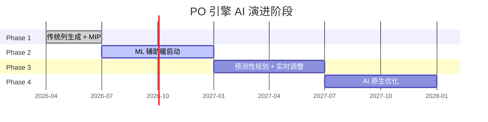
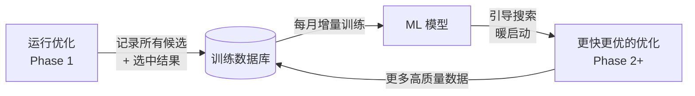

# PO 引擎 AI 演进路线图

---

## 一、演进总览



---

## 二、Phase 1 — 传统优化基础（2026-04 ~ 2026-06）

### 目标

建立生产可用的列生成 + MIP 优化基础，验证算法正确性和规模可行性。

### 核心能力

| 能力 | 说明 |
|------|------|
| 列生成 | 图搜索枚举合法配对候选池 |
| 集合分割 | OR-Tools / CBC 整数规划 |
| 异步任务队列 | ARQ + Redis，支持并发优化任务 |
| 法规约束编译器 | Rule Config → Python 约束函数，热更新 |
| 参数化权重 | w1-w4 可配置，各航司独立调整 |

### 交付物

- [ ] 重写 `optimizer/` 模块（列生成替换 CP-SAT 直接建模）
- [ ] 异步 Worker 架构（ARQ + Redis）
- [ ] 性能基准测试（≤ 500 航班, ≤ 5 分钟）
- [ ] 单元 + 集成测试覆盖率 ≥ 80%

### AI 接口预留

```python
class OptimizationPipeline:
    # Phase 1: None（传统搜索）
    # Phase 2: 替换为 ML 引导版本
    candidate_ranker: CandidateRanker | None = None

    # Phase 1: None
    # Phase 3: 替换为预测引导版本
    warm_start_provider: WarmStartProvider | None = None
```

---

## 三、Phase 2 — ML 辅助暖启动（2026-07 ~ 2026-12）

### 背景

列生成的主要瓶颈是：
1. **候选池剪枝**：如何从海量候选中快速找到高质量配对？
2. **分支决策**：Branch & Price 中的分支变量选择影响求解速度。

ML 可以在不破坏最优性的前提下显著加速。

### 3.1 配对质量预测模型

**目标**：从历史优化结果中学习"什么样的配对结构更可能出现在最优解中"。

```python
class PairingQualityPredictor:
    """
    输入：配对候选的特征向量
    输出：该配对被选中的概率（0~1）
    """
    def predict(self, pairing: PairingCandidate) -> float:
        features = self._extract_features(pairing)
        return self.model.predict_proba([features])[0][1]

    def _extract_features(self, p: PairingCandidate) -> list[float]:
        return [
            p.total_duty_minutes,
            p.tafb_minutes,
            p.deadhead_count,
            p.sector_count,
            p.duration_days,
            p.avg_ground_time_minutes,
            p.base_match_score,     # 出发/返回是否在主要基地
            p.time_of_day_score,    # 值勤开始时间的"效率"
        ]
```

**训练数据来源**：历史 PO 优化结果（每次优化后记录被选中/未被选中的配对特征）。

### 3.2 ML 引导的列生成

```
传统列生成：均匀搜索所有候选
ML 引导：优先搜索预测质量高的方向，快速找到好的初始解
```

```python
class MLGuidedDutyGenerator(DutyGenerator):
    """ML 引导的值勤期生成器：在 DFS 中使用模型得分对搜索方向排序"""

    def get_next_flights(
        self,
        state: DutyState,
        candidates: list[Flight],
    ) -> list[Flight]:
        if self.predictor is None:
            return candidates  # Phase 1 降级：均匀搜索

        # 按 ML 预测的"扩展价值"排序
        scored = [(f, self.predictor.score_extension(state, f)) for f in candidates]
        scored.sort(key=lambda x: -x[1])
        return [f for f, _ in scored]
```

### 3.3 暖启动（Warm Start）

用 ML 生成的初始解直接传给 MIP 求解器，跳过冷启动阶段：

```python
def solve_with_warm_start(
    candidates: list[PairingCandidate],
    warm_start: list[PairingCandidate] | None,
    ...
) -> list[PairingCandidate]:
    solver = pywraplp.Solver.CreateSolver("CBC")
    # ...构建模型...

    # 设置初始解提示（CBC 支持 MIP hint）
    if warm_start:
        warm_start_ids = {p.id for p in warm_start}
        for p in candidates:
            x[p.id].SetHint(1.0 if p.id in warm_start_ids else 0.0)

    solver.Solve()
```

**预期收益**：求解时间减少 40-60%（对相似月度排班问题）。

### 3.4 数据收集基础设施（Phase 1 起预留）

```python
class OptimizationLogger:
    """在每次优化后记录训练数据"""

    async def log_result(
        self,
        job_id: str,
        all_candidates: list[PairingCandidate],
        selected: list[PairingCandidate],
        metadata: dict,
    ) -> None:
        selected_ids = {p.id for p in selected}
        records = [
            {
                "job_id": job_id,
                "pairing_features": p.feature_vector(),
                "selected": p.id in selected_ids,
                "airline": metadata["airline"],
                "fleet": metadata["fleet"],
                "month": metadata["month"],
            }
            for p in all_candidates
        ]
        await self.store.bulk_insert(records)
```

---

## 四、Phase 3 — 预测性规划 + 实时调整（2027-01 ~ 2027-06）

### 4.1 预测性规划

**核心思想**：在排班计划生成之前，预测下月可能的变化，提前生成"弹性配对"。

```
传统方式：航班计划 → 运行优化 → 配对结果
预测方式：历史规律 + 当前计划 → 预测航班负荷 → 预生成候选库 → 快速适配最终计划
```

**应用场景**：
- 预测哪些航线最可能被加班或取消
- 提前为高概率变化路线准备备用配对
- 季节性航班规律预测（节假日、旅游旺季）

### 4.2 实时中断响应

当航班发生变更（延误、取消、加班），快速重新优化受影响的配对：

```python
class RealTimeReoptimizer:
    """针对单个变更事件的快速局部重优化"""

    async def handle_disruption(
        self,
        disrupted_flight: Flight,
        existing_pairings: list[Pairing],
        event_type: Literal["DELAY", "CANCEL", "ADDED"],
    ) -> ReoptimizationResult:
        # 1. 找出受影响的配对
        affected = self._find_affected_pairings(disrupted_flight, existing_pairings)

        # 2. 仅对受影响配对局部重优化（< 10 秒目标）
        local_result = await self._local_reoptimize(
            affected_pairings=affected,
            fixed_pairings=[p for p in existing_pairings if p not in affected],
            trigger_event=disrupted_flight,
        )

        return local_result
```

**技术基础**：
- 将已确定配对固定（warm fix），只优化受影响片段
- ML 预测最可能的修复方案（根据历史中断处理记录）
- 目标：30 秒内给出可行修复方案

### 4.3 Gantt 集成：实时建议

```
排班员在 Gantt 手动调整航班 → 系统后台快速计算影响
                             → 在 Gantt 侧栏推送建议修复方案
                             → 排班员一键应用
```

---

## 五、Phase 4 — AI 原生优化（2027-07 +）

### 5.1 LLM 约束翻译器

**问题**：每次法规更新，需要工程师手动将法规条文翻译为约束代码。

**解决方案**：LLM 将自然语言法规条文自动翻译为约束函数：

```
输入（法规条文）：
"飞行机组成员在任何 7 个连续日历日内的飞行时间不得超过 40 飞行小时"

输出（Python 约束）：
def check_7day_flight_time(duty_history: list[Duty]) -> bool:
    for window_start in range(len(duty_history)):
        window = [d for d in duty_history
                  if d.date <= duty_history[window_start].date + timedelta(days=7)]
        total_flt_min = sum(d.flight_minutes for d in window)
        if total_flt_min > 40 * 60:
            return False
    return True
```

**人工审核门禁**：自动生成的约束必须经过人工审核和测试后才能投入使用。

### 5.2 强化学习优化代理

**目标**：训练 RL 代理直接做配对分配决策，替代传统 MIP。

```
状态空间：当前未分配航班 + 已构建配对的部分解
动作空间：选择下一个航班加入当前配对，或开始新配对
奖励函数：-cost(最终解) + 覆盖完整性奖励
```

**注**：RL 在组合优化上仍处于研究阶段，作为 MIP 的补充而非替代。

### 5.3 持续学习

```python
class ContinuousLearningPipeline:
    """每月运行，用最新优化结果更新 ML 模型"""

    async def monthly_retrain(self):
        # 1. 收集上月所有优化结果
        recent_records = await self.db.get_recent_logs(days=30)

        # 2. 增量训练（不重头训练，只微调）
        self.model.partial_fit(recent_records)

        # 3. 评估：在 holdout 集上验证指标
        metrics = self.evaluate(holdout_set)
        if metrics.coverage_pct < 95:
            # 回退到上一个稳定版本
            self.model.rollback()
            return

        # 4. 发布新模型版本
        await self.model_registry.publish(self.model)
```

---

## 六、各阶段技术栈

| Phase | 算法 | 框架 | AI/ML 技术 |
|-------|------|------|-----------|
| 1 | 列生成 + CBC/OR-Tools | Python, FastAPI, ARQ | 无 |
| 2 | ML 引导列生成 + 暖启动 | + scikit-learn, PyTorch | GBM / 轻量神经网络 |
| 3 | 局部重优化 + 预测 | + Prophet / LightGBM | 时序预测, 分类模型 |
| 4 | RL 代理 + LLM 约束翻译 | + Stable-Baselines3 | PPO/DQN, GPT-4 API |

---

## 七、数据飞轮



从 Phase 1 起就开始收集训练数据，Phase 2 起就能从数据中受益。数据飞轮越转越快，优化质量持续提升。

---

## 八、风险与对策

| 风险 | 概率 | 影响 | 对策 |
|------|------|------|------|
| ML 模型引导方向偏差，错过最优解 | 中 | 中 | 保留传统搜索为兜底；ML 仅影响搜索顺序，不剪枝 |
| 训练数据量不足（初期） | 高 | 低 | Phase 1 收集数据，Phase 2 才启用 ML |
| LLM 翻译法规出错 | 高 | 高 | 人工审核门禁，生产前必须测试 |
| RL 训练不稳定 | 高 | 低 | 作为实验性功能，不影响主流程 |
