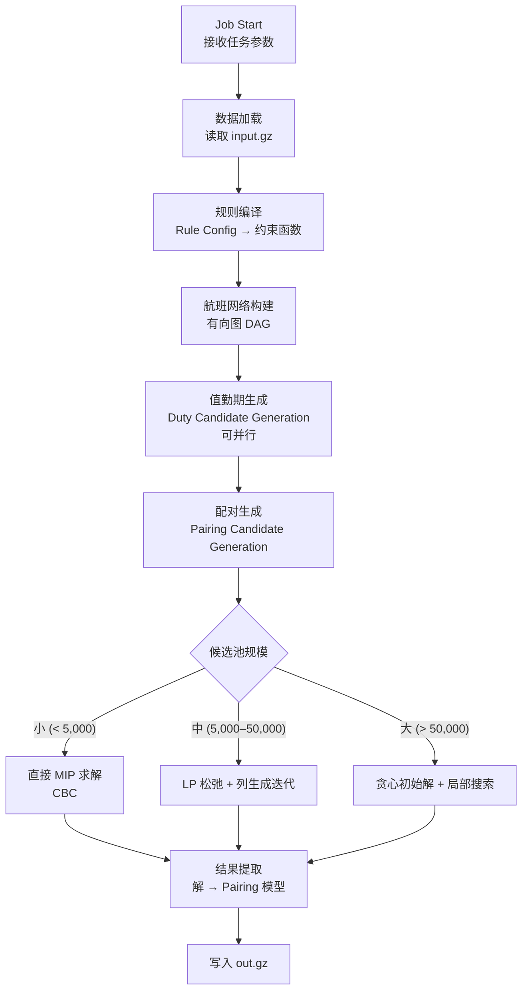

# PO 优化算法设计

---

## 一、行业现状与算法选型

### 1.1 为什么不用 CP-SAT 直接建模

当前 v1 将所有航班直接放入 CP-SAT 模型，存在根本性规模问题：

| 航班数 | x[f,p] 变量数 | y[f1,f2] 变量数 | 实际可解性 |
|--------|-------------|----------------|-----------|
| 50 | 2,500 | ~2,500 | ✅ 秒级 |
| 200 | 40,000 | ~20,000 | ⚠️ 分钟级 |
| 500 | 250,000 | ~125,000 | ❌ 超时 |
| 1,000+ | 1,000,000+ | ~500,000+ | ❌ 不可解 |

行业主流（SITA、Sabre、Lufthansa Systems）均采用 **列生成 + 集合分割** 两阶段方法。

### 1.2 列生成核心思想

```
第一阶段：生成"列"（合法配对候选池）
    通过图搜索枚举所有满足法规约束的配对
    每个合法配对 = 一"列"

第二阶段：选择最优列子集
    集合分割问题（Set Partitioning Problem）
    每个航班恰好被一个配对覆盖
    最小化总成本
```

**关键优势**：
- 生成阶段完全并行（按基地/机型分片）
- MIP 规模取决于候选池大小，而非航班数的平方
- 约束在生成阶段剪枝，求解器只处理合法候选

---

## 二、算法流程总览



---

## 三、第一阶段：航班网络构建

### 3.1 时空网络图

将航班建模为有向图的边：

```
节点：(机场, 时间窗) 
边：航班（dep → arv）+ 地面连接（同机场，满足 MCT）

例：
PEK[06:00] --F8001--> SHA[08:00] --F8002--> PEK[12:00]
                ↑ MCT = 60分钟，F8002 dep=09:00 不满足
                ↓ MCT = 60分钟，F8003 dep=09:30 满足
PEK[06:00] --F8001--> SHA[08:00] --F8003--> PEK[12:30]
```

### 3.2 可行连接预筛选

构建连接图时提前过滤不可行连接，大幅减少后续搜索空间：

```python
def is_feasible_connection(flight_i: Flight, flight_j: Flight, mct: int) -> bool:
    """判断 flight_j 是否可跟在 flight_i 之后"""
    # 1. 机场匹配
    if flight_i.arv_arp != flight_j.dep_arp:
        return False
    # 2. 最小连接时间
    ground_time = (flight_j.sch_dep_dt_utc - flight_i.sch_arv_dt_utc).total_seconds() / 60
    if ground_time < mct:
        return False
    # 3. 最大地面等待（超过 24h 则跨值勤期，不在同一 duty 内连接）
    if ground_time > 24 * 60:
        return False
    return True
```

---

## 四、第二阶段：值勤期生成（Duty Generation）

### 4.1 算法

从每个航班出发，DFS 搜索所有合法值勤期序列：

```python
def generate_duties(
    start_flight: Flight,
    all_connections: dict[int, list[int]],  # flight_id → [successor_ids]
    flights: list[Flight],
    constraints: CompiledConstraints,
) -> list[DutyCandidate]:
    """
    从 start_flight 出发，DFS 生成所有合法值勤期。
    在搜索过程中实时剪枝（early termination）。
    """
    results = []
    stack = [DutyState(segments=[start_flight])]

    while stack:
        state = stack.pop()
        current_flight = state.segments[-1]

        # 当前 duty 已是一个完整值勤期（至少 1 个航班），记录
        if is_valid_duty(state, constraints):
            results.append(DutyCandidate.from_state(state))

        # 尝试扩展
        for next_flt_id in all_connections.get(current_flight.id, []):
            next_flt = flights_by_id[next_flt_id]
            new_state = state.extend(next_flt)

            # 剪枝条件（违反则不继续扩展）
            if new_state.fdp_minutes > constraints.max_fdp_minutes(new_state.sector_count):
                continue  # FDP 超限，剪枝
            if new_state.sector_count > constraints.max_sectors_per_duty:
                continue  # 航段数超限，剪枝
            if new_state.flight_time_minutes > constraints.max_flight_time_per_duty:
                continue  # 飞行时间超限，剪枝

            stack.append(new_state)

    return results
```

### 4.2 值勤期约束

| 约束 | 来源 | 剪枝时机 |
|------|------|---------|
| 最大 FDP（按航段数查表） | CCAR-121 | 每次扩展后 |
| 最大值勤时间 | CCAR-121 | 每次扩展后 |
| 最大单 duty 飞行时间 | CCAR-121 | 每次扩展后 |
| 最大航段数/值勤期 | 可配置参数 | 每次扩展后 |
| 机场连接性 | 物理约束 | 图构建时 |
| MCT 满足 | 航司参数 | 图构建时 |

### 4.3 大规模并行化策略

当航班数 > 200 时，值勤期生成按**起始机场**分片并行（`generate_duties_parallel`）：

```python
from concurrent.futures import ProcessPoolExecutor
from collections import defaultdict

def generate_duties_parallel(
    flights: list[Flight],
    connection_graph: dict[int, list[int]],
    cc: CompiledConstraints,
    deadline: float | None = None,
    min_flights: int = 200,
    max_workers: int = 4,
) -> list[DutyCandidate]:
    """按起飞机场分片，多进程并行生成值勤期。
    每个 worker 以自己分片的航班为 DFS 起点，但使用完整航班列表做后继查找。
    """
    if len(flights) < min_flights:
        return generate_duties(flights, connection_graph, cc, deadline=deadline)

    by_dep: dict[str, list[Flight]] = defaultdict(list)
    for f in flights:
        by_dep[f.dep_arp].append(f)

    groups = list(by_dep.values())
    if len(groups) <= 1:
        return generate_duties(flights, connection_graph, cc, deadline=deadline)

    # 每个 worker: start_flights=本分片, all_flights=完整列表（用于后继查找）
    args_list = [(g, flights, connection_graph, cc, deadline) for g in groups]
    results: list[DutyCandidate] = []
    with ProcessPoolExecutor(max_workers=min(max_workers, len(groups))) as pool:
        for group_result in pool.map(_duties_worker, args_list):
            results.extend(group_result)
    return results
```

> **说明**：`CompiledConstraints` 须可 pickle（用 `FdpLimitCalculator` 替换闭包）。DFS 起点按机场分片，不同分片不会产生重复配对。

---

## 五、第三阶段：配对生成（Pairing Generation）

### 5.1 算法

在值勤期有向图上搜索，生成满足所有多日约束的完整配对：

```python
def generate_pairings(
    duties: list[DutyCandidate],
    constraints: CompiledConstraints,
    base_airports: set[str],
) -> list[PairingCandidate]:
    """
    将值勤期组合为完整配对（必须从基地出发并返回基地）。
    """
    # 按起始/终止机场分组，只组合有连接可能的值勤期
    duty_connections = build_duty_connections(duties, constraints)

    results = []
    # 只从基地起飞的 duty 开始搜索
    base_duties = [d for d in duties if d.dep_arp in base_airports]

    for start_duty in base_duties:
        stack = [PairingState(duties=[start_duty])]
        while stack:
            state = stack.pop()
            last_duty = state.duties[-1]

            # 配对合法终止条件：最后一个 duty 在基地结束
            if last_duty.arv_arp in base_airports and state.is_complete():
                results.append(PairingCandidate.from_state(state))

            # 约束剪枝
            if state.consecutive_duty_days >= constraints.max_consecutive_duty_days:
                continue  # 连续值勤天数超限
            if state.total_days > constraints.max_pairing_days:
                continue  # 配对总天数超限

            # 扩展下一个值勤期
            for next_duty in duty_connections.get(last_duty.id, []):
                rest = compute_rest(last_duty, next_duty)
                if rest < constraints.min_rest_minutes:
                    continue  # 休息不足，剪枝
                stack.append(state.extend(next_duty, rest))

    return results
```

### 5.2 配对约束

| 约束 | 来源 |
|------|------|
| 从基地出发 + 返回基地 | 航司运营要求 |
| 值勤间最小休息时间 | CCAR-121 |
| 最大连续值勤天数 | CCAR-121 |
| 最大 TAFB（离基到返基时间） | 航司参数 |
| 飞行时间 7d/28d/90d/365d 累计限制 | CCAR-121（配对级别预检） |

### 5.3 候选池裁剪（大规模防爆）

当候选配对数超过阈值时，在进入 MIP 之前裁剪候选池，只保留 Pareto 最优或近优的候选：

```python
MAX_CANDIDATES = 50_000  # 超过此数触发裁剪

def prune_candidates(
    candidates: list[PairingCandidate],
    flights: list[Flight],
    weights: OptimizeWeights,
    target: int = MAX_CANDIDATES,
) -> list[PairingCandidate]:
    """
    按配对成本升序排列，保留 target 个候选。
    同时确保每个航班至少被 MIN_COVERAGE 个候选覆盖（保证可行性）。
    """
    MIN_COVERAGE = 3
    # 先按成本排序
    scored = sorted(candidates, key=lambda p: pairing_cost(p, weights))
    # 贪心保留：确保每个航班有足够覆盖
    kept = []
    coverage: dict[int, int] = defaultdict(int)
    for p in scored:
        if len(kept) >= target and all(coverage[f] >= MIN_COVERAGE for f in p.flight_ids):
            continue  # 已满且不增加覆盖，跳过
        kept.append(p)
        for flt_id in p.flight_ids:
            coverage[flt_id] += 1
        if len(kept) >= target * 1.2:  # 宽松 20% 以保覆盖
            break
    return kept
```

---

## 六、第四阶段：集合分割求解（Set Partitioning）

### 6.1 数学模型

```
变量：
  x_p ∈ {0, 1}    — 配对 p 是否被选中

参数：
  cost(p)          — 配对 p 的成本（加权）
  a_fp ∈ {0, 1}    — 航班 f 是否出现在配对 p 中

目标：
  minimize  Σ_p  cost(p) × x_p

约束：
  Σ_p  a_fp × x_p  = 1    ∀f    (每个航班恰好被一个配对覆盖)
  x_p ∈ {0, 1}            ∀p
```

### 6.2 配对成本函数

```
cost(p) = w1 × 1                           (每个配对计 1 次)
         + w2 × deadhead_count(p)           (死飞惩罚)
         + w3 × total_duty_minutes(p)       (值勤时间惩罚，单位：分钟)
         + w4 × Σ soft_violations(p)        (软约束违反惩罚)
```

### 6.3 求解策略（按候选池规模自适应）

| 候选池规模 | 求解策略 | 工具 | 实现状态 |
|-----------|---------|------|---------|
| < 5,000 | 直接 MIP（整数规划） | OR-Tools CBC | **已实现** |
| 5,000 – 50,000 | LP 松弛 + 列生成 + CBC MIP | OR-Tools GLOP + CBC | **已实现** |
| > 50,000 | 先裁剪到 50k，再走列生成路径 | 同上 | **已实现** |

```python
from ortools.linear_solver import pywraplp

def solve_set_partitioning(
    candidates: list[PairingCandidate],
    all_flight_ids: list[int],
    weights: dict[str, float],
    time_limit_sec: int,
) -> SolverResult:
    solver = pywraplp.Solver.CreateSolver("CBC")
    solver.set_time_limit(time_limit_sec * 1000)
    x = [solver.BoolVar(f"x_{i}") for i in range(len(candidates))]

    for fid in all_flight_ids:
        covering = [x[i] for i, p in enumerate(candidates) if fid in p.flight_ids]
        if not covering:
            return SolverResult("INFEASIBLE", [], set(), ...)
        solver.Add(solver.Sum(covering) == 1)

    solver.Minimize(solver.Sum(_pairing_cost(p, weights) * x[i]
                               for i, p in enumerate(candidates)))
    status = solver.Solve()
    # OPTIMAL → DONE；FEASIBLE → TIMEOUT（超时后的当前最优解）
    result_status = "DONE" if status == pywraplp.Solver.OPTIMAL else "TIMEOUT"
    selected = [candidates[i] for i in range(len(candidates)) if x[i].solution_value() > 0.5]
    return SolverResult(result_status, selected, ...)
```

### 6.4 列生成迭代（候选池 5k–50k 时）

```
1. 以 max(flight_count×2, 100) 个配对作为初始 RMP（受限主问题）
2. 用 GLOP 求解 LP 松弛，获得对偶变量 π_f（航班 f 的影子价格）
3. 对池中剩余候选计算 reduced cost = cost(p) - Σ_f π_f
4. 将 reduced cost < 0 的前 200 个候选加入 RMP
5. 重复步骤 2–4，最多 30 次迭代或用掉 60% 时间预算
6. 用 CBC 对最终 RMP 求整数最优解
```

```python
def solve_set_partitioning_with_cg(
    candidates, all_flight_ids, weights, time_limit_sec
) -> SolverResult:
    seed_size = min(n, max(len(all_flight_ids) * 2, 100))
    in_rmp: set[int] = set(range(seed_size))
    pool: set[int] = set(range(seed_size, n))

    for iteration in range(30):
        if not pool or elapsed >= time_limit_sec * 0.60:
            break
        duals = _solve_lp_relaxation([candidates[i] for i in sorted(in_rmp)], ...)
        improving = [(cost(p) - sum(duals[f] for f in p.flight_ids), idx)
                     for idx in pool if rc < -1e-6]
        if not improving:
            break  # LP 最优，无改进列
        in_rmp |= {idx for _, idx in sorted(improving)[:200]}

    return solve_set_partitioning([candidates[i] for i in sorted(in_rmp)], ...)
```

---

## 七、时间预算分配

`time_limit_sec` 是总预算，各阶段按比例分配：

| 阶段 | 时间分配 | 超时处理 |
|------|---------|---------|
| 值勤期生成 | `time_limit × 20%`，上限 60s | 截断，使用已生成候选 |
| 配对生成 | `time_limit × 20%`，上限 60s | 截断，使用已生成候选 |
| MIP 求解 | 剩余时间（最少 30s，预留 5s 写文件） | 超时写当前最优解，exit(2) |

```python
t_duty_gen = min(time_limit * 0.20, 60.0)
t_pairing_gen = min(time_limit * 0.20, 60.0)
elapsed = time.monotonic() - t_start
mip_budget = max(time_limit - elapsed - 5, 30.0)
```

**超时降级策略**：若候选生成阶段超时，使用已有候选进入 MIP；MIP 超时（CBC 返回 FEASIBLE）时写入当前最优解，状态为 TIMEOUT，exit(2)。

---

## 八、性能分析

### 8.1 算法复杂度对比

| 阶段 | v1（CP-SAT 直接建模） | v2（列生成） |
|------|---------------------|-------------|
| 变量数 | O(n² × m) | O(候选池大小) |
| 约束数 | O(n² × m) | O(航班数) |
| 500 航班的实际规模 | ~250k 变量 | ~5k 候选，~500 约束 |
| 求解时间 | 超时 | ≤ 5 分钟 |

> n = 航班数，m = 配对上限数

### 8.2 候选池大小估算

对于不同规模的航班场景（单机型、单基地、月度排班）：

| 航班数 | 合法值勤期数 | 合法配对数 | MIP 规模 | 预估求解时间 |
|--------|-----------|----------|---------|------------|
| ≤ 50 | 100–500 | 200–1,000 | 微小 | < 5s |
| 50–200 | 500–2,000 | 1,000–5,000 | 小 | < 30s |
| 200–500 | 1,000–5,000 | 2,000–20,000 | 中 | 30s–2min |
| 500–1,000 | 3,000–15,000 | 10,000–50,000 | 大 | 2–5min（含列生成）|
| > 1,000 | > 15,000 | > 50,000 | 需裁剪 | 5min+（可能需多次迭代）|

### 8.3 内存使用估算

MIP 的覆盖矩阵 `a_fp` 是**稀疏矩阵**（每个配对平均覆盖 ~10 个航班）：

| 规模 | 稀疏矩阵大小 | 内存占用（压缩） |
|------|-----------|--------------|
| 5,000 候选 × 500 航班 | 非零元素 ~50k | < 10 MB |
| 50,000 候选 × 1,000 航班 | 非零元素 ~500k | < 100 MB |

使用 `scipy.sparse.csc_matrix` 或字典列表表示覆盖关系，禁止构建全密集矩阵。

---

## 九、参数化约束配置

所有约束阈值从 `input.gz` 的 `RULES` 节和 `OPERATIONAL_PARAMS` 节读取，不硬编码：

```python
@dataclass
class CompiledConstraints:
    # 法规约束（来自 RULES 节）
    max_fdp_by_sector: dict[int, int]   # sector_count → max_fdp_minutes
    min_rest_minutes: int
    max_duty_minutes: int
    max_flight_time_per_duty_minutes: int
    max_consecutive_duty_days: int
    max_pairing_days: int               # 航司参数
    max_tafb_minutes: int               # 航司参数

    # 运营参数（来自 OPERATIONAL_PARAMS 节）
    mct_by_airport: dict[str, int]      # airport_code → mct_minutes
    brief_minutes: int                  # 汇报时间
    debrief_minutes: int                # 解散时间
    base_airports: set[str]
```

---

## 十、测试策略

### 10.1 已知最优解验证

```python
def test_simple_round_trip_optimal():
    """
    2 个航班构成一个完美环线，最优解应是 1 个配对、0 死飞。
    PEK→SHA (06:00-08:00)
    SHA→PEK (10:00-12:00)  地面等待 2h > MCT
    """
    flights = [flight_pek_sha, flight_sha_pek]
    result = optimize(flights, ...)
    assert result.total_pairings == 1
    assert result.total_deadheads == 0
    assert result.coverage_pct == 100.0
```

### 10.2 压力测试

```
test_scale_50_flights     # ≤ 5 秒
test_scale_200_flights    # ≤ 30 秒
test_scale_500_flights    # ≤ 120 秒
test_scale_1000_flights   # ≤ 300 秒（5 分钟，含列生成迭代）
```

### 10.3 法规合规性验证

```python
def test_no_fdp_violation():
    """优化结果中不应有任何 FDP 超限的值勤期"""
    for pairing in result.pairings:
        for duty in pairing.duties:
            assert duty.fdp_minutes <= max_fdp_for_sectors(duty.sector_count)
```

### 10.4 大数据超时降级验证

```python
def test_timeout_returns_partial_result():
    """超时时应返回当前最优解（可能覆盖率 < 100%）而非 FAILED"""
    result = run_with_tight_limit(time_limit_sec=10, flights=500_flights)
    assert result.status in ("TIMEOUT", "DONE")
    assert result.coverage_pct > 0  # 有部分解
    assert result.pairings  # 不为空
```
