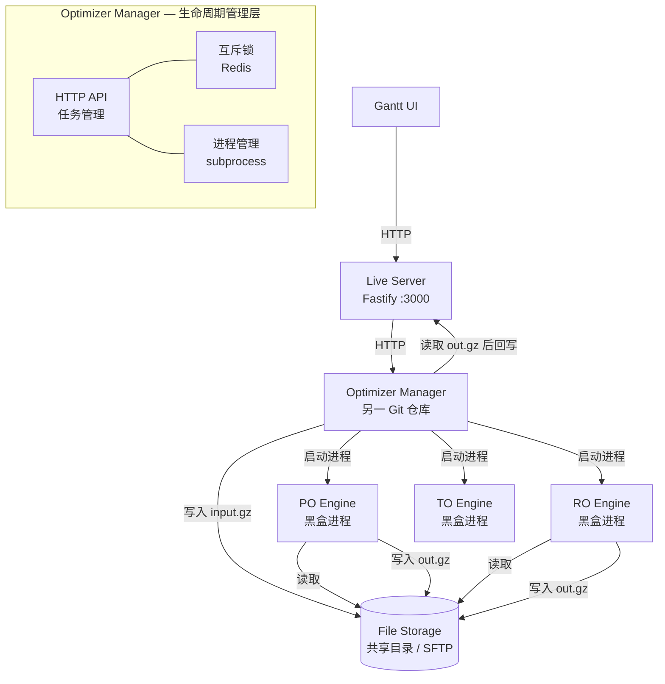
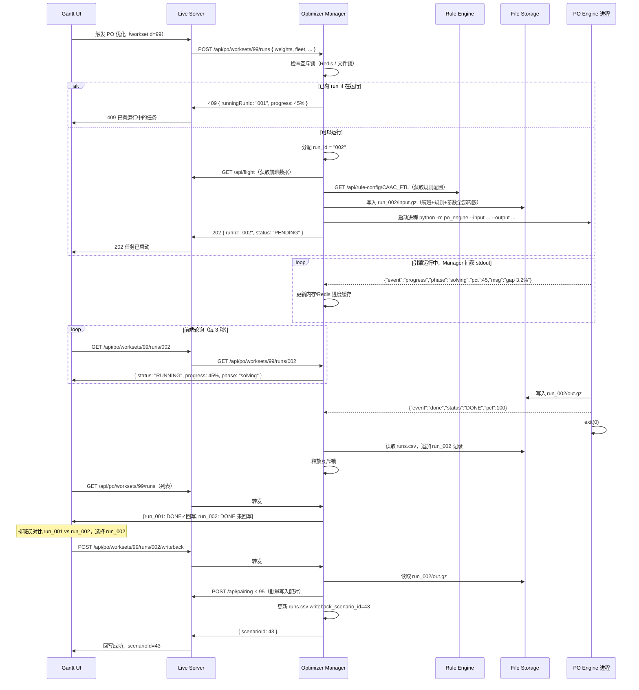

# PO 引擎系统架构

---

## 一、整体架构

### 1.1 三层架构总览



### 1.2 各层职责

| 层 | 组件 | 职责 |
|----|------|------|
| **前端** | Gantt UI | 触发优化、轮询进度、选择结果、触发回写 |
| **业务层** | Live Server | 提供航班/法规数据 API；接收回写的配对数据 |
| **编排层** | Optimizer Manager（另一仓库） | 生命周期管理、文件准备、进程启动、结果回写 |
| **计算层** | PO / RO / TO / BO Engine | **纯文件黑盒**：读 input.gz → 优化 → 写 out.gz |

### 1.3 引擎黑盒原则

```
引擎的唯一接口：

  输入：python -m src --input /path/input.gz --output /path/out.gz
  进度：stdout JSON Lines
  输出：out.gz 文件
  退出码：0=DONE / 1=INFEASIBLE / 2=TIMEOUT / 3=INTERNAL_ERROR

引擎不依赖：
  × HTTP 服务      × Redis     × 数据库连接
  × Live Server    × Rule Engine HTTP（规则已内嵌在 input.gz）
```

> Rule Engine 的规则配置由 Optimizer Manager 在创建 `input.gz` 时提前从 Rule Engine 获取并写入。
> 引擎运行时只读文件，完全离线。

---

## 二、任务生命周期

### 2.1 完整流程（含 Optimizer Manager）



### 2.2 Run 状态机

```
PENDING → RUNNING → DONE
                 ↘ FAILED
                 ↘ TIMEOUT
                 ↘ CANCELLED
```

| 状态 | 说明 | 触发条件 | 互斥锁 |
|------|------|---------|--------|
| PENDING | 已入队，等待 Worker 拾取 | 提交后 | 未持有锁 |
| RUNNING | Worker 已开始处理 | dequeue 后立即获取锁 | 持有锁 |
| DONE | 优化完成，out.gz 已写入 | 求解完成 | 释放锁 |
| FAILED | 系统错误或无解 | 异常 / INFEASIBLE | 释放锁 |
| TIMEOUT | 超出时间限制，返回当前最优解 | `solve_time > time_limit` | 释放锁 |
| CANCELLED | 用户主动取消 | DELETE 接口 | 释放锁 |

### 2.3 互斥锁机制

```
Redis Key:  optimizer:lock:{engine}:{workset_id}
Value:      当前运行的 run_id（如 "002"）
TTL:        time_limit_seconds × 1.5（防止 Worker 崩溃后锁永久不释放）
```

- Worker 启动时用 `SET ... NX EX` 原子性获取锁
- Worker 完成/失败/取消时主动 `DEL` 释放锁
- TTL 到期自动释放（兜底保护）
- 排班员取消任务时，API 层先 `DEL` 锁，再向 Worker 发送取消信号

---

## 三、组件详解

### 3.1 PO Engine 内部结构（本仓库）

PO Engine 是一个**纯命令行进程**，无 HTTP 服务、无 Worker、无 Redis：

```
po-engine/
└── src/
    ├── __main__.py         # 入口：解析 --input/--output，调用 pipeline
    ├── io/
    │   └── job_io.py       # 读写 input.gz / out.gz（模块级函数）
    ├── optimizer/
    │   ├── pipeline.py     # OptimizationPipeline（总调度）
    │   └── ...
    ├── constraints/
    │   ├── compiler.py     # Rule Config JSON → CompiledConstraints
    │   └── fdp_table.py    # FDP 时间窗查表
    ├── algorithm/
    │   ├── flight_network.py    # 航班时空连接图
    │   ├── duty_generator.py    # 值勤期候选生成（DFS + 剪枝）
    │   ├── pairing_generator.py # 配对候选生成
    │   └── mip_solver.py        # 集合分割 MIP（CBC）
    └── utils/
        └── progress.py     # stdout JSON Lines 进度上报
```

### 3.2 优化 Pipeline（详见 algorithm.md）

```
OptimizationPipeline.run(sections: dict)
├── 1. 解析 input.gz → flights, rule_config, job_params
├── 2. ConstraintCompiler.compile() → CompiledConstraints
├── 3. FlightNetworkBuilder → 有向连接图
├── 4. DutyGenerator → 合法值勤期候选池（含实时剪枝）
├── 5. PairingGenerator → 合法配对候选池
├── 6. MIPSolver → 集合分割，选出最优子集
└── 7. ResultExtractor → 序列化为 out.gz 各节
```

### 3.3 Constraint Compiler（规则编译器）

`input.gz` 的 `RULES` 节已包含完整规则参数（由 Optimizer Manager 在写入 input.gz 时从 Rule Engine 获取）。
引擎启动时解析此节，编译为 Python 约束函数，**无需任何 HTTP 调用**：

```python
# 引擎内部：从 input.gz 的 RULES 节编译约束
rule_rows = sections["RULES"]   # 来自 input.gz，已内嵌完整 params_json
rule_config = parse_rule_config(rule_rows)
constraints = ConstraintCompiler().compile(rule_config, base_airports)
# → constraints.fdp_limit_func(segments, report_local) → int
# → constraints.min_rest_minutes: int
# → ...
```

### 3.4 Optimizer Manager 的职责（另一仓库）

| 职责 | 实现方式 |
|------|---------|
| 接收 HTTP 请求 | FastAPI / Fastify HTTP API |
| 互斥锁管理 | Redis `SET NX EX` 或文件锁 |
| 创建 input.gz | 调用 Live Server + Rule Engine HTTP API，合并写入文件 |
| 启动引擎进程 | `subprocess.Popen` / Docker run / K8s Job |
| 捕获进度 | 读取子进程 stdout JSON Lines |
| 维护运行历史 | 读写 `runs.csv` |
| 回写结果 | 读取 `out.gz`，调用 Live Server API |
| 多结果对比 | 读取多个 `out.gz` KPI 节对比 |

---

## 四、数据流设计

### 4.1 输入数据

```
Job Payload (来自 Live Server)
├── workset_id          场景工作集 ID
├── start_date          优化日期范围
├── end_date
├── fleet               机型筛选（可选）
├── base_airports       基地机场列表
├── division            P=飞行员 / C=客舱
├── rule_group_code     法规集合代码
├── weights             目标函数权重
│   ├── w_pairings      配对数权重
│   ├── w_deadhead      死飞权重
│   ├── w_duty_time     值勤时间权重
│   └── w_penalty       软约束惩罚权重
└── time_limit_seconds  求解时间上限
```

### 4.2 输出数据

```
OptimizationResult
├── status              success / infeasible / timeout / failed
├── scenario_id         写入 Live Server 的场景 ID
├── kpi
│   ├── total_flights   总航班数
│   ├── total_pairings  生成配对数
│   ├── coverage_pct    航班覆盖率（应为 100%）
│   ├── total_deadheads 死飞数
│   ├── avg_duty_min    平均值勤时间（分钟）
│   ├── avg_tafb_min    平均 TAFB（离基到返基时间，分钟）
│   ├── total_flt_min   总飞行时间（分钟）
│   └── solve_time_sec  求解耗时（秒）
└── pairings            配对列表（已写入 Live Server）
```

---

## 五、部署架构

### 5.1 单机开发

```
localhost:3000   Live Server（提供航班数据 API）
localhost:3001   Rule Engine（提供规则配置 API）
localhost:XXXX   Optimizer Manager（另一仓库，管理进程生命周期）
/data/optimizer/ 共享文件目录

# PO Engine 由 Optimizer Manager 按需启动，不作为常驻服务
python -m po_engine --input ... --output ...
```

### 5.2 生产部署

```yaml
# Optimizer Manager 的 Docker Compose（另一仓库）
services:
  optimizer-manager:
    image: rois/optimizer-manager:latest
    volumes:
      - /data/optimizer:/data/optimizer  # 共享文件目录
      - /var/run/docker.sock:/var/run/docker.sock  # 用于启动引擎容器
    environment:
      - LIVE_SERVER_URL=http://live-server:3000
      - RULE_ENGINE_URL=http://rule-engine:3001
      - STORAGE_ROOT=/data/optimizer
      - REDIS_URL=redis://redis:6379

# PO Engine 镜像（本仓库构建，被 Manager 按需启动）
# docker run --rm -v /data/optimizer:/data/optimizer \
#   rois/po-engine:2.0.0 --input ... --output ...
```

**引擎无需常驻**：Optimizer Manager 需要时启动引擎进程，完成后进程自动退出。多个任务通过 Manager 串行调度（互斥锁保证同一场景不并发）。

---

## 六、可靠性设计

| 场景 | 处理方式 |
|------|---------|
| 引擎进程崩溃（exit code 3） | Manager 检测到异常退出码，标记 run 为 FAILED；`input.gz` 已存在，可直接重新启动进程重试 |
| Live Server 不可达（回写阶段） | `out.gz` 已完整写入，run 标记 DONE；可事后调用 `/writeback` 重新回写，不需要重跑优化 |
| 求解超时（exit code 2） | 引擎写入当前最优解到 `out.gz`（status=TIMEOUT）；Manager 可选择接受或触发重跑 |
| 并发提交同一场景 | Manager 检查互斥锁，返回 409 + 当前运行进度 |
| Manager 重启 | 扫描文件目录恢复状态：有 input.gz 无 out.gz → 该 run 需重跑；有 out.gz → DONE |
| 多次回写同一 run | 允许，每次创建新 `scenario_id`；`runs.csv` 记录最新回写的 `writeback_scenario_id` |
| 引擎内存溢出 | 进程被 OOM kill，exit code 非零；Manager 标记 FAILED；可调整时间限制或减少航班范围后重跑 |

---

## 七、监控指标

```
po_job_duration_seconds       任务总耗时（Histogram）
po_solver_duration_seconds    纯求解耗时（Histogram）
po_pairing_count              生成配对数（Gauge）
po_coverage_pct               航班覆盖率（Gauge）
po_job_total{status}          任务总数按状态分组（Counter）
po_queue_depth                队列中待处理任务数（Gauge）
```
