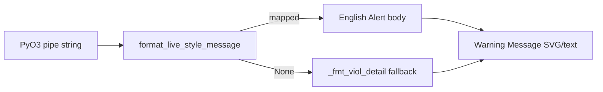

# Plan: ro_check display Live/Scenario alert copy

> **Successor:** Shared JSON source of truth and full migration path live in [`2026-08-24-shared-legality-alert-messages.md`](2026-08-24-shared-legality-alert-messages.md) (design: [`../specs/2026-08-24-shared-legality-alert-messages-design.md`](../specs/2026-08-24-shared-legality-alert-messages-design.md)).

## Goal

`ro_check.py` Warning Message rows use the **same English sentences** as Live/Scenario Alert Center for mapped rules (display-only). Unmapped rules keep today’s `_fmt_viol_detail` field dump.

## Default scope (phase 1)

Map these two first (field parity is clear):

| Rule | PyO3 pipe (today) | Live-style body |
|------|-------------------|-----------------|
| **8072** | `8072\|segment=\|qualified=\|…\|min=\|max=\|…` | `Crew count out of range (Current: {qualified}, Allowed: {min}–{max}).` (en-dash U+2013) |
| **7506** | `7506\|local_day_start=\|groups=\|` | `Multiple check-ins per day ({YYYY-MM-DD}).` |

**Row N:** Live prefixes via `withParamRowPrefix`. PyO3 strings for 8072/7506 **do not** carry `row_index`. Phase 1 **omits** `Row N:` rather than inventing it. (Later: emit `row=` from engine if needed.)

**Out of scope:** reading DB `rule_violation`; changing Rust pipe format; rewriting all rules; PBS solver UX.

**Deferred:** 8030 / 7505 / etc. until pipe fields match Live templates 1:1 (8030 pipe lacks `maxNumber`).

## Approach

Add a small pure-Python mapper next to `ro_check`, then call it from the Warning Message path.



### Files

- **Create** `rule-engine-rs/ro-tests/live_alert_messages.py`
  - `parse_pipe(v) -> (code, dict)`
  - `format_live_style_message(v) -> str | None`
  - Handlers: `_msg_8072`, `_msg_7506` only

- **Modify** `rule-engine-rs/ro-tests/ro_check.py`
  - Where Warning Message builds `detail = _fmt_viol_detail(...)` (≈2606 and console peers ≈3482/3507/3675): prefer `format_live_style_message(v)` when not `None`, else existing formatter
  - Keep `Rule{code}` label prefix as today

- **Create** `rule-engine-rs/ro-tests/test_live_alert_messages.py`
  - 8072 exact string with en-dash
  - 7506 day from `local_day_start` epoch → UTC date `YYYY-MM-DD` (document assumption; match how `local_day_start` is defined in Engine)
  - Unknown code → `None` (fallback)

- **Docs**
  - Spec: `docs/superpowers/specs/2026-08-16-ro-check-live-alert-messages-design.md`
  - Plan mirror: this file

## Verification

```bash
cd rule-engine-rs/ro-tests && python -m pytest test_live_alert_messages.py -q
```

Optional smoke: run an existing `ro_check` fixture that fires 8072/7506 and confirm Warning Message shows the new bodies.

## Non-goals / risks

- Copy can drift from `live-server/scripts/legality-recheck-core.mjs` until a later shared-source effort (option 2). Mitigate: comment in mapper pointing at the Live template line for each rule.
- 7506 date timezone: if `local_day_start` is already a local-midnight UTC instant, formatting as UTC date is correct for zero-offset; verify against one Engine fixture before locking the test.
