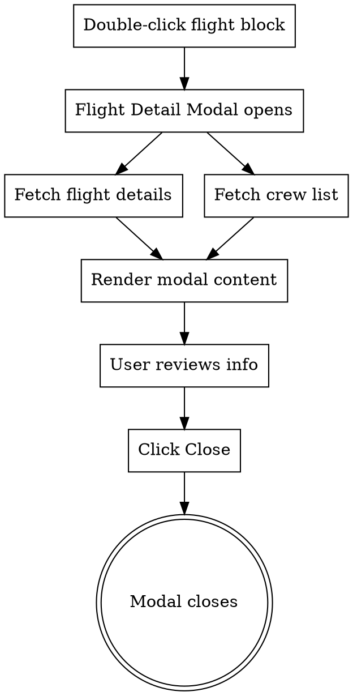

# Flight Detail Modal Design

> Display-only modal showing flight details and crew assignments
> Created: 2026-04-28

## Overview

A modal dialog that displays comprehensive flight information when user double-clicks a flight block in the Flight Pane. Initial implementation is display-only without action buttons functionality.

## User Flow



## Backend Implementation

### New Endpoint: GET /api/flight/:id/crew

**Location:** `live-server/src/routes/flight-route.ts`

**Query:**
```sql
SELECT
  rf.seq_order,
  rf.crew_id,
  c.crew_name,
  c.crew_rank,
  rf.acting_rank,
  rf.label,
  rf.source,
  rf.sch_credited_minutes AS mbh_minutes
FROM roster_flight rf
JOIN crew c ON rf.crew_id = c.crew_id
WHERE rf.flight_id = :id
  AND rf.is_deleted = 0
ORDER BY rf.seq_order ASC
```

**Response Schema (Zod):**
```typescript
const FlightCrewItemSchema = z.object({
  seqOrder: z.number(),
  crewId: z.string(),
  crewName: z.string(),
  crewRank: z.string(),
  actingRank: z.string(),
  label: z.string(),
  source: z.enum(['SYSTEM', 'IMPORT', 'MANUAL']),
  mbh: z.string(), // formatted H:MM from minutes
  mfdp: z.string().nullable(), // placeholder for future rule engine integration
})

const FlightCompositionSchema = z.object({
  CA: z.object({ plan: z.number(), actual: z.number() }),
  FO: z.object({ plan: z.number(), actual: z.number() }),
  PU: z.object({ plan: z.number(), actual: z.number() }),
  FA: z.object({ plan: z.number(), actual: z.number() }),
})

const FlightCrewResponseSchema = z.object({
  items: z.array(FlightCrewItemSchema),
  composition: FlightCompositionSchema,
  status: z.enum(['full', 'partial', 'cancelled']),
})
```

**Composition Calculation:**
- Query `flight_composition` table for plan values per rank
- Count actual from crew list items grouped by `acting_rank`
- Status: `full` (all ranks match), `partial` (any under), `cancelled` (flight cancelled)

**Implementation Notes:**
- Endpoint added to existing flight router
- Service method in `flight-service.ts`
- MFDP placeholder returns `null` for now (future rule engine integration)

## Frontend Implementation

### 1. State Management (ui-store.ts)

Add to existing `UiStore` interface:

```typescript
/** Flight detail dialog */
flightDetailOpen: boolean
flightDetailId: number | null

openFlightDetail: (id: number) => void
closeFlightDetail: () => void
```

Implementation in store:

```typescript
// State
flightDetailOpen: false,
flightDetailId: null,

// Actions
openFlightDetail: (id) => set({ flightDetailOpen: true, flightDetailId: id }),
closeFlightDetail: () => set({ flightDetailOpen: false, flightDetailId: null }),
```

### 2. API Client (flight-api.ts)

Add new method:

```typescript
/** Get crew assignment list for a flight */
async getCrewList(id: number): Promise<FlightCrewResponse> {
  return api.get(`/api/flight/${id}/crew`) as Promise<FlightCrewResponse>
}
```

### 3. Types (flight.ts)

Add response types:

```typescript
/** Crew assignment item for flight detail modal */
export interface FlightCrewItem {
  seqOrder: number
  crewId: string
  crewName: string
  crewRank: string
  actingRank: string
  label: string
  source: 'SYSTEM' | 'IMPORT' | 'MANUAL'
  mbh: string
  mfdp: string | null
}

/** Composition counts for flight */
export interface FlightCompositionCounts {
  plan: number
  actual: number
}

export interface FlightComposition {
  CA: FlightCompositionCounts
  FO: FlightCompositionCounts
  PU: FlightCompositionCounts
  FA: FlightCompositionCounts
}

/** Flight crew API response */
export interface FlightCrewResponse {
  items: FlightCrewItem[]
  composition: FlightComposition
  status: 'full' | 'partial' | 'cancelled'
}
```

### 4. Dialog Component (flight-detail-dialog.tsx)

**Location:** `gantt/src/components/flight/flight-detail-dialog.tsx`

**Structure:**
```
Dialog
├── DialogContent (max-w-[860px])
│   ├── Header Section
│   │   ├── Icon (plane)
│   │   ├── Title: #id | flt_num | date
│   │   ├── Badges: composition status + flight type
│   │   └── Close button
│   ├── Body Section (scrollable)
│   │   ├── Route Banner
│   │   │   ├── Dep airport code + name
│   │   │   ├── Arrow with flight number
│   │   │   ├── Arr airport code + name
│   │   │   └── Meta: fleet, reg, airline
│   │   ├── Times Grid
│   │   │   ├── Departure column: STD/ETD/ATD
│   │   │   ├── Arrival column: STA/ETA/ATA
│   │   │   └── Duration row: BH/FT/Date/Status
│   │   ├── Composition Cards
│   │   │   ├── CA card: actual/plan
│   │   │   ├── FO card: actual/plan
│   │   │   ├── PU card: actual/plan
│   │   │   └── FA card: actual/plan
│   │   └── Crew Table
│   │       ├── Columns: Seq, ID, Name, Rank, Acting, Label, Source, MBH, MFDP
│   │       └── Unfilled slot row (if partial)
│   └── Footer Section
│       ├── Updated timestamp + crew count
│       └── Close button
```

**Key Design Elements:**

1. **Route Banner:**
   - Large airport codes (mono font, 22px)
   - Arrow line with flight number centered
   - Meta sidebar: fleet, registration, airline

2. **Times Grid:**
   - Two-column layout with separator
   - Time deltas shown as colored badges (+Xm late, -Xm early)
   - Status colors: green (actual), amber (estimated), red (delayed)

3. **Composition Cards:**
   - Horizontal flex cards for each rank
   - Color-coded: CA=blue, FO=purple, PU=cyan, FA=orange
   - Shows actual/plan with visual indicator for mismatch

4. **Crew Table:**
   - Sticky header with sort columns
   - Scrollable body (max-height 260px)
   - Row stripes + hover highlight
   - Missing crew row shown with warning style

5. **Theme Support:**
   - Inherits app theme via Tailwind classes
   - No hardcoded colors

### 5. Trigger Integration (flight-pane.tsx)

Update `onItemDoubleClick` callback:

```typescript
onItemDoubleClick: (hit) => {
  if (hit.itemId !== null) {
    useUiStore.getState().openFlightDetail(hit.itemId)
  }
}
```

### 6. App Integration (App.tsx)

Add dialog to app root (similar to existing SwapDialog, ShortcutsDialog):

```typescript
<FlightDetailDialog />
```

## File Changes Summary

### Backend (live-server)

| File | Change |
|------|--------|
| `src/routes/flight-route.ts` | Add `GET /flight/:id/crew` endpoint |
| `src/services/flight-service.ts` | Add `getCrewList(id)` method |
| `src/types/flight.ts` | Add `FlightCrewItem`, `FlightCrewResponse` types |

### Frontend (gantt)

| File | Change |
|------|--------|
| `src/stores/ui-store.ts` | Add `flightDetailOpen`, `flightDetailId`, actions |
| `src/services/flight-api.ts` | Add `getCrewList(id)` method |
| `src/types/flight.ts` | Add crew response types |
| `src/components/flight/flight-detail-dialog.tsx` | New component |
| `src/components/panes/flight-pane.tsx` | Update `onItemDoubleClick` |
| `src/App.tsx` | Add `<FlightDetailDialog />` |

## Testing

### Backend Tests

- Unit test for `getCrewList` service method
- Integration test for endpoint response format
- Edge case: flight with no crew assignments
- Edge case: partial composition (missing FA)

### Frontend Tests

- Dialog opens on double-click
- Data loads correctly from both APIs
- Close button dismisses dialog
- Composition cards display correct counts
- Unfilled row appears when partial
- Theme switching works correctly

## Future Enhancements (Not in Initial Scope)

1. **Assign Crew action:** Opens crew selection dialog
2. **Edit action:** Modify flight details
3. **MFDP integration:** Fetch from rule engine
4. **Crew removal:** Remove crew from flight
5. **Keyboard navigation:** Arrow keys in crew table