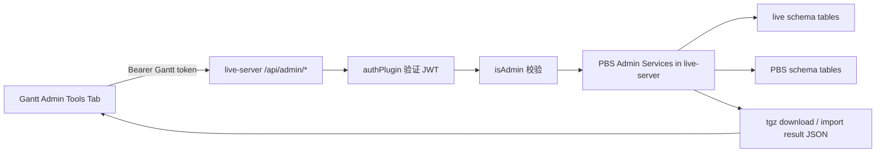

# Gantt PBS Admin Tools API 接管设计

## 背景

当前 `/api/admin/algorithm-export` 与 `/api/admin/crew-bid-imports*` 系列接口实现位于 `pbs-server`，但用户明确要求后续这些管理接口归属 Gantt 管理端体系，`pbs-server` 后续会删除这些接口。Gantt 用户不应再输入或携带 PBS admin token，而应使用当前 Gantt 登录 token。

现有 Gantt 工作树已经有一份 PBS 管理端导航骨架设计：

- `docs/superpowers/specs/2026-06-17-gantt-pbs-admin-navigation-design.md`
- 目标是新增顶部 `PBS` 导航、左侧 `Period` 子导航，以及 `gantt/src/components/pbs/pbs-view.tsx` 占位内容区。

本设计在该骨架之上继续扩展：在 `PBS > Period` 内容区新增 `Admin Tools` tab，并由 `live-server` 接管原本位于 `pbs-server` 的 PBS admin API。

## 目标

1. 在 Gantt 的 `PBS > Period` 页面内容区新增一个 tab：`Admin Tools`。
2. `Admin Tools` 页面提供按钮和表单，直接调用 Gantt/live-server 后端接口。
3. 后端接口使用 Gantt 当前 `Authorization: Bearer <gantt-token>` 鉴权。
4. 所有接口要求 `request.authUser?.isAdmin` 为真，否则返回 403。
5. `live-server` 接管以下接口路径与语义：

```text
GET    /api/admin/algorithm-export
GET    /api/admin/algorithm-export/yeg-test-package
POST   /api/admin/crew-bid-imports/dry-run
POST   /api/admin/crew-bid-imports
GET    /api/admin/crew-bid-imports
GET    /api/admin/crew-bid-imports/:runId
DELETE /api/admin/crew-bid-imports/:runId
```

6. `pbs-server` 仅作为本次迁移的参考实现；完成验证后，后续可以删除 `pbs-server` 中同名路由。
7. 不在浏览器存储 PBS token，不在代码中硬编码 PBS token，不通过 Gantt 前端直连 `pbs-server`。

## 非目标

- 不新增 PBS Portal 页面。
- 不把 Gantt 前端直接连到 `pbs-server`。
- 不设计新的 PBS token 登录流程。
- 不在本次修改数据库 schema。
- 不改变 crew bid TXT 文件格式、algorithm export 文件内容或导入业务规则。
- 不把这些接口做成通用公开 API；它们仍然是 admin-only 运维/管理工具。
- 不在本次删除 `pbs-server` 路由；删除应在 Gantt/live-server 验证通过后单独执行。

## 命名与入口

推荐名称：

```text
Admin Tools
```

页面层级：

```text
Top Nav: PBS
Sidebar: Period
Content Tabs: Period / Admin Tools
```

第一版可保留 `Period` tab 为空白或原占位内容，在同一内容区新增 `Admin Tools` tab。这样不会把管理接口提升为新的一级导航，也符合“就在 PBS Period 页面下面增加一个 tab 页面”的要求。

## 方案对比

### 方案 A：推荐，live-server 接管路由与服务

Gantt 前端调用 `live-server` 的 `/api/admin/...`，`live-server` 使用 Gantt token 校验 admin 权限，并直接执行 algorithm export 与 crew bid import 逻辑。

优点：

- 满足“接口属于 Gantt，不属于 pbs-server”的目标。
- 前端只使用 Gantt token。
- 未来删除 `pbs-server` 同名接口时，Gantt 功能不受影响。
- 与 live-server 已有 `/api/admin/violations-init`、`/api/admin/manday-credit-refresh` 等管理路由风格一致。

代价：

- 需要把 `pbs-server` 里相关 service、parser、export helper 迁移或复制到 `live-server`。
- `live-server` 需要增加 multipart 文件上传支持。

### 方案 B：抽 shared package 再双端复用

把 algorithm export 与 crew bid import service 抽到共享包，再由 `pbs-server` 和 `live-server` 同时引用。

优点：

- 迁移期间不会出现两份逻辑。
- 长期边界更清晰。

代价：

- 当前仓库只有 `packages/ui`，新增服务共享包会引入 package 边界、构建和引用约定。
- 用户已经确认 `pbs-server` 后续会删这些接口，临时双端复用价值有限。

### 方案 C：Gantt 前端直连 pbs-server

Gantt 页面输入 PBS baseURL/token，直接调用 `pbs-server`。

不推荐。它与用户最新要求相反，也会把 PBS admin token 暴露到浏览器。

结论：采用方案 A。迁移实现时可以先按现有 `pbs-server` 代码等价迁移到 `live-server`，验证通过后再计划删除 `pbs-server` 同名路由，避免一次性迁移造成不可回滚风险。

## 后端设计

### 路由归属

在 `live-server` 新增两个 admin route 文件：

```text
live-server/src/routes/admin/pbs-algorithm-export.ts
live-server/src/routes/admin/pbs-crew-bid-imports.ts
```

在 `live-server/src/index.ts` 中按现有模式注册：

```typescript
await server.register(pbsAlgorithmExportAdminRoutes, { prefix: '/api/admin' })
await server.register(pbsCrewBidImportsAdminRoutes, { prefix: '/api/admin' })
```

所有 route 使用 live-server 全局 `authPlugin` 注入的 `request.authUser`，并在 route 内校验：

```typescript
if (!request.authUser?.isAdmin) {
  return reply.status(403).send({ code: 403, data: null, message: 'Admin access required' })
}
```

### Multipart 支持

`live-server` 当前没有 `@fastify/multipart` 依赖，而 crew bid import 需要 `multipart/form-data`。实现时需要：

- 在 `live-server/package.json` 增加 `@fastify/multipart`。
- 在 `live-server/src/index.ts` 注册 multipart 插件。
- 文件限制沿用 `pbs-server` 当前限制：
  - `files: 1`
  - `fileSize: 25 * 1024 * 1024`
  - `fields: 16`
  - `parts: 20`

该依赖属于 Fastify 官方生态，许可与来源符合当前依赖安全规范。

### Service 迁移范围

建议在 `live-server` 中新增：

```text
live-server/src/services/pbs-admin/algorithm-export/
live-server/src/services/pbs-admin/crew-bid-import/
```

迁移来源为：

```text
pbs-server/src/services/algorithm-export/
pbs-server/src/services/crew-bid-import/
pbs-server/src/routes/algorithm-export.ts
pbs-server/src/routes/crew-bid-imports.ts
```

迁移原则：

- 优先保持业务行为等价，避免边迁移边重写业务规则。
- 使用 `live-server` 的 `fastify.pgPool` 与 `fastify.db`。
- `pbsSchema` 使用 `env.PBS_SCHEMA`。
- `liveSchema` 使用 `env.PBS_SCHEMA.replace(/_pbs$/i, '')`，与 `pbs-server` 当前做法一致。
- 保留 schema 名校验，避免拼接 SQL 时接受非法 schema。
- route 响应格式沿用 live-server 的 `{ code, data, message }`，文件下载接口保留二进制响应与 `Content-Disposition`。

### 接口契约

#### `GET /api/admin/algorithm-export`

Query：

```text
periodCode: string, required
```

行为：

- 导出当前 period 的 PBS algorithm package。
- 响应为 `.tgz` 文件。
- `Content-Type: application/gzip`
- 文件名沿用现有格式：`pbs-algorithm-export-<period>.tgz`

#### `GET /api/admin/algorithm-export/yeg-test-package`

Query：

```text
periodCode: string, required
```

行为：

- 导出 YEG 14 crew 测试包。
- 响应为 `.tgz` 文件。
- 文件名沿用现有格式：`pbs-algorithm-export-yeg-14-<period>.tgz`

#### `POST /api/admin/crew-bid-imports/dry-run`

Request：

```text
Content-Type: multipart/form-data
file: TXT file, required
periodCode: string, required
sourcePeriodCode?: string
scopeBase?: string
scopeCategories?: JSON string array
scopeCrewIds?: JSON string array
options?: JSON string object
confirm?: boolean-like string
```

行为：

- 只解析和验证，不写入正式 bid。
- 返回导入 summary、items、problems。
- `mode` 为 `dry_run`。

#### `POST /api/admin/crew-bid-imports`

Request 同 dry-run，但正式导入必须传：

```text
confirm=true
```

行为：

- 写入 bid 相关表。
- 创建 import run。
- 保存可回滚的 backup。
- 返回导入结果，成功状态码建议保持 201 或用 `{ code: 200/201 }` 与现有 response helper 对齐。

#### `GET /api/admin/crew-bid-imports`

Query：

```text
periodCode?: string
limit?: number
```

行为：

- 查询历史 import runs。
- 用于页面 run list。

#### `GET /api/admin/crew-bid-imports/:runId`

行为：

- 查询单个 import run 的 summary、items、problems 和 rollback 状态。

#### `DELETE /api/admin/crew-bid-imports/:runId`

Body：

```json
{
  "confirm": true,
  "restorePrevious": true
}
```

行为：

- 当前 pbs-server 实现语义是 rollback/clear import run，不是普通删除。
- UI 按钮不应只叫 `Delete`，推荐显示为 `Rollback` 或 `Rollback Run`。
- 必须弹出确认，说明会删除本次导入的 bid，并可按 `restorePrevious` 恢复之前快照。

## 前端设计

### 文件范围

预计新增或修改：

```text
gantt/src/components/pbs/pbs-view.tsx
gantt/src/components/pbs/pbs-admin-tools.tsx
gantt/src/services/pbs-admin-tools-api.ts
```

如实现时需要拆分，可以再新增：

```text
gantt/src/components/pbs/pbs-admin-tools.types.ts
gantt/src/components/pbs/pbs-admin-run-detail.tsx
gantt/src/components/pbs/pbs-admin-import-result.tsx
```

### 页面结构

`PbsView` 负责 `PBS > Period` 工作区。内容区顶部建议：

```text
PBS Period
[Period] [Admin Tools]
```

`Admin Tools` tab 内部分为三块工作区：

1. Algorithm Export
2. Crew Bid Import
3. Import Runs

不要做营销式说明页，不做大 hero，不使用假的数据。该页面是内部管理工具，应保持密集、清晰、可扫描。

### Algorithm Export 区域

控件：

- `Period Code` 输入框或选择框。
  - 可复用 `GET /api/pbs/periods` 加载现有 period options。
  - 允许手动输入，避免新 period 尚未出现在列表时无法导出。
- `Export Current Package` 按钮。
- `Export YEG Test Package` 按钮。

状态：

- `periodCode` 为空时按钮 disabled。
- 请求中显示 loading。
- 下载失败时显示错误消息。
- 成功时由浏览器下载 `.tgz` 文件。

### Crew Bid Import 区域

控件：

- `Period Code`，必填。
- `Source Period Code`，选填。
- `File`，必填，字段名固定为 `file`。
- `Scope Base`，选填，例如 `YEG`。
- `Scope Categories`，选填，可用逗号/换行输入，前端转换为 JSON string array。
- `Scope Crew IDs`，选填，可用逗号/换行输入，前端转换为 JSON string array。
- Options checkbox：
  - `useCurrentBidWhenAvailable`
  - `fallbackToDefaultBid`
  - `firstPairingBidGroupOnly`
  - `overwriteCurrentBid`
  - `failOnUnmatchedPairing`
- `Dry Run` 按钮。
- `Import` 按钮。

交互：

- `Dry Run` 不需要 `confirm=true`。
- `Import` 必须二次确认，并由前端提交 `confirm=true`。
- 没有文件或没有 `periodCode` 时两个按钮 disabled。
- 导入结果展示 summary、problems 和 item table。
- `problems` 中 `severity=error` 与 `severity=warning` 要有清晰区分。

### Import Runs 区域

控件：

- `Period Code` filter，可选。
- `Limit` input，默认可由后端决定或前端给 `20`。
- `Refresh` 按钮。
- run list table。

表格建议列：

```text
Run ID
Period
Source Period
Mode
Status
Ready / Imported / Failed
Created By
Created At
Actions
```

Actions：

- `View Detail`：调用 `GET /api/admin/crew-bid-imports/:runId`。
- `Rollback`：调用 `DELETE /api/admin/crew-bid-imports/:runId`，必须确认。

## 数据流



## 错误处理

后端：

- 401：Gantt token 缺失或失效，由全局 authPlugin 返回。
- 403：非 admin 用户访问。
- 400：缺少 `periodCode`、非法 multipart、非法 JSON 字符串数组、缺少文件、`confirm` 非法。
- 404：`runId` 不存在。
- 409：run 已 rollback 等冲突。
- 500：导出或导入内部错误。

前端：

- 所有 action 显示独立 loading，不阻塞整个页面。
- 下载类接口失败时，如果返回 JSON error，需要读出 message；如果不是 JSON，显示通用错误。
- 文件上传失败后保留用户已填参数，方便修正后重试。
- 不在 console 输出 token、文件全文、crew bid 原始文本。

## 安全与权限

- 所有接口只接受 Gantt token。
- `pbs-server` admin token 不出现在前端、配置和日志中。
- live-server route 必须检查 `request.authUser?.isAdmin`。
- 文件上传限制 25MB，防止超大文件压垮服务。
- 后端日志只记录 runId、periodCode、triggeredBy、统计数量，不记录 TXT 文件全文。
- schema 名必须来自环境配置并经过校验，不接受前端传 schema。

## 测试计划

### live-server 后端测试

建议新增 Vitest：

```text
live-server/src/routes/admin/pbs-algorithm-export.test.ts
live-server/src/routes/admin/pbs-crew-bid-imports.test.ts
```

覆盖：

- 无 token 返回 401。
- 非 admin 返回 403。
- admin 缺 `periodCode` 返回 400。
- algorithm export 成功返回 gzip 与 attachment filename。
- dry-run multipart 成功调用 service。
- 正式 import 缺 `confirm=true` 返回 400。
- runs list、run detail、rollback 调用正确 service。
- multipart 非 `file` 字段返回 400。
- 超大文件返回 400。

### Gantt 前端验证

建议执行：

```bash
cd /Users/lei/Codehub/rois-ai/gantt
npx tsc --noEmit
```

手工验证：

1. 登录 Gantt admin 账号。
2. 打开顶部 `PBS`。
3. 进入左侧 `Period`。
4. 切换到 `Admin Tools` tab。
5. 输入 `Jun 2026`，点击 `Export Current Package`，确认下载 `.tgz`。
6. 点击 `Export YEG Test Package`，确认下载 `.tgz`。
7. 上传 crew bid TXT，先执行 `Dry Run`，确认 summary/problems/items 显示。
8. 勾选确认后执行正式 `Import`，确认返回 runId。
9. 刷新 runs list，查看详情。
10. 对测试 run 执行 `Rollback`，确认二次确认与结果展示。

### live-server 构建验证

建议执行：

```bash
cd /Users/lei/Codehub/rois-ai/live-server
npm run build
```

如新增依赖，需同步检查：

```bash
cd /Users/lei/Codehub/rois-ai/live-server
npm audit --omit=dev
```

## 迁移与删除策略

第一阶段：

- `live-server` 增加同名 `/api/admin/...` 接口。
- Gantt `Admin Tools` 只调用 live-server。
- `pbs-server` 保持现状，不删除。

第二阶段：

- 用真实 admin token 登录 Gantt，完成导出、dry-run、正式 import、run list、detail、rollback 验证。
- 对比 `pbs-server` 原接口与 `live-server` 新接口关键结果一致。

第三阶段：

- 删除 `pbs-server` 中同名 route 注册和对应 admin-only endpoint。
- 如果 `pbs-server` 中 service 不再被其他 PBS 功能使用，再清理服务文件和测试。
- 删除前单独写清理计划，避免误删 PBS Portal 仍需要的非 admin bid 功能。

## 关键假设

- `live-server` 的 `DATABASE_URL` 能访问 live schema 和 `env.PBS_SCHEMA` 指向的 PBS schema。
- `env.PBS_SCHEMA` 默认类似 `f8_pbs`，live schema 可通过去掉 `_pbs` 得到 `f8`。
- Gantt 登录用户 payload 中 `isAdmin` 可用于管理权限判断。
- 现有 PBS import/export 业务逻辑仍以 `pbs-server` 当前实现为准。
- `PBS > Period` 导航骨架会保留，`Admin Tools` 只作为 Period 内容区内的 tab。

## Multi-Agent Parallelism Assessment

- Recommendation: No
- Rationale: 这次虽然跨 `gantt` 与 `live-server`，但后端服务迁移、接口契约、前端调用和 UI 状态强相关；拆多 agent 容易造成接口命名、响应格式和迁移范围不一致。
- Suggested split: 暂不拆分。主线按“后端服务接管 → 前端 Admin Tools → 验证”顺序推进。
- Write boundaries: `live-server/src/routes/admin/*`、`live-server/src/services/pbs-admin/*`、`live-server/package.json`、`gantt/src/components/pbs/*`、`gantt/src/services/*`。
- Conflict risk: 中等。当前工作树已有 PBS 导航骨架未提交，继续实现时必须基于现有改动，不可覆盖。
- Execution gate: 用户审阅并确认本 spec 后，再进入实现。

## 验收标准

1. `PBS > Period` 内容区出现 `Admin Tools` tab。
2. 非 admin Gantt 用户访问相关接口返回 403。
3. Admin Gantt 用户可以从页面下载 current algorithm package。
4. Admin Gantt 用户可以从页面下载 YEG test package。
5. Admin Gantt 用户可以上传 crew bid TXT 并执行 dry-run。
6. Admin Gantt 用户可以在确认后执行正式 import。
7. 页面可以列出 import runs。
8. 页面可以查看 run detail。
9. 页面可以对测试 run 执行 rollback。
10. 前端不需要 PBS token。
11. 浏览器网络请求只访问 Gantt/live-server 的 `/api/admin/...`。
12. `pbs-server` 同名接口即使未来删除，Gantt Admin Tools 的接口归属仍然成立。
