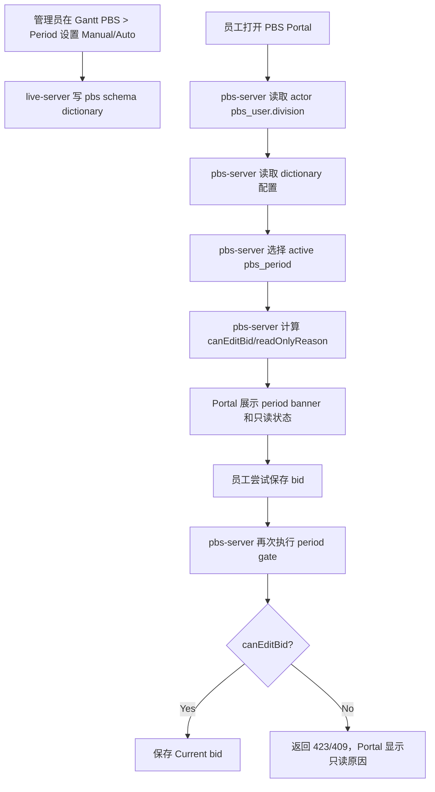

# PBS Portal Active Period Lifecycle Design

> 日期：2026-06-30  
> 范围：`pbs-portal`、`pbs-server`、`gantt` PBS 管理页、`live-server` PBS period admin  
> 目标阶段：Phase 1 — 让 `pbs_period` 真正控制员工侧 PBS Portal 当前周期与是否可申请  
> 参考文档：`init-docs/Crew Planning PBS work flow Ver2.docx`

## 1. 背景

现有 `PBS > Period` 管理页已经能维护 `pbs_period`：

- `period_code`：例如 `Jun 2026`
- `filiale`
- `division`
- `bid_open_at`
- `bid_close_at`
- `max_tiers`
- `status`

PBS Portal 现有 Pairing / Days Off / Line / Reserve / Tier / Dashboard 也已经在很多数据结构中携带 `periodId` / `periodCode`，`pbs-server` 也已有 `resolveCurrentPeriod` 逻辑。

但当前实现还没有完整做到：

1. Portal 员工侧严格按 `pbs_period` 的开放窗口决定是否可编辑和提交 bid。
2. 管理端可以在测试环境指定 Portal 显示哪个周期。
3. 周期选择按 crew `division` 区分，避免 Cabin / Pilot / Airmarshal 混用周期。
4. 所有写接口在后端统一门禁，不能只靠前端禁按钮。

用户已确认本阶段先做 Phase 1，不做完整自动化生命周期。

## 2. 用户确认的产品决策

### 2.1 Portal 显示周期

Portal 当前显示哪个 bid period 由管理端配置控制：

- 默认模式：`Automatic`
- 测试/受控模式：`Manual`

`Manual` 只控制“Portal 显示哪个周期”，不直接绕过申请时间规则。

### 2.2 是否可申请

是否允许员工编辑或提交 bid，只由目标 `pbs_period` 自身决定：

- `status = OPEN`
- `bid_open_at <= businessNow <= bid_close_at`

如果管理员想让测试人员现在申请 `Jun 2026`，正确做法是：

1. 管理端指定 `Jun 2026` 为 Portal Active Period。
2. 把 `Jun 2026` 的 `status` 调为 `OPEN`。
3. 把 `bid_open_at` / `bid_close_at` 调整到当前业务时间窗口内。

### 2.3 按 division 分开配置

Manual Active Period 必须按 `filiale + division` 分开：

- Cabin 用户只看 Cabin 周期。
- Pilot 用户只看 Pilot 周期。
- Airmarshal 用户只看 Airmarshal 周期。

这与 `pbs_period` 唯一键 `(period_code, filiale, division)` 保持一致。

## 3. 业务生命周期解释

从业务上看，PBS 周期不是“当前日历月”，而是“下一个排班月的申请窗口”。

以 `2026-06-30` 为例：

- `Jul 2026` 的申请窗口通常是 `2026-06-05` 到 `2026-06-12`，已经关闭。
- `Aug 2026` 的申请窗口通常是 `2026-07-03` 到 `2026-07-10`，尚未开放。
- 自动模式下 Portal 应显示 `Aug 2026`，但只读，提示 `Opens Jul 3`。
- 如果测试环境没有 `Aug 2026` 数据，管理员可以 Manual 指定 `Jun 2026`。
- `Jun 2026` 是否可编辑，仍看 `Jun 2026` 自己的 `OPEN/open/close` 配置。

## 4. 目标

### 4.1 员工侧目标

Portal 每个业务页面都能明确告诉员工：

- 当前工作的是哪个 bid period。
- 这个 period 是否可申请。
- 如果不可申请，原因是什么：
  - 还未开放
  - 已关闭
  - 状态不是 `OPEN`
  - 当前用户缺少 division 或没有可用周期

### 4.2 管理端目标

管理员可以在 `gantt` 的 `PBS > Period` 管理页为每个 `filiale + division` 配置 Portal Active Period：

- `Automatic`
- `Manual`
- Manual 时选择具体 `pbs_period.id`

管理员仍通过编辑 `pbs_period.status`、`bid_open_at`、`bid_close_at` 控制是否可申请。

### 4.3 后端目标

`pbs-server` 成为员工侧周期判定权威：

- 统一解析 actor 的 division。
- 统一选择 active period。
- 统一计算 `canEditBid`。
- 所有 bid 写接口复用同一个门禁。

`live-server` / `gantt` 只负责管理端写配置，不在员工侧运行时调用 `pbs-server` 或推断周期。

## 5. 非目标

Phase 1 不做以下内容：

- Pairing 变更后自动延长 2 天。
- Crew 通知中心或消息推送。
- 自动定时把 `DRAFT -> OPEN -> CLOSED`。
- Award run / publish 自动化。
- Captain / FO / IFD / FA 分阶段 run lock。
- NOC 调整结果自动回写 PBS。

这些属于 Phase 2+ 的生命周期自动化。

## 6. 当前实现差距

### 6.1 `pbs-server` 当前问题

当前 `resolveCurrentPeriod` 已经查 `pbs_period`，但存在两个关键差距：

1. 未按 actor 的 `division` 过滤。
2. 返回的 period context 只有 `periodId` / `periodCode`，没有：
   - `status`
   - `bidOpenAt`
   - `bidCloseAt`
   - `canEditBid`
   - `readOnlyReason`
   - `selectionMode`

因此 Portal 页面目前更像是在使用 “periodCode 月份标签”，还不是严格生命周期门禁。

### 6.2 `pbs-portal` 当前问题

Portal 多个页面已经展示或传递 `periodCode`，但还没有统一的 period banner / read-only gate：

- Dashboard Bidding Calendar
- Pairing
- Days Off
- Line
- Reserve
- Tier

页面保存按钮和交互入口需要按统一的 `canEditBid` 控制。

### 6.3 管理端当前问题

`gantt/src/components/pbs/pbs-period-view.tsx` 目前只维护 period 列表和年度生成，没有 Portal Active Period 配置。

另外，`Admin Tools` 的 period 下拉当前来自 `pbs_bid.period_code` 去重，而不是 `pbs_period`。这和 “period 是周期控制中心” 的方向不完全一致，但不是 Phase 1 必须立即修复的主链路。

## 7. 推荐方案

### 7.1 周期选择服务

在 `pbs-server` 中建立统一的 period resolver，替代散落的 `resolveCurrentPeriod` 简单查询。

输入：

- actor `crewId`
- actor `userCode`
- businessNow

内部步骤：

1. 从 `pbs_user` 查询 actor 的 `division`。
2. 推导当前部署 filiale。
   - 当前 `PBS_SCHEMA=f8_pbs`，可先按 `F8` 推导。
   - 未来多航司部署如需要，可新增显式 `PBS_FILIALE` 环境变量，但 Phase 1 不强制引入。
3. 读取 `dictionary` 中的 Portal Active Period 配置。
4. 如果 mode 是 `Manual` 且 manual period 存在并匹配 `filiale + division`，选择该 period。
5. 否则走 `Automatic`：
   - 优先选当前 `OPEN` 且时间窗口内的 period。
   - 没有当前开放期时，选最近即将开放的 period。
   - 没有未来 period 时，选最近关闭的 period。
6. 计算 `canEditBid` 和只读原因。

输出 `PbsActivePeriodContext`：

```ts
type PbsActivePeriodContext = {
  periodId: number | null
  periodCode: string
  filiale: string | null
  division: 'P' | 'C' | 'A' | null
  status: 'DRAFT' | 'OPEN' | 'CLOSED' | 'AWARDED' | 'PUBLISHED' | null
  bidOpenAt: string | null
  bidCloseAt: string | null
  selectionMode: 'automatic' | 'manual' | 'fallback'
  canEditBid: boolean
  readOnlyReason:
    | null
    | 'not_open'
    | 'not_yet_open'
    | 'closed'
    | 'no_period'
    | 'missing_division'
    | 'manual_period_invalid'
}
```

### 7.2 配置存储

复用现有 `dictionary` 模式，避免新增孤立参数表。

建议配置项：

```text
parent_code = 'SYS_PARAM'
code = 'PBS_PORTAL_ACTIVE_PERIOD_MODE_F8_C'
code_value = 'AUTO' | 'MANUAL'

parent_code = 'SYS_PARAM'
code = 'PBS_PORTAL_ACTIVE_PERIOD_ID_F8_C'
code_value = '<pbs_period.id>'
```

同理：

- `PBS_PORTAL_ACTIVE_PERIOD_MODE_F8_P`
- `PBS_PORTAL_ACTIVE_PERIOD_ID_F8_P`
- `PBS_PORTAL_ACTIVE_PERIOD_MODE_F8_A`
- `PBS_PORTAL_ACTIVE_PERIOD_ID_F8_A`

说明：

- Manual 存 `pbs_period.id`，不用 `period_code`，避免名称变更或同名跨 division 混淆。
- 如果 Manual 指向的 period 被删除或 division 不匹配，Portal fallback 到 Automatic，并记录 warning。
- 配置写入由管理端完成，Portal 只读取解析后的结果。

### 7.3 后端写接口门禁

所有会修改 Current bid 的接口必须调用统一门禁：

```ts
assertCanEditCurrentBid(periodContext)
```

门禁失败返回业务错误，例如：

```json
{
  "code": 423,
  "data": null,
  "message": "Bidding is closed for Jun 2026."
}
```

建议状态码：

- `423 Locked`：period 存在但当前只读。
- `409 Conflict`：请求携带的 `periodId/periodCode` 与当前 active period 不一致。
- `400 Bad Request`：请求缺少必要 period identity。

必须覆盖的写入口：

- Pairing bid create/update/delete/favorite mutation
- Days Off bid create/update/delete/favorite mutation
- Line bid create/update/delete/favorite mutation
- Reserve bid create/update/delete/favorite mutation
- Full draft save / submit 类接口

### 7.4 Portal 前端表现

Portal 共享工作台增加统一的 period 状态显示：

示例：

```text
Aug 2026 · Opens Jul 3, 2026 00:00 · Read-only
```

或：

```text
Jun 2026 · OPEN · Closes Jun 30, 2026 23:59
```

页面行为：

- `canEditBid=true`：保持现有编辑体验。
- `canEditBid=false`：
  - 新增/编辑/删除/提交按钮 disabled。
  - 配置弹窗不可打开或打开为只读，优先禁入口。
  - Dashboard calendar 仍展示已保存 bid 和只读事件。
  - 保存接口如果被直接调用，后端仍拒绝。

文案保持英文 UI：

- `Bidding opens on ...`
- `Bidding closed on ...`
- `This bid period is not open for editing.`
- `Contact Crew Planning if this period looks incorrect.`

### 7.5 管理端 UI

在 `gantt` 的 `PBS > Period` 页面增加一个配置区，例如：

```text
Portal Active Period
Division: Cabin / Pilot / Airmarshal
Mode: Automatic / Manual
Manual Period: Jun 2026
```

显示规则：

- Manual Period 下拉只列出当前 division 的 `pbs_period`。
- 下拉项显示：
  - `Jun 2026 · C · OPEN · May 1 - May 8`
  - `Jul 2026 · C · CLOSED · Jun 5 - Jun 12`
- 保存后提示：
  - `Portal active period updated. Editability still follows period status and bid window.`

不在这个配置区提供 “force editable” 开关。

## 8. 数据流



## 9. 接口契约建议

### 9.1 员工侧响应扩展

所有 Current draft / summary / calendar 响应应携带统一 `activePeriod` 或等价字段。

推荐新增：

```ts
type PbsActivePeriodInfo = {
  periodId: number | null
  periodCode: string
  filiale: string | null
  division: 'P' | 'C' | 'A' | null
  status: string | null
  bidOpenAt: string | null
  bidCloseAt: string | null
  selectionMode: 'automatic' | 'manual' | 'fallback'
  canEditBid: boolean
  readOnlyReason: string | null
}
```

兼容策略：

- 保留现有顶层 `periodId` / `periodCode` 字段，避免一次性打断所有页面。
- 新增 `activePeriod`，前端逐步迁移到 `activePeriod`。

### 9.2 管理端接口

建议 `live-server` 继续提供管理端接口，因为当前 `gantt` PBS Period 管理页已经走 `live-server`：

- `GET /api/pbs/period-admin/portal-active-period`
- `PUT /api/pbs/period-admin/portal-active-period`

请求：

```json
{
  "filiale": "F8",
  "division": "C",
  "mode": "MANUAL",
  "manualPeriodId": 42
}
```

响应：

```json
{
  "filiale": "F8",
  "division": "C",
  "mode": "MANUAL",
  "manualPeriodId": 42,
  "manualPeriod": {
    "id": 42,
    "periodCode": "Jun 2026",
    "status": "OPEN",
    "bidOpenAt": "2026-06-01T00:00:00.000Z",
    "bidCloseAt": "2026-07-05T23:59:00.000Z"
  }
}
```

## 10. 错误与边界场景

### 10.1 无 division

如果 `pbs_user.division` 为空：

- Portal 显示只读。
- 后端写接口拒绝。
- 提示：`Unable to determine your crew division. Contact Crew Planning.`

### 10.2 Manual period 不存在

如果 dictionary 指向的 period 已删除：

- Resolver fallback 到 Automatic。
- 返回 `selectionMode='fallback'`。
- 管理端配置区显示 warning。

### 10.3 Manual period division 不匹配

如果 Cabin 配置误指向 Pilot period：

- 不使用该 manual period。
- fallback 到 Automatic。
- 管理端保存时也应阻止这类配置。

### 10.4 请求 period 与当前 active period 不一致

例如前端持有旧页面缓存，保存 `Jun 2026`，但当前 active period 已切到 `Aug 2026`：

- 后端返回 `409 Conflict`。
- 前端提示重新加载。

### 10.5 周期关闭后页面仍停留

如果用户打开页面时可编辑，但关闭时间到达后仍在页面上：

- 前端下次查询应刷新为只读。
- 后端写接口立即拒绝，不能等前端刷新。

## 11. 验收标准

### 11.1 自动模式

- 当存在当前开放周期时，Portal 显示该周期并允许编辑。
- 当无开放周期但有未来周期时，Portal 显示最近未来周期，只读。
- 当无未来周期时，Portal 显示最近关闭周期，只读。
- 选择周期必须匹配当前用户 division。

### 11.2 Manual 模式

- 管理员可按 division 指定 Portal Active Period。
- Portal 显示管理员指定周期。
- 指定周期未开放或已关闭时，Portal 只读。
- 指定周期为 `OPEN` 且当前时间在窗口内时，Portal 允许编辑。

### 11.3 后端门禁

- `canEditBid=false` 时，所有 Current bid 写接口拒绝。
- 直接绕过 UI 调 API 也无法保存。
- period mismatch 返回明确错误。

### 11.4 UI

- Dashboard / Pairing / Days Off / Line / Reserve / Tier 共享相同 active period。
- 每个页面都不会出现一个页面 `Jun 2026`、另一个页面 `Aug 2026` 的不一致。
- Portal UI 文案为英文。

## 12. 测试策略

### 12.1 pbs-server 自动化测试

新增或更新测试：

- resolver 自动模式选择当前 OPEN 周期。
- resolver 没有 OPEN 时选择未来周期。
- resolver manual 模式按 division 选择指定 period。
- manual 指向错误 division 时 fallback。
- `canEditBid=false` 时写接口返回拒绝。
- period mismatch 时返回 `409`。

### 12.2 pbs-portal 自动化测试

新增或更新测试：

- Period banner 显示 `periodCode/status/open/close`。
- `canEditBid=false` 时按钮 disabled。
- `canEditBid=true` 时保留现有编辑路径。
- 页面切换时共享 active period 不重置。

### 12.3 E2E / QA

新增 QA 文档：

`docs/test-cases/pbs/period-lifecycle/2026-06-30-portal-active-period-lifecycle.md`

覆盖：

- Automatic 当前期
- Automatic 未来期
- Manual 指定历史期
- Manual 指定期可申请
- Manual 指定期不可申请
- 周期关闭后保存失败

## 13. Multi-Agent Parallelism Assessment

- Recommendation: Yes
- Rationale: 该任务横跨 `pbs-server`、`pbs-portal`、`gantt/live-server` 管理端和测试文档，适合拆分，但 contract 必须由主 agent 统一。
- Suggested split:
  - Agent A：`pbs-server` active period resolver、contract、write gate、tests。
  - Agent B：`pbs-portal` period banner、只读态、页面集成、tests。
  - Agent C：`gantt/live-server` 管理端 Manual/Auto 配置 UI/API、tests。
  - Agent D：QA 测试案例和回归矩阵。
- Write boundaries:
  - A 只写 `pbs-server/src/**`、`packages/contracts/**` 中 period contract 部分。
  - B 只写 `pbs-portal/src/**`。
  - C 只写 `gantt/src/components/pbs/**`、`gantt/src/services/**`、`live-server/src/routes/pbs/**`。
  - D 只写 `docs/test-cases/pbs/**`。
- Conflict risk: Medium。`packages/contracts` 和 shared period type 是主要冲突点，需主 agent 先定义。
- Execution gate: 只有用户确认本 spec 后，才能进入实施计划和代码实现。

## 14. 实施顺序建议

1. 定义 active period contract。
2. 改 `pbs-server` resolver，让它按 actor division + Manual/Auto 配置选择周期。
3. 把 `canEditBid` 门禁接入所有 Current bid 写接口。
4. 扩展 Portal 共享工作台展示 active period。
5. 禁用 Portal 编辑入口。
6. 增加 Gantt 管理端 Manual/Auto 配置。
7. 补测试和 QA 文档。

## 15. 风险

- 当前 `resolveCurrentPeriod` 被多个 service 使用，迁移时必须避免每个 service 自己缓存出不同 period。
- 如果只改前端禁按钮，不改后端写接口，会出现绕过 UI 保存的漏洞。
- 如果 Manual 配置不用 `pbs_period.id`，将来同名跨 division 会混淆。
- 如果不按 division 选周期，Cabin / Pilot 可能互相污染 bid period。
- 如果 `dictionary` 表在某些环境不存在，需要 migration / init 脚本保证它存在。

## 16. 待后续 Phase 2 处理

- Pairing pool 在 OPEN 期间变更时记录事件。
- 自动延长 `bid_close_at` 2 天。
- Portal 通知 crew pairing 发生变更。
- 管理端显示变更历史。
- 自动状态流转。
- Award / Publish 生命周期接入。

