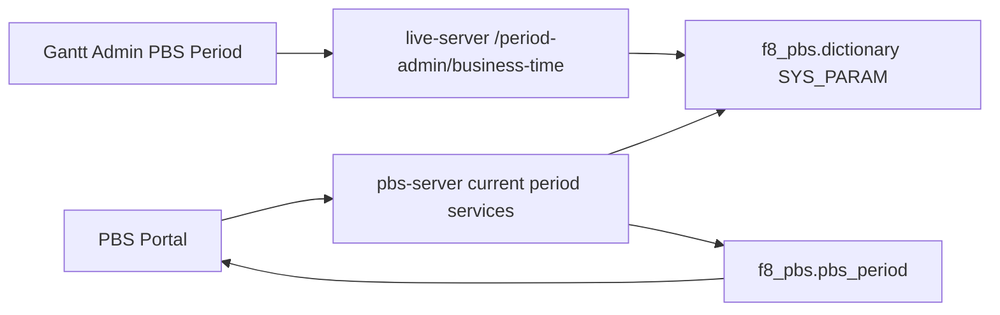

# PBS Business Time 管理端配置设计

日期：2026-07-01  
状态：待确认 / 待实施  
范围：`live-server` 管理端 API、`gantt` PBS Period 管理页面、测试文档

## 背景

PBS Server 已有 `business time` 机制，用于测试或业务模拟时改变 PBS 的“当前业务时间”。现有机制通过 `dictionary/SYS_PARAM` 三个参数控制：

- `PBS_BUSINESS_TIME_MODE`
- `PBS_BUSINESS_TIME_ANCHOR`
- `PBS_BUSINESS_TIME_ANCHOR_REAL`

现有 CLI 已能修改这些参数：

```bash
cd /Users/lei/Codehub/rois-ai/pbs-server
npm run business-time -- status
npm run business-time -- clear
npm run business-time -- 20260703080000
```

当前问题是：Portal Active Period 的 `Automatic` 模式已经按 PBS business time 解析当前周期，但 Gantt 管理端没有显示或修改 business time 的入口。管理员容易以为系统按真实时间选择 period，实际 Portal 可能仍按旧的测试 business time 显示旧月份。

## 目标

1. 在 Gantt `PBS Period` 管理页面新增 `PBS Business Time` 管理卡片。
2. 管理员可查看当前 PBS business time 状态。
3. 管理员可清空 override，让 PBS 使用真实系统时间。
4. 管理员可设置 rolling business time anchor。
5. `Portal Active Period` 的 `Automatic` 文案明确说明：Automatic 使用 PBS Business Time。
6. 不改变现有 Portal / PBS Server 的 current period 解析规则，只补齐管理入口和可见性。

## 非目标

- 不修改服务器系统时间。
- 不新增独立业务表。
- 不把 business time 拆成 C/P/A 各自配置；它是当前 PBS schema 下的全局口径。
- 不实现 `FROZEN` 模式；第一版继续只支持 `ROLLING`。
- 不让审计字段、日志、JWT、cache TTL 使用 business time。
- 不绕过 period 生命周期：是否可申请仍由 `businessNow + pbs_period.status + bid_open_at/bid_close_at` 决定。

## 现有业务规则

PBS business time 第一版语义是 `ROLLING`：

```text
business_now = anchor_business_time + (real_now - anchor_real_time)
```

示例：

```text
PBS_BUSINESS_TIME_ANCHOR      = 2026-07-03T00:00:00.000Z
PBS_BUSINESS_TIME_ANCHOR_REAL = 2026-07-01T01:00:00.000Z
```

设置完成时，PBS 业务时间为 `2026-07-03T00:00:00.000Z`。真实经过 10 分钟后，PBS 业务时间也推进 10 分钟。

`Automatic` period 选择应继续使用现有规则：

1. 优先选择同 `filiale/division` 下 `OPEN` 且 `bid_open_at <= businessNow <= bid_close_at` 的 period。
2. 如果没有开放窗口内的 period，选择未来最近的 period。
3. 如果没有未来 period，选择最近历史 period。
4. 如果没有任何 period，fallback 到只读状态。

## 数据设计

继续复用 `dictionary`：

```text
parent_code = SYS_PARAM
code        = PBS_BUSINESS_TIME_MODE
code_value  = ROLLING
```

```text
parent_code = SYS_PARAM
code        = PBS_BUSINESS_TIME_ANCHOR
code_value  = 2026-07-03T00:00:00.000Z
```

```text
parent_code = SYS_PARAM
code        = PBS_BUSINESS_TIME_ANCHOR_REAL
code_value  = 2026-07-01T01:00:00.000Z
```

清空 override 时保留 key，但将两个 anchor 置空：

```text
PBS_BUSINESS_TIME_MODE        = ROLLING
PBS_BUSINESS_TIME_ANCHOR      = ''
PBS_BUSINESS_TIME_ANCHOR_REAL = ''
```

## API 设计

在 `live-server/src/routes/pbs/period-admin.ts` 中新增两个管理端接口。它们沿用现有 PBS Period 管理接口的认证和返回格式。

### GET `/api/pbs/period-admin/business-time`

用途：读取当前 business time 配置和计算后的状态。

返回数据：

```ts
type PbsBusinessTimeStatus = {
  mode: "ROLLING";
  source: "system" | "override";
  realNow: string;
  businessNow: string;
  anchor: string | null;
  anchorReal: string | null;
  warnings: string[];
};
```

语义：

- `source = system`：anchor 为空或配置非法，PBS 实际使用真实时间。
- `source = override`：anchor 和 anchorReal 有效，PBS 使用 rolling business time。
- `warnings` 用于暴露非法 mode、非法 anchor、非法 anchorReal 等配置问题。

### PUT `/api/pbs/period-admin/business-time`

用途：设置或清空 business time。

清空：

```json
{
  "action": "CLEAR"
}
```

设置：

```json
{
  "action": "SET",
  "businessTimeLocal": "2026-07-03T08:00:00"
}
```

第一版输入按 `Asia/Shanghai` 解释，与现有 CLI 的 `YYYYMMDDHHmmss` 语义保持一致。上面的输入会存成：

```text
PBS_BUSINESS_TIME_ANCHOR = 2026-07-03T00:00:00.000Z
```

保存时同时写：

```text
PBS_BUSINESS_TIME_MODE        = ROLLING
PBS_BUSINESS_TIME_ANCHOR      = 业务时间锚点 UTC ISO
PBS_BUSINESS_TIME_ANCHOR_REAL = 保存动作发生时的真实 UTC ISO
```

错误：

- `400`：缺少 action、非法 action、非法 businessTimeLocal。
- `401/403`：沿用现有 admin 认证逻辑。
- `500`：数据库读写失败。

## UI 设计

在 `gantt/src/components/pbs/pbs-period-view.tsx` 的 `Portal Active Period` 上方新增卡片：

```text
PBS Business Time
Controls the clock used by PBS Automatic period selection and bid window validation.
```

展示字段：

- `Source`: `System Time` / `Override`
- `Mode`: `ROLLING`
- `Real Now`
- `Business Now`
- `Anchor`
- `Anchor Real`
- `Warnings`

操作区：

- `Business Time` 输入框：`datetime-local`
- `Set Business Time`：设置 rolling anchor。
- `Use Real Time`：清空 override。
- `Refresh`：重新读取状态。

显示规则：

- `source = override` 时显示醒目的 `OVERRIDE` badge。
- `source = system` 时显示 `SYSTEM TIME` badge。
- 有 warnings 时使用 amber 提示。
- 保存成功后刷新 business time 状态，并提示用户 PBS Server 有最长约 60 秒缓存延迟。

`Portal Active Period` 卡片文案调整为：

```text
Controls which period the PBS Portal displays. Automatic mode uses PBS Business Time. Bid edits still require the selected period to be OPEN and inside Bid Open/Close.
```

## 数据流



说明：

1. 管理员通过 Gantt 修改 business time。
2. `live-server` 写入 `f8_pbs.dictionary`。
3. `pbs-server` 在 current period、calendar、bid draft 解析时读取同一组 business time 参数。
4. Portal 不直接计算当前时间，只消费后端返回的 `activePeriod`。

## 缓存与一致性

`pbs-server` 的 business clock 当前有短 TTL cache。管理端保存后，Portal 可能最多等待约 60 秒才反映新 business time。

第一版不做跨服务缓存主动失效，原因：

- `live-server` 和 `pbs-server` 已解耦。
- business time 是低频管理操作。
- 当前 TTL 足够短，风险可接受。

UI 需要在保存成功后提示：

```text
Saved. PBS Portal may take up to 60 seconds to reflect the new business time.
```

## 安全与权限

- 只允许 admin 使用。
- 不打印数据库连接串、密码、token。
- 只读写 `dictionary` 中 PBS business time 三个 key。
- 不提供任意 SQL 或任意 dictionary 修改能力。

## 测试计划

### live-server

新增或更新：

```text
live-server/src/__tests__/unit/pbs-period-admin-route.test.ts
```

覆盖：

1. `GET business-time` 在 anchor 为空时返回 `source=system`。
2. `GET business-time` 在 anchor 有效时返回 `source=override` 和计算后的 `businessNow`。
3. `PUT business-time SET` 写入 `ROLLING`、anchor、anchorReal。
4. `PUT business-time CLEAR` 清空两个 anchor。
5. 非法 `businessTimeLocal` 返回 `400`。

### gantt

验证：

1. `npm run build` 通过。
2. `npm run check:ui` 通过且 0 hard violations。
3. 页面可加载 business time 状态。
4. 点击 `Use Real Time` 后状态变为 `SYSTEM TIME`。
5. 设置 `2026-07-03 08:00` 后状态变为 `OVERRIDE`，`Business Now` 接近该值。

### PBS Portal 手工回归

新增 QA 用例：

```text
docs/test-cases/pbs/period/YYYY-MM-DD-business-time-admin.md
```

覆盖：

1. 使用真实时间时，Automatic 按真实时间选择 period。
2. 设置 business time 到 Aug 2026 申请窗口内，Automatic 选择 Aug 2026。
3. 清空 business time 后，Automatic 回到真实时间口径。
4. Manual 指定旧 period 时，如果 business time 不在该 period 窗口内，Portal 仍只读。

## 验收标准

1. 管理端能清楚看到当前 PBS business time 是系统真实时间还是 override。
2. 管理端能设置 business time，并让 Automatic period selection 使用该口径。
3. 管理端能清空 business time，使 PBS 回到真实时间。
4. Portal 显示 period、申请窗口、只读状态与管理端 business time 一致。
5. C/P/A 共用同一个 PBS business time。
6. `Manual Period` 不绕过生命周期校验。

## 风险与处理

| 风险 | 处理 |
| --- | --- |
| 管理员误以为 Manual 可以绕过时间窗口 | UI 文案明确说明 bid edits still require OPEN and inside window |
| 保存后 Portal 没立即变化 | UI 提示 60 秒 TTL；必要时刷新或重启 pbs-server |
| 时区理解混乱 | 输入说明固定为 Asia/Shanghai；展示 UTC ISO 作为辅助 |
| 复制 CLI 逻辑导致口径漂移 | 在 live-server 中实现同等规则，并用 route test 锁定 |

## Multi-Agent Parallelism Assessment

- Recommendation: No
- Rationale: 改动集中在一个管理路由和一个 Gantt 管理页面，串行实现更容易保持接口和 UI 一致。
- Suggested split: 不拆分。
- Write boundaries: `live-server` route/test、`gantt` service/UI/version、QA 文档。
- Conflict risk: 低；主要风险是同时编辑 `period-admin.ts` 和 `pbs-period-view.tsx`。
- Execution gate: 用户确认本 spec 后再开始实现。
