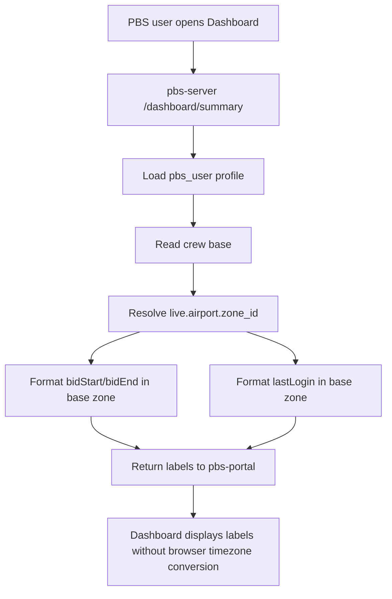

# PBS Dashboard Base Timezone 统一口径设计

## 背景

PBS Dashboard 左侧信息卡当前展示了多类时间信息：

- `BID START`
- `BID END`
- `REMAINING`
- `LAST LOGIN`

页面标题写的是 `BID INFORMATION-LOCAL TIME`，但当前后端实现里部分时间仍按 UTC 格式化：

- `dashboard-profile-service.ts` 的 `lastLoginLabel` 使用 `timeZone: "UTC"` 和 `getUTC*`
- `dashboard-summary-service.ts` 的 `bidStartLabel` / `bidCloseLabel` 使用 `timeZone: "UTC"` 和 `getUTC*`
- `timezoneLabel` 当前固定返回 `UTC`

这会导致用户在加拿大 base 查看 Dashboard 时，看到的时间与自己 base local time 不一致。尤其是接近午夜的时间会出现跨天误差。

## 核心判断规则

Dashboard 里不是所有 `YYYY-MM-DD` 都需要时区转换，必须按数据来源区分：

### 1. 纯业务日历日期：不做时区转换

这些日期本身就是业务日历日期，不是 UTC timestamp 推导出来的：

- period 月份里的日历格子，例如 `Jun 2026` 的 1 号、2 号
- 用户选择的 Prefer Off / Day Off 日期
- 已经按 base local date 生成的 pairing occurrence `startDate` / `endDate`

这类日期可以作为 `YYYY-MM-DD` 直接展示和参与日历网格计算。

### 2. UTC timestamp 推导出来的日期/时间：必须先按 crew base zone 转换

这些字段代表真实时刻，存储通常是 UTC 或 `timestamptz`：

- `pbs_user.last_login_at`
- `pbs_period.bid_open_at`
- `pbs_period.bid_close_at`
- pairing segment 的 `*_utc` 字段
- 未来如果接入 planned absence / roster event timestamp，也属于这一类

这类字段不能直接 `toISOString().slice(0, 10)`，也不能用 `getUTC*` 直接格式化。正确做法是：

1. 读取 crew base，例如 `YVR`
2. 从 live schema 的 `airport.zone_id` 解析 IANA timezone，例如 `America/Vancouver`
3. 使用 IANA timezone 格式化本地日期和时间
4. 找不到 base timezone 时才 fallback 到 `UTC`

## 目标

1. Dashboard 所有“时刻类”展示按 crew base zone 显示。
2. `LAST LOGIN` 按 crew base local time 显示。
3. `BID START` / `BID END` 按 crew base local time 显示。
4. `timezoneLabel` 不再固定写 `UTC`，改为表达当前 Dashboard 时间口径。
5. `REMAINING` 继续按真实时间差计算，不受展示 timezone 影响。
6. 中间日历不破坏现有业务日期行为。

## 非目标

- 不修改数据库表结构。
- 不修改 `last_login_at`、`bid_open_at`、`bid_close_at` 的存储方式；存储仍保持 UTC / `timestamptz` 语义。
- 不把 Dashboard 时间格式化挪到前端浏览器执行，避免受用户电脑本地时区影响。
- 不重做 Calendar UI。
- 不重做 Pairing Search / Pairing Detail 的时间口径；它们当前已经按 pairing base / actor base zone 做了转换。

## 当前现状审计

### 有问题

#### `LAST LOGIN`

文件：

- `pbs-server/src/services/dashboard-profile/dashboard-profile-service.ts`

现状：

- `formatDateTimeLabel` 写死 `timeZone: "UTC"`
- 使用 `getUTCDate()` / `getUTCHours()` / `getUTCMinutes()`
- `lastLoginLabel` 直接调用该 formatter

影响：

- 例如 `2026-04-02T02:30:00Z` 在 `YVR` 应显示为 `Apr 01, 19:30`，当前会显示 `Apr 02, 02:30`

#### `BID START` / `BID END`

文件：

- `pbs-server/src/services/dashboard-summary/dashboard-summary-service.ts`

现状：

- `formatDateTimeLabel` 写死 `timeZone: "UTC"`
- `timezoneLabel` 固定返回 `UTC`
- 前端标题却写 `BID INFORMATION-LOCAL TIME`

影响：

- 管理员配置的 period 时间如果是业务时间，员工端应该按 base local time 理解；当前显示容易造成申请窗口时间误解。

### 暂不需要改

#### Weekend grid

文件：

- `pbs-server/src/services/calendar/bidding-calendar-service.ts`
- `pbs-portal/src/features/dashboard/bidding-calendar-mappers.ts`

原因：

- weekend grid 是 period 月份的纯日历格子，不是 timestamp 转换结果。
- 它表达的是“这个 bid month 的日期结构”，不是某个 UTC 时刻。

注意：

- 如果未来 weekend 不是按 period 月份生成，而是从 UTC timestamp 截出来，则必须重新套用 base timezone 规则。

#### Pairing calendar event

文件：

- `pbs-server/src/services/pairing-search/pairing-occurrence-query.ts`
- `pbs-server/src/services/calendar/bidding-calendar-pairing-events.ts`

原因：

- occurrence 查询已经通过 actor base 的 `airport.zone_id` 把 UTC timestamp 转成 local date。
- calendar event 使用的是已经转换后的 `originDate` / `startDate` / `endDate`。

#### Pairing detail time

文件：

- `pbs-server/src/services/pairing-search/pairing-search-preview-mapper.ts`
- `pbs-portal/src/features/pairing/components/pairing-dialog-detail.tsx`

原因：

- pairing detail formatter 使用 `base_zone_id` 转换 `reportTime`、`departureTime`、`arrivalTime`、`STD`、`STA` 等字段。

## 方案对比

### 方案 A：前端根据浏览器时区格式化

做法：

- 后端返回 ISO timestamp
- 前端用 `Intl.DateTimeFormat` 格式化

优点：

- 后端改动少

缺点：

- 会按用户电脑所在时区显示，不一定是 crew base zone
- 加拿大、大陆、远程办公场景会继续出现口径不一致
- 不符合“业务时间按 base，而不是浏览器本地时区”的产品要求

结论：不推荐。

### 方案 B：后端按 crew base zone 统一格式化 label

做法：

- 后端根据 `pbs_user.base` 查询 live schema `airport.zone_id`
- 后端统一格式化 `lastLoginLabel`、`bidStartLabel`、`bidCloseLabel`
- 前端只展示 label

优点：

- 口径稳定，不受浏览器时区影响
- 和 Pairing Search 当前后端格式化方向一致
- 改动集中在 pbs-server，前端风险低

缺点：

- `dashboard-profile-service` 和 `dashboard-summary-service` 都需要读取 base timezone
- 需要补后端测试覆盖跨天场景

结论：推荐。

### 方案 C：返回 timezone + timestamp，前端用指定 timezone 格式化

做法：

- 后端返回 `baseTimeZone`
- 前端用该 timezone 格式化所有 timestamp

优点：

- 前端可灵活展示多种格式
- API 信息更完整

缺点：

- 需要扩大 API contract
- 前端多个页面可能重复实现格式化
- 当前 Dashboard 已经使用后端 label，改造范围比方案 B 更大

结论：暂不推荐。后续如果产品需要切换显示时区，再考虑。

## 推荐方案

采用方案 B：**后端按 crew base zone 统一生成 Dashboard 时间 label，前端继续只展示 label。**

## 详细设计

### Base timezone 解析

新增或复用一个 pbs-server 内部 helper：

```text
resolveBaseZoneId(pgPool, liveSchema, base): string
```

规则：

1. `base` 为空时返回 `UTC`
2. 查询 `${liveSchema}.airport`：
   - `airport.airport = base`
   - 读取 `airport.zone_id`
3. 用 `pg_timezone_names` 校验 `zone_id` 是否为合法 IANA timezone
4. 合法则返回该 `zone_id`
5. 找不到或不合法则返回 `UTC`

建议返回额外 label：

```text
{
  zoneId: "America/Vancouver",
  timezoneLabel: "YVR Local Time"
}
```

如果 fallback：

```text
{
  zoneId: "UTC",
  timezoneLabel: "UTC"
}
```

### 时间格式化

新增通用 formatter：

```text
formatDashboardDateTimeLabel(value, zoneId): "Apr 01, 19:30" | null
```

要求：

- 使用 `Intl.DateTimeFormat("en-US", { timeZone: zoneId })`
- 输出格式保持当前 UI 风格：`MMM DD, HH:mm`
- 使用 24 小时制
- 输入无效返回 `null`
- invalid timezone fallback 到 UTC

### `/dashboard/profile`

调整：

- 查询 `pbs_user` 后获取 `base`
- 用 base 解析 `zoneId`
- `lastLoginLabel = formatDashboardDateTimeLabel(user.lastLoginAt, zoneId)`

注意：

- `/dashboard/profile` 单独访问时也必须正确，不依赖 `/dashboard/summary`
- 如果 `base` 为空，显示 UTC formatter 结果或保持 null？建议：
  - `lastLoginAt` 存在但 base timezone 不存在：按 UTC 显示
  - `lastLoginAt` 不存在：仍显示 null

### `/dashboard/summary`

调整：

- 当前 summary 已经调用 `dashboardProfileService.getCurrentProfile`
- 用 `profile.base` 解析 `zoneId`
- `bidStartLabel = formatDashboardDateTimeLabel(period.bidOpenAt, zoneId)`
- `bidCloseLabel = formatDashboardDateTimeLabel(period.bidCloseAt, zoneId)`
- `timezoneLabel = profile.base ? `${profile.base} Local Time` : "UTC"`

`businessNow`、`bidStartAt`、`bidCloseAt` 继续返回 ISO：

- 它们是机器可读字段
- 不应因展示 timezone 改变原始 instant

### `REMAINING`

保持现有算法：

```text
remainingMs = bidCloseAt.getTime() - businessNow.getTime()
```

原因：

- remaining 表达真实剩余时长，不是本地日历差
- 同一个申请窗口对所有用户的剩余秒数应该一致

只要 `businessNow` 和 `bidCloseAt` 都是同一 instant 体系，timezone 不影响结果。

### 前端展示

前端 `DashboardLeftPanel` 不需要自己转时区：

- 继续展示 `bidStartLabel`
- 继续展示 `bidCloseLabel`
- 继续展示 `remainingLabel`
- 继续展示 `lastLoginLabel`

可选优化：

- 将标题从固定 `BID INFORMATION-LOCAL TIME` 改为带实际 timezone label：

```text
BID INFORMATION-YVR LOCAL TIME
```

或者保持标题不变，把 timezone label 放入 tooltip / subtitle。为了最小改动，本次建议先保持标题，只修数据口径。

## 数据流



## 边界场景

1. base 为空：
   - fallback UTC
   - 不抛 500
2. airport 表没有该 base：
   - fallback UTC
   - 可考虑记录 debug 日志，但不要污染用户界面
3. `zone_id` 不合法：
   - fallback UTC
4. 时间跨天：
   - 必须显示 base local date
   - 示例：`2026-04-02T02:30:00Z` + `YVR` -> `Apr 01, 19:30`
5. DST：
   - 必须依赖 IANA timezone，不允许硬编码 UTC offset
6. `lastLoginAt` 为 null：
   - 继续显示 `-`

## 测试设计

### pbs-server service tests

新增/更新：

1. `dashboard-profile-service.test.ts`
   - user base = `YVR`
   - `lastLoginAt = 2026-04-02T02:30:00.000Z`
   - mock `airport.zone_id = America/Vancouver`
   - 期望 `lastLoginLabel = Apr 01, 19:30`

2. `dashboard-summary-service.test.ts`
   - profile base = `YVR`
   - `bidOpenAt = 2026-04-01T07:00:00.000Z`
   - `bidCloseAt = 2026-04-09T06:59:00.000Z`
   - 期望：
     - `bidStartLabel = Apr 01, 00:00`
     - `bidCloseLabel = Apr 08, 23:59`
     - `timezoneLabel = YVR Local Time`

3. fallback 测试
   - base 找不到 zone
   - formatter fallback UTC
   - 接口不报错

### route tests

更新：

- `dashboard-profile.test.ts`
- `dashboard-summary.test.ts`

确认 route response 中 label 不是固定 UTC 期望。

### pbs-portal tests

更新 Dashboard mock：

- 将 `timezoneLabel` 从 `UTC` 改成 `YVR Local Time`
- 将时间 label 设置成 base-local 结果
- 确认页面只是展示后端 label，不做浏览器时区转换

### Playwright / E2E

建议补一个轻量 Dashboard E2E：

- mock `/api/dashboard/summary`
- 返回跨天 base-local label
- 页面断言显示 `Apr 01, 19:30` 这类跨天结果

如果 E2E 已有 Dashboard 主流程，则更新现有测试即可，不新增重复文件。

## 验收标准

1. `LAST LOGIN` 按 crew base local time 显示。
2. `BID START` / `BID END` 按 crew base local time 显示。
3. 跨天 case 显示正确。
4. DST case 依赖 IANA timezone，不硬编码 offset。
5. 找不到 base timezone 时 fallback UTC，不影响 Dashboard 打开。
6. `REMAINING` 仍按真实剩余时长计算。
7. 中间 calendar pairing event / pairing detail 原有 base-local 行为不回退。
8. 前端不使用浏览器本地时区重新解释后端 timestamp。

## 风险与注意事项

- `pbs_user.base` 和 live `airport.airport` 必须一致；否则会 fallback UTC。
- 如果环境缺少 live schema 连接，profile/summary 不应失败。
- 不要把 base timezone 解析逻辑复制到多个 service；应抽一个小 helper，避免后续 planned absence / roster event 接入时继续分叉。
- 不要为了这次修复改动 period 存储语义。period 的 open/close instant 仍按现有业务时间机制保存，本次只修 Dashboard 展示口径。

## Multi-Agent Parallelism Assessment

- Recommendation: No
- Rationale: 改动范围集中在 pbs-server Dashboard profile/summary 时间格式化与对应测试，前端只需要更新 mock/断言。单 agent 顺序修改更稳。
- Suggested split: 不建议拆分；如强行拆分，可分为后端时间 helper 与前端测试更新，但协调成本高于收益。
- Write boundaries: 单 agent 负责 `pbs-server/src/services/dashboard-*`、相关 route/service tests、少量 `pbs-portal` Dashboard tests。
- Conflict risk: 中低；但会触碰 Dashboard 测试 mock，需避免与其他窗口的 UI 改动冲突。
- Execution gate: 用户确认本 spec 后再实施。
