# PBS Pairing Preference 可筛选选择器产品修改设计

## 1. 背景

当前 PBS Portal 的 `Pairing Preference`（`propertyCode=102`）通过 Pairing Number autocomplete 选择 pairing。该方式适合已经知道 pairing number 的用户，但不适合先按日期、时间、天数、credit、route 或 rank 缩小候选，再进行多选。

已确认的参考交互是一个可搜索、可筛选、可分页和可多选的 pairing 表格。开发期 HTML 原型已完成：

- [Pairing Preference 可筛选选择器原型设计](./2026-07-16-pbs-pairing-preference-filterable-picker-prototype-design.md)
- `.superpowers/brainstorm/pairing-preference-filterable-picker-20260716/pairing-preference-filterable-picker-v2.html`
- `pbs-portal/.superpowers/pairing-preference-filterable-picker-v2.html`

本 spec 描述如何把已确认原型落到产品代码。

## 2. 目标

- 将 Pairing Preference 的 Pairing Number autocomplete 替换为宽版、可筛选的多选 pairing picker。
- 用户可在不知道 pairing number 的情况下，通过 pairing 业务信息定位候选。
- 筛选仅影响候选列表，不进入 bid payload。
- 继续保存 stable `pairingId`，并保存与其同序的可读 `pairingNumber` label。
- 完整保留当前 Pairing Preference 的 Tier、Award/Avoid、Run Date、Fulfilment、Favorite、Existing edit 和 Search Pairings criteria edit 行为。
- 复用现有 `/pairing-search/preview`、actor Base/Rank/RP scope、pagination 和 result mapper，不新建另一套 pairing search 服务。
- 避免选中多个 pairing 后逐 ID 请求 occurrences 的 N+1。

## 3. 方案选择

### 方案 A：扩展现有 all-pairings preview，并新增 feature-local picker（采用）

- 复用 `POST /api/pairing-search/preview` 的 `mode="all_pairings"`。
- 扩展 filters 和 result fields。
- 在 Pairing Preference editor 内新增 feature-local table picker。
- 保留同一个 dialog、draft mapper 和 bid payload。

优点：数据作用域、分页、缓存和 actor 权限继续由现有 Search Pairings 链路保证；不会出现两套 SQL 或两套身份逻辑。

### 方案 B：新增 Pairing Preference 专用搜索 endpoint（不采用）

会复制 actor scope、period scope、result mapper 和分页逻辑，长期容易与 Search Pairings 分叉。

### 方案 C：跳转或嵌入整个 Search Pairings 页面（不采用）

现有页面是卡片式、单选加 Tier dialog，并携带独立 criteria 状态；直接嵌入会破坏 Pairing Preference 的同弹窗编辑、Favorite 和 Run Date/Fulfilment 流程。

## 4. 产品 UI 与交互

### 4.1 Dialog

- 仍使用 `PbsDialogFrame` 和 `PairingPropertyDialogFooter`。
- 仅 `propertyCode=102` 使用宽版 panel，目标宽度 `min(1120px, calc(100vw - 32px))`。
- 其他 Pairing preference 条件保持当前 `680px`，非 preference 条件保持当前宽度。
- dialog header、footer 固定；中间 body 可滚动。
- 表格拥有自己的水平滚动和受控垂直 viewport，不能把 footer 推出可视区。

固定信息顺序：

1. Title
2. `TIERS · REQUIRED`
3. `PREFERENCE`：Award / Avoid
4. `PAIRINGS · REQUIRED`
5. Search / Filters
6. Multi-select table / pagination
7. 已有 `LIMIT TO RUN DATE`
8. 已有 `FULFILMENT`
9. Footer

### 4.2 Search 与 Filters

顶部 quick search 文案：

`Search pairing, base, route, or rank...`

正式语义：

- 输入先 `trim`、合并连续空白并转为 uppercase；空字符串视为未设置 query。
- Contract 最长接受 64 个字符；标准化后最多 6 个 whitespace-separated tokens，超过限制返回可操作的 400 错误。
- token 之间使用 AND：每个 token 都必须在该 pairing 上命中。
- 单个 token 内使用 OR，按以下固定分支判断：
  - pairing：对可读 pairing display label / pairing number 做参数化、转义后的 case-insensitive substring 匹配。
  - base：对 `pairing.base` 做 case-insensitive exact match，但不得突破 actor Base scope。
  - rank：对 active `pairing_composition.acting_rank` 做 case-insensitive exact match，但不得突破 actor Rank scope。
  - airport：只有符合 `^[A-Z0-9]{3,4}$` 的 token 才对有效 segment 的 `dep_arp / arv_arp` 做 exact match。
- 符合 `^[A-Z0-9]{3,4}-[A-Z0-9]{3,4}$` 的 route token 是特殊 token：拆成两个 airport code，并要求二者都出现在该 pairing 的有效 route stations 中；不要求二者位于同一 segment，也不要求输入顺序与实际飞行顺序一致。
- route token 不再同时走普通 pairing/base/rank 分支；其他普通文本不做任意 substring route 聚合，避免为模糊 route 搜索引入昂贵的全量 `string_agg`。
- Mandatory actor Base/Rank/RP scope 先应用，再应用上述 query predicate，最后才 count 和 pagination。

Quick search 使用 `300ms` debounce；搜索变化回到第 1 页。

Filters panel：

- Pairing start date：From / To，比较 pairing local origin date，inclusive。
- Check-in time：From / To，比较 base-local report time，inclusive。
- Check-out time：From / To，比较 base-local final release/debrief time，inclusive。
- Pairing days：Min / Max，正整数，inclusive。
- Pairing credit：Min / Max，UI 使用十进制小时，contract 使用整数 minutes，inclusive。
- `Clear filters`。
- `Apply filters`。

范围规则：

- 任一端可单独填写。
- 两端都有值时必须 `From <= To` / `Min <= Max`。
- 时间范围不支持跨午夜输入；跨午夜 pairing 的 check-out 仍比较其最终 base-local clock value。
- 非法范围显示 field-level error，并禁用 `Apply filters`。
- badge 按激活的逻辑维度计数；Min/Max 同属一个维度。
- Apply 后回到第 1 页；Clear 立即清除 applied filters 并刷新第 1 页。

### 4.3 Table

列顺序：

1. Checkbox
2. Pairing
3. Base
4. Route
5. Dates
6. Days
7. Credit
8. Rank

字段映射：

| UI | 数据来源 |
|---|---|
| Pairing | `pairingNumber`，只用于显示和搜索 |
| Stable identity | `pairingId`，只用于选择 identity 和 payload |
| Base | `base` |
| Route | 新增 `routeLabel`，由当前页已加载且按 duty/segment 排序的 legs 生成紧凑 airport chain |
| Dates | `startDateLabel` + 新增 `endDateLabel`；同日只显示一个日期 |
| Days | 新增显式 `durationDays`，不再从 `priorityLabel` 解析 |
| Credit | 现有 `totalCredit` |
| Rank | 现有 `compositionLabel` |

分页继续为 server-side。产品使用现有 preview 默认 `pageSize=30`；table viewport 显示有限行并内部滚动，不一次加载全部候选。

### 4.4 Selection

- 使用 `Map<pairingId, { pairingNumber, summary? }>` 管理本地选择。
- 点击行或行 checkbox 切换选择；checkbox event 必须阻止冒泡，避免一次点击切换两次。
- 搜索、Apply/Clear filters、分页、请求刷新不清除 selection。
- 表头 checkbox 只作用于当前页：unchecked / indeterminate / checked 三态。
- 取消当前页全选不得取消其他页或当前筛选不可见的 selection。
- 顶部显示 `N selected`、`M total` 和 `Clear selection`。
- Selected strip 使用 pairing number label；已保存 ID 当前不可查且无 label 时显示 `Pairing <ID>`，不得静默丢失。
- `ADD BID` / `UPDATE BID` 可附带选择数量，例如 `ADD BID · 3`。

## 5. 现有 Pairing Preference 行为保持不变

Picker 只替换 `PairingPreferenceEditor` 当前的 `TagListControl`。

- `dateScope` 仍支持 `null`、`specific_date`、`date_range`。
- `LIMIT TO RUN DATE` 默认关闭。
- Date Range 继续使用一个 `PbsDatePicker mode="range"`。
- matching runs 为 1 时保持现有 `minimumRequired=1 / maximumRequired=1` 归一化。
- matching runs 至少为 2 时继续显示 `FULFILMENT`，至少填写 min/max 之一。
- `min <= max` 且不得超过 matching runs。
- 清空全部 pairing 后清理 date scope 和 fulfilment values。
- Editor validity 继续统一控制 `SAVE FAVORITE`、`ADD BID` 和 `UPDATE BID`。

## 6. API 与 Contract 修改

### 6.1 Request

扩展 `PbsSearchPairingsPreviewFilters`，保留现有字段以兼容 Search Pairings 页面：

```ts
type PbsSearchPairingsPreviewFilters = {
  // Existing
  pairingNumber?: string
  originDateFrom?: string
  originDateTo?: string
  airport?: string
  timeFrom?: string       // existing report/check-in time
  timeTo?: string

  // New picker filters
  query?: string             // normalized max 64 chars / max 6 tokens
  releaseTimeFrom?: string
  releaseTimeTo?: string
  durationDaysMin?: number
  durationDaysMax?: number
  creditMinutesMin?: number
  creditMinutesMax?: number
}
```

要求：

- Route schema 使用 Zod 校验日期、`HH:MM`、正整数 days 和非负整数 minutes。
- Server 再做 cross-field range validation，返回可操作的 400 错误；不能只依赖 Portal。
- Cache key 自动包含完整 normalized filters。
- Filters 只能缩小 actor Base、actor Rank、RP period 已限定的候选，不能扩大权限作用域。

### 6.2 Response

向 `PbsSearchPairingsResult` / Portal `PairingSearchResult` 增加：

```ts
type PairingSearchResultAdditions = {
  originDate: string
  endDate: string
  durationDays: number
  routeLabel: string
  endDateLabel: string
  releaseTime: string
}
```

这些字段是 additive，不删除或改名现有字段，Search Pairings 页面现有消费方继续兼容。

- `originDate` 是 occurrence 的 machine-readable local origin date，也是 Run Date matching 的唯一日期基准。
- `endDate` 是 machine-readable local end date，只用于稳定生成 display label / 后续展示；不得用于 matching-run 计数。
- `activeDates` 继续表示 pairing 覆盖到的 duty dates，仅供覆盖日期展示；禁止把它当作 occurrence origins。一个 3-day pairing occurrence 仍只算 1 个 matching run。

### 6.3 Stable identity

- `pairingId` 是数据库稳定 ID，也是 checkbox key 和 `pairingIds` payload 值。
- `pairingNumber` 是可读 display label，对应 `pairingLabels`。
- 禁止用 pairing number、row index、current page 或 route label 作为选择 identity。
- Pairing Preference 的 `pairing-preference` payload shape 不修改，不需要 DB migration。

## 7. Backend 查询设计

继续扩展 `pairing-search-preview-query.ts` 的 `all_pairings` result filter：

- quick query 严格使用 4.2 定义的 normalization、token 分类、token 间 AND / token 内 OR 语义；所有值参数化，substring 分支转义 SQL wildcard。
- origin date、report time 和 airport 复用现有表达式。
- release time 使用有效 segment 的最终 debrief/release UTC 转 base-local time。
- duration days 直接比较 `p.duration_days`。
- route token 使用 `EXISTS` 查询有效 `pairing_segment.dep_arp / arv_arp`，不构建全库 route string。
- rank token 使用有效 `pairing_composition.acting_rank`。
- credit filter 必须与结果 `totalCredit` 使用同一业务定义：按 duty 去重后汇总当前 mapper 使用的 duty credit minutes；不得写一套与显示值不同的 credit 公式。
- 所有 filters 在 count 和 pagination 之前应用，确保 `totalItems`、`totalPages` 和当前页结果一致。
- `routeLabel` 在当前页 segments 已加载后由 mapper 生成，不为显示字段增加全结果 N+1。
- preview 和 pairing-details 必须返回 machine-readable `originDate`；同一个 stable `pairingId` 的不同 occurrence 以不同 `originDate` 行表示。

Pairing details 安全作用域：

- `pairingSearchService.getPairingDetails` 必须解析与 all-pairings preview 相同的完整 actor context，而不是只读取 actor Base。
- details query 对全部 targets 强制应用 actor Base、active composition Rank 和当前 RP period scope；请求携带的 pairing ID 不能扩大该 scope。
- 越权、已失效或当前 RP period 不可用的 target 均不返回详情；Portal 统一按 missing ID 处理，保留 fallback chip、显示可操作错误并禁用保存，不能暴露该 pairing 的其他字段。

性能要求：

- Dialog 打开只请求第 1 页，不预取全部 269+ pairings。
- 一个 page preview 查询 + 当前页 segments 批量查询；禁止每行额外查询。
- 对 SQL 运行 focused query test，并在远端 authority 上检查 `EXPLAIN (ANALYZE, BUFFERS)`；若现有 `pairing_segment(pairing_id)` / composition 索引不足，再单独提出 index migration，不在本 spec 中预设新索引。
- 首批可见 rows 应在正常网络和现有数据规模下 1–2 秒内出现；loading 时保留 dialog/table skeleton，不能先显示 mock rows。

## 8. Portal 组件设计

新增 feature-local 组件，避免把整个 Search Pairings page/card shell 抽成过度通用组件：

- `pairing-preference-picker.tsx`
  - toolbar、filters、selected strip、table、pagination、loading/empty/error。
  - 接收 `periodCode`、selected map、disabled、onSelectionChange。
- `pairing-preference-picker-filters.ts`
  - filter draft、validation、normalization、active count、query-key-safe mapping。
- 必要时增加对应 styles 文件；优先使用现有 preference primitives 和项目 token。

修改：

- `pairing-preference-editor.tsx`
  - 用 picker 替换 `TagListControl`。
  - `onSelectionChange` 调用现有 `buildPairingPreferenceBid`，只更新 IDs/labels，保留 date/fulfilment。
  - 清空 selection 时沿用现有隐藏字段清理。
- `pairing-property-config-dialog.tsx`
  - 仅 property 102 切换宽版 panel。
- `pairing-service.ts`
  - 复用 `previewAllPairings`，扩展 filters normalization。

Search Pairings 页面继续使用现有 `PairingSearchPanel` 和单选 Add Pairing flow；只共享扩展后的 contract/service/result，不在本任务中把它重做成同一张 table。

## 9. Matching runs 与 N+1 处理

当前 editor 对每个 selected pairing 调用一次 `searchPairingOccurrences`。多选表格上线后必须改为批量加载：

- 使用现有 `POST /pairing-search/pairing-details`，targets 为去重后的 selected pairing IDs；后端对每个 ID 返回当前 actor scope 内的 occurrence rows。
- 保持现有 route contract 的 `targets.max(50)`；Portal 按最多 50 个 stable pairing IDs 分批，请求数与 batch 数相关，不得逐 ID 请求。
- matching run key 固定为 `pairingId:originDate`；从 details results 的 machine-readable `originDate` 去重生成 matching run 集，用于现有 date scope 和 fulfilment validity。
- `activeDates` 是多日 pairing 的 duty coverage，不能用于 matching run 生成或计数。
- date scope 只对 occurrence `originDate` 判断；同一个 pairing ID 在两个 origin dates 运行时计为 2 个 matching runs，多日 pairing 的单次 occurrence 仍只计 1 个。
- Selection map 已有的 label/summary 立即回显，不等待 details 返回。
- details 中不存在的 saved ID 仍保留 fallback chip；无法验证 matching runs 时显示可操作错误并禁用保存，不能静默当作 0 或删除 ID。

## 10. Data flow

```mermaid
flowchart LR
  A["Open Pairing Preference dialog"] --> B["Request all_pairings page 1"]
  B --> C["Actor Base + Rank + RP scope"]
  C --> D["Apply picker filters before pagination"]
  D --> E["Return page rows + total count"]
  E --> F["Select by stable pairingId"]
  F --> G["Selection Map persists across page/filter"]
  G --> H["Batch pairing details for matching runs"]
  H --> I["Run Date + Fulfilment validity"]
  I --> J["Build existing pairing-preference payload"]
```



只有 `J` 进入 Save Favorite / Add / Update；search query、filters、page、select-all UI state 永不进入 payload。

## 11. Loading、Empty 与 Error

- Initial load：固定 table skeleton，不阻塞 dialog header/Tier/Action 首屏。
- Filter refresh：保留旧 rows 并显示 `Refreshing pairings…`，避免表格高度跳动；pending 时仍可查看 selection，但禁止重复 Apply。
- Empty：`No pairings match the current search and filters.`，提供 Clear filters。
- Preview error：显示 retry，不关闭 dialog、不清 selection。
- Batch details error：selected chips 保留，Run Date/Fulfilment 区显示 error，footer disabled。
- Save/Add/Update error：沿用现有 mutation error 与 pending 处理，不刷新整个 Pairing workspace 掩盖失败。

## 12. Existing、Favorite 与 Search Pairings 回显

- New bid：Tier 空、Award 默认、selection 空。
- Existing：从 bid 的 `pairingIds/pairingLabels` 初始化 selection map；footer 为 `UPDATE BID`。
- Favorite：使用同一 mapper 回显 IDs/labels、Tier、Action、date scope 和 fulfilment；Add Favorite 不经过另一套 picker 逻辑。
- Search Pairings criteria edit：继续渲染同一个 `PairingPropertyConfigDialog` / `PairingPreferenceEditor`，因此自动使用同一 picker。
- 当前页或 filters 中找不到 saved ID 时，selection 仍保留。

## 13. 文件影响范围

预计涉及：

- `packages/contracts/pbs-search-pairings.d.ts`
- `pbs-server/src/routes/pairing-search.ts`
- `pbs-server/src/services/pairing-search/pairing-search-preview-query.ts`
- `pbs-server/src/services/pairing-search/pairing-search-preview-mapper.ts`
- `pbs-server/src/services/pairing-search/pairing-search-service.ts`
- `pbs-server/src/services/pairing-search/pairing-search-service.test.ts`
- `pbs-server/src/routes/pairing-search.test.ts`
- `pbs-portal/src/features/pairing/types.ts`
- `pbs-portal/src/shared/services/pairing-service.ts`
- `pbs-portal/src/features/pairing/components/pairing-preference-picker.tsx`（新增）
- `pbs-portal/src/features/pairing/components/pairing-preference-picker-filters.ts`（按需要新增）
- `pbs-portal/src/features/pairing/components/pairing-preference-editor.tsx`
- `pbs-portal/src/features/pairing/components/pairing-property-config-dialog.tsx`
- 对应 focused tests
- `e2e/tests/pbs-portal/pairing-preference.spec.ts`
- Search Pairings 回显相关 E2E / Vitest
- `docs/test-cases/pbs/pairing/<date>-pairing-preference-filterable-picker.md`

不涉及：

- `propertyCode`、bid schema、DB catalog、seed 或 migration。
- pairing algorithm export。
- Search Pairings 页面整体 UI 重构。
- 当前未提交的 Long Stretch Off / Compressed Flying 改动。

## 14. 自动化与 QA

### Server focused tests

- Contract/route 接受新增 filters，拒绝非法 date/time/day/credit ranges。
- query builder 覆盖 quick query normalization、64 字符/6 token 边界、route special token、普通 token 内 OR、token 间 AND，以及 origin date、report/release time、days、credit。
- actor Base/Rank/RP scope 始终先于并包含于最终结果。
- pairing-details 对 Base、active Rank、RP period 使用与 preview 相同的 scope；越权 rank、越权 base、period 外和不存在的 target 均不返回详情。
- filters 在 pagination 前生效，count 和 page rows 一致。
- response 返回 `originDate/endDate/durationDays/routeLabel/endDateLabel/releaseTime`。
- matching runs 按唯一 `pairingId:originDate` 计数；多日 occurrence 的多个 `activeDates` 不得放大 run count。
- credit filter 与显示 `totalCredit` 使用同一数值。

### Portal Vitest

- 初始 loading、empty、error/retry。
- debounce + Apply/Clear filters。
- 当前页 select-all 三态。
- 选择跨分页/筛选保持。
- checkbox 不双重 toggle。
- stable ID 与 label 分离。
- Existing/Favorite/missing-label fallback。
- 清空 selection 清理 date/fulfilment。
- batch details 取代逐 ID occurrence 请求。
- batch details 每批不超过 50 个 ID，并按 `originDate` 而不是 `activeDates` 计算 matching runs。
- details missing/unauthorized ID 保留 chip、显示错误并禁用 footer。
- property 102 宽版 dialog，其他条件宽度不变。

### Playwright

真实 Pairing 页面至少覆盖：

1. 打开 Pairing Preference。
2. 验证 initial loading 后出现 table。
3. Search + Days filter，断言请求参数和结果 count。
4. 选择当前页 pairing，翻页再选，返回后选择保持。
5. 配置 Tier、Run Date、Fulfilment 后 Add Bid。
6. 断言保存 payload 只有 Pairing Preference contract 字段，没有 query/filters/page。
7. 编辑 Existing，完整回显并 Update。
8. Save Favorite，再从 Favorite 加入并重新编辑。
9. Search Pairings criteria edit 路径复用同一 picker。

### 交付命令

- focused Portal Vitest
- focused Server node tests
- `cd pbs-portal && npm test`
- `cd pbs-portal && npm run lint -- --quiet`
- `cd pbs-portal && npm run build`
- `cd pbs-server && npm run build`
- targeted Playwright
- `npm run check:ui`
- `git diff --check`
- GitNexus `detect_changes` before commit

## 15. 验收标准

- Pairing Preference 不再使用单一 autocomplete 作为主要选择方式。
- 用户可搜索、筛选、分页和多选 pairing。
- filters 不进入 bid payload。
- stable `pairingId` 与可读 `pairingNumber` 不混用。
- 选择跨分页和 filters 保持；当前页全选不影响隐藏选择。
- Existing、Favorite、Search Pairings criteria edit 使用同一 editor 并正确回显。
- Run Date 与 Fulfilment 现有语义无回归。
- 无逐 ID occurrences N+1。
- matching runs 严格按 occurrence `originDate` 计算，多日 pairing 不会因 `activeDates` 被重复计数。
- preview 和 details 的 actor Base/Rank/RP 安全作用域一致且无回归。
- UI gate 为 0 hard violations，相关自动化和真实 Playwright 主流程通过。

## 16. Multi-Agent Parallelism Assessment

- Recommendation: No
- Rationale: Contract、preview SQL、result mapper、Portal picker、matching-run validity 和 E2E 紧密耦合；当前工作区还有未提交的 Days Off/Long Stretch 改动，单 agent 更容易保持边界并避免交叉覆盖。
- Suggested split: 不拆；按 contract/server → Portal picker → integration/E2E 顺序实施。
- Write boundaries: 仅本 spec 列出的 Pairing Search / Pairing Preference / tests / QA 文件。
- Conflict risk: Medium，主要风险是共享 `PbsSearchPairingsResult` 对现有 Search Pairings 消费方的 additive 影响。
- Execution gate: 本 spec 完成审阅并由用户明确批准后才能开始实现；实现期间不得提交 Git，除非用户另行明确授权。
