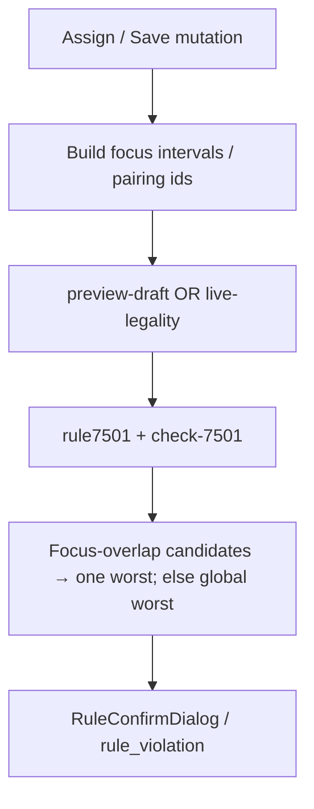

# Design: 7501 edit-focus worst window (preview + persist)

**Date:** 2026-08-01  
**Status:** Approved for implementation (user confirmed approach B + focus selection)  
**Scope:** Live assign-time preview popup and live/scenario legality persist/recheck for rule **7501** (SDFD).

## Problem

`check_sdfd_rolling` returns a **single** worst violating window per crew per rule-row (lowest SDFD; earliest on ties). When an older window (e.g. January) already has SDFD=0, a **new** August violation caused by assigning a pairing is never emitted.

Assign-time UI (`checkLiveDraftLegality`) only surfaces **new** violations vs the before-preview. Before/after both show the same January row → **no RuleConfirmDialog**, even though the edit alone creates an August 7501 breach.

Confirmed on SIT (`f8_sit_live`, crew `2438`, pairing `15676`):

| Input | Result |
|-------|--------|
| August duties only, before assign | No 7501 |
| August duties only, after +15676 | 7501 SDFD=0, window ~Aug 9–16, trigger 15806 |
| Full-year duties (preview path), before/after | Only January pairing 514 |

## Goals

1. If the **current edit** causes a 7501 breach, the assign-time dialog **must** warn.
2. Preview **and** persist / Alert Center / crew bell (mutation recheck) use the same selection rule (**option B**).
3. Still **at most one** 7501 row per crew per rule-row (e.g. one for 168 RH, one for 672 RH). If several edit-related windows violate, keep only the **worst** among them.
4. Full Recheck **without** edit context keeps today’s global-worst behavior.

## Non-goals

- Emitting all violating windows into `rule_violation` (no persist row explosion).
- Changing 7501 parameter semantics (Min Limits / Period / Local Night).
- Treating 7501 like 7505/7507 “always surface” on the frontend (would spam unrelated historical breaches).

## Approach

**Optional focus intervals** on the 7501 check path (recommended over PA-flag misuse or multi-emit).

### Selection algorithm

Given candidate windows where `SDFD < Min Limits`:

1. If **focus** is present and non-empty:
   - Restrict to candidates that **time-overlap** any focus interval (or any duty belonging to a focus pairing id).
   - Among that subset, pick **worst**: lowest SDFD; on ties, earliest window start.
   - If the subset is empty → **fall back** to global worst (same as today).
2. If **focus** is absent/empty → global worst (unchanged).

Still one `Option`/`SdfdViolation` per (crew, rule-row).

### Who supplies focus

| Path | Focus source |
|------|----------------|
| `POST /api/legality/preview-draft` | Duties newly added/changed in `afterItems` vs before (UTC `[schStr, schEnd]` and/or new `pairingId`s) |
| Mutation recheck after Save / draft commit | Mutation overlay window and/or affected pairing ids already collected for recheck |
| Full Recheck / cold legality with no mutation context | **No focus** |

### Wiring layers

1. **Rust** (`check_sdfd_rolling_app` / Editor path, and `check-7501` CLI if needed for harness parity): accept optional focus intervals (or pairing ids resolved to work spans already in `work`). Prefer focus-overlapping violators; else global worst.
2. **JS** (`rule7501` in `legality-recheck-core.mjs`): pass focus from `ctx` when present (`ctx.focusIntervals` / `ctx.focusPairingIds`).
3. **Preview** (`legality-preview.ts` / preview callers): compute focus from draft delta; set on ctx.
4. **Live mutation recheck**: set focus from mutation ref dates / pairing ids when spawning `live-legality.mjs`.
5. **Frontend filter**: unchanged principle (new + related). With correct after-preview payload, August row becomes **new** and window-related → dialog shows. Optional hardening: treat 7501 like period rules only if needed after engine fix—prefer engine-only first.

## Data flow

## Acceptance (crew 2438 ← pairing 15676, ruleset 103, Min Limits=1 @ 168 RH)

1. **Preview:** Assigning 15676 shows a 7501 confirm dialog whose window overlaps Aug 11–12 (typically Aug 9–16, trigger 15806 or related).
2. **Persist:** After Save + successful mutation recheck with focus, `rule_violation` / bell for that crew reflects the edit-related worst window (not stuck exclusively on January 514 when the edit caused an August breach).
3. **Full Recheck** with no focus: still emits global worst (January may remain the stored row if it stays worst overall)—documented, not a regression of prior full-recheck semantics.
4. No more than one 7501 row per instance/period row per crew per persist write for that rule-row.

## Known limitations

Move, swap, update, and Scenario preview paths may not create negative-id temporary items. Live assign avoids that ambiguity by sending the same `focusPairingIds` to both before/after previews; extending equivalent explicit focus coverage to Scenario remains a follow-up.

## Risks

- Focus too wide (entire −31/+31 mutation band) may still pick a non-local window; prefer **pairing ids / exact duty spans** of the mutation when available.
- Fall back to global worst when no focus overlap means a pure “fill gap” edit that somehow fails overlap tests could still hide—mitigate with duty-span focus from the edited pairing segments.
- SIT deploy must refresh `check-7501` binary via `deploy/sit` rust-bins push; schema `f8_sit_live` needs no DB change.

## Test plan

- Rust unit/integration: two SDFD=0 windows (early + late); with focus on late work → late selected; without focus → early selected.
- Vitest or script harness: preview before/after for 2438+15676 (or fixture) asserts August-related 7501 in after output when focus passed.
- Playwright (UI): Live assign pairing onto crew that has a masked historical 7501; dialog must appear with 7501 text (§Playwright-Required / §Simulate-User).

## Out of scope for this change

- Rebuilding SIT without going through normal `deploy.sh --live` / rust-bins.
- Frontend-only always-show-7501 without engine focus.
