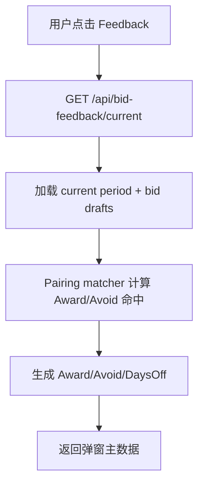
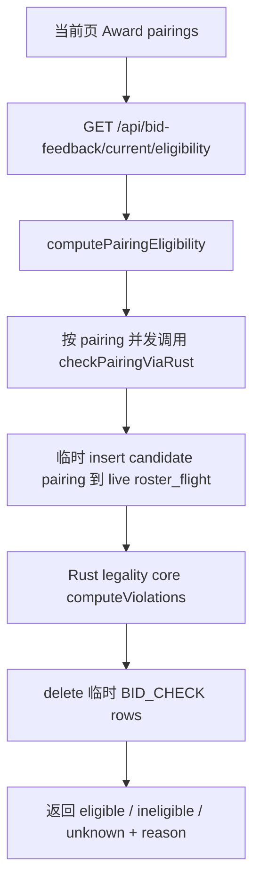
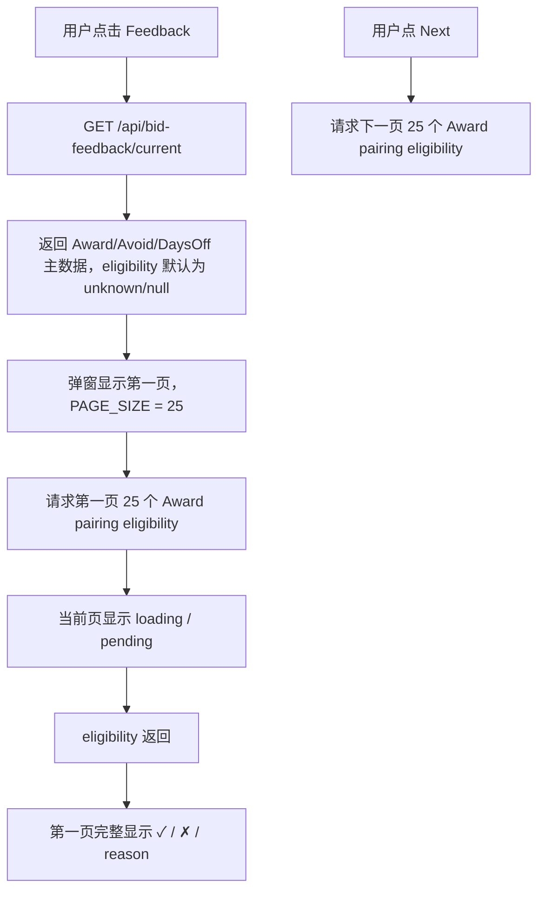

# PBS Bid Feedback Eligibility 分页按需计算设计

## 背景

Bid Feedback 弹窗需要让用户看到 Award pairing 的法规 eligibility：

- 列表显示 `✓ / ✗`
- 详情显示 `Eligible / PASS`
- 详情显示 `Not eligible / FAIL`
- 不通过法规时显示 rule reason

前一版尝试把 eligibility 从 `GET /api/bid-feedback/current` 主接口拆到：

`GET /api/bid-feedback/current/eligibility?pairingIds=...`

这个方向保留，但实现需要收窄范围。当前问题不是“必须预计算全量”，而是页面分页和 eligibility 批次不一致：

- Bid Feedback 表格现在 `PAGE_SIZE = 100`
- eligibility 子接口一次最多请求 `25` 个 pairing
- 所以第一页实际展示 100 行，但只最多算 25 行
- 前端全局请求 timeout 是 10 秒，25 个真实 Rust 法规检查仍可能被取消
- Feedback 按钮右上角红色冲突角标会额外触发 `/api/bid-feedback/current/conflicts`，增加打开前的后台请求和等待压力
- 参考项目是在优化结果场景里跑 Bid Feedback，场景结果天然已经按 crew 的 base、rank 和 bid month local time 收窄；当前实现直接从 live pairing 池匹配，必须显式补上这些候选池过滤

本版本不做后台预计算物化表。先把体验改成“点击 Feedback 后只保证当前页 25 条完整显示 eligibility”。

## 当前慢在哪里

主接口当前已经应该避免同步计算全量 eligibility：

真正慢的是 request-time eligibility：

关键卡点：

- `checkPairingViaRust` 每个 pairing 都会跑真实 Rust 法规。
- 每个 pairing 都涉及临时 DB 写入、法规执行、清理。
- 全量 Award 可能几百到 2000+，不能在打开弹窗时一次算完。
- 一页如果显示 100 行，而 eligibility 只算 25 行，用户会看到大量空白状态。
- 10 秒 timeout 对真实法规检查偏短，会导致浏览器显示 `canceled / 0B / 10s`。
- 当前 `loadBidFeedbackPairingFacts` 已经用 pairing base timezone 做 bid period local overlap 过滤，但缺少 actor base 和 actor rank 过滤。

对应代码：

- `pbs-portal/src/features/bid/components/bid-feedback-dialog.tsx`
- `pbs-portal/src/features/bid/hooks/use-bid-feedback.ts`
- `pbs-portal/src/shared/services/bid-feedback-service.ts`
- `pbs-server/src/routes/bid-feedback.ts`
- `pbs-server/src/services/bid-feedback/bid-feedback-service.ts`
- `pbs-server/src/services/bid-feedback/rule-eligibility.ts`
- `pbs-server/src/services/rule-check/rust-rule-runner.ts`

## 设计目标

- 点击 Feedback 后，弹窗主数据可以正常出现。
- Award 列表每页只展示 25 条 pairing。
- 当前页 25 条 eligibility 返回后，这一页完整显示 `✓ / ✗`。
- eligibility 仍在点击 Feedback 后按需计算，不新增预计算表、不新增后台 job。
- 取消 Feedback 按钮右上角红色角标，不再为了角标预查 `/api/bid-feedback/current/conflicts`。
- Calendar 视图不自动批量计算全月 eligibility。
- Bid Feedback 候选 pairing 池必须先按当前 crew 的 base、rank、bid period local time 过滤，行为对齐参考项目的优化后场景结果。
- 不改变 Bid 保存语义、DAYSOFF.csv 导出、Pairing matcher 规则、Rust 法规含义。

## 推荐方案：点击后按当前页 25 条计算

### 核心流程

### 分页规则

把 Bid Feedback pairing 表格分页从 100 改为 25。

理由：

- 一页 25 条与 eligibility 接口上限一致。
- 用户看到的一页数据都能被同一次 eligibility 请求覆盖。
- 不需要一口气计算 406 / 2071 条。
- 与当前后端接口 `pbsBidFeedbackEligibilityPairingLimit = 25` 对齐。

### 候选 Pairing 池过滤

Bid Feedback 在运行 bid property matcher 之前，必须先把 live pairing 池收窄到当前 crew 可参与的范围。

参考项目差异：

- 参考项目是在已经优化好的 scenario/result 里做 Bid Feedback。
- 该结果天然已经只包含当前 crew 可用的 base/rank/month pairing。
- 当前项目直接从 live `pairing` / `pairing_segment` / `pairing_composition` 查候选，因此必须显式补这层过滤。

过滤规则：

- Actor context 来源使用 `loadBidFeedbackInputs` 已返回的 `actorContext.base / actorContext.rank / actorContext.zoneId`。
- Base 硬过滤：`upper(btrim(pairing.base)) = actorContext.base`。
- Rank 过滤：当 `actorContext.rank` 存在时，要求存在未删除的 `pairing_composition`：
  - `pairing_composition.pairing_id = pairing.id`
  - `upper(btrim(pairing_composition.acting_rank)) = actorContext.rank`
  - `pairing_composition.is_deleted = 0`
- Period local time 过滤：继续使用 local date overlap，而不是 UTC 日期硬截断。
  - pairing start local date `<= rpEndLocal`
  - pairing end local date `>= rpStartLocal`
  - local timezone 优先使用 pairing base airport `zone_id`；缺失时可降级到 actor/base period timezone 或 `UTC`，但测试要覆盖。
- 若 `actorContext.base` 缺失，Bid Feedback 应返回可控错误或空结果，不应退回全航司 pairing 池。
- 若 `actorContext.rank` 缺失，本版本允许只按 base + period 过滤，但需要在日志或测试里明确这是降级路径；不允许因为 rank 缺失扩大到跨 base。

与 Pairing Search 对齐：

- Pairing Search 现有语义是 `p.base = actorBase`，并在有 rank 时加 `pairing_composition.acting_rank = actorRank`。
- Bid Feedback 的候选池过滤应复用这套语义，避免同一个 crew 在 Search Pairings 和 Bid Feedback 看到不同 base/rank 范围。

### Eligibility 请求规则

前端只在以下情况下请求 eligibility：

- 弹窗主数据已加载完成。
- 当前视图是 `BIDS`。
- 当前 tab 是 `AWARD`。
- 当前页有 Award pairing。

请求内容：

- 当前页 25 个 `pairingId`
- 若有已选中 pairing，确保它在当前页内即可，不额外把非当前页 pairing 混入请求

不请求：

- `AVOID` tab 不请求 eligibility
- `DAYS OFF` tab 不请求 eligibility
- `CALENDAR` view 不自动请求全月 eligibility
- Feedback 按钮未打开弹窗时不请求 eligibility
- 右上角红色角标取消后，不请求 `/api/bid-feedback/current/conflicts`

### Loading 表现

主弹窗 loading：

- `GET /api/bid-feedback/current` 未返回时，继续使用现有 skeleton。

当前页 eligibility loading：

- 当前页 eligibility 未返回前，这一页的 eligibility 列可显示轻量 loading 或空态。
- 详情区若选中当前页 pairing 且 eligibility 未返回，显示 `Eligibility loading` 或 `Eligibility unavailable` 的稳定状态。
- 不弹 toast，不刷错误红字。

请求 timeout：

- 保持全局默认 10 秒不变。
- 仅对 `GET /api/bid-feedback/current/eligibility` 放宽 timeout，例如 45 秒。
- 这条请求 `retry: 0`，避免后端真实法规压力被重试放大。

### 后端行为

`GET /api/bid-feedback/current`：

- 返回 Award/Avoid/DaysOff 主数据。
- 不调用 `checkPairingViaRust`。
- 在运行 Pairing matcher 前应用 actor base/rank/local period 候选池过滤。
- Award pairing 默认 eligibility 为 `unknown`，或保留当前主接口已有的 unknown shape。
- Avoid pairing 继续 `eligibility: null`。

`GET /api/bid-feedback/current/eligibility?pairingIds=...`：

- 只接受 1 到 25 个数字 pairing id。
- 后端重新按当前 bid draft 计算 Award 命中集合，确保请求的 pairing 确实属于当前用户当前 Award 结果。
- 这一步必须复用相同的 actor base/rank/local period 过滤，不能让前端传入跨 base/rank 的 pairing id 后被计算。
- 只对这些 requested Award pairings 调用 `computePairingEligibility`。
- 返回每个 pairing 的 `eligible / ineligible / unknown + reason`。
- 若 ruleset 未配置，返回 `unknown` 和明确 reason，不让接口 500。
- 若单个 pairing 法规执行失败，返回该 pairing `unknown`，不让整批失败。

### 红色角标取消

Feedback 按钮右上角红色 conflict badge 本版本取消。

对应行为：

- `BidFeedbackToolbarActions` 不再调用 `useBidFeedbackConflicts`。
- 按钮只显示 `Feedback`。
- 不再显示红色 count。
- `/api/bid-feedback/current/conflicts` 可以暂时保留后端接口，避免破坏外部调用；但前端不再使用。

取消原因：

- 角标需要在用户打开弹窗前额外请求一次 conflicts。
- 当前用户已经明确不需要这个红色角标。
- 先减少 Bid 页面上的后台请求数量，避免影响体验。

## 不做的事

本版本不做：

- 不新增 `pbs_bid_feedback_pairing_eligibility` 表。
- 不新增后台 job / queue。
- 不在 Bid 保存后预计算全量 eligibility。
- 不在 Calendar 视图自动计算全月 eligibility。
- 不把 timeout 全局改大。
- 不修改 DAYSOFF.csv 导出。
- 不改变 Rust 法规判断逻辑。

## 实施范围

前端：

- `BidFeedbackDialog`
  - `PAGE_SIZE` 从 100 改为 25。
  - eligibility 请求只取当前页 25 条 Award pairing。
  - Calendar view 不触发 eligibility 请求。
  - 当前页 eligibility loading/unknown 状态稳定显示。
- `useBidFeedback`
  - 保留 `useBidFeedbackEligibility`，但 timeout 通过 service 传入。
  - 继续 `retry: 0`。
- `bid-feedback-service`
  - `getCurrentEligibility` 单独传 `timeout: 45000`。
- `BidFeedbackToolbarActions`
  - 移除 `useBidFeedbackConflicts` 调用。
  - 移除红色角标。

后端：

- 保留 `/api/bid-feedback/current/eligibility`。
- 保持 pairingIds 限制 25。
- 确保主接口不跑 Rust eligibility。
- 确保 eligibility 接口只计算 requested + current Award 交集。
- 修改 `loadBidFeedbackPairingFacts` / matcher 输入，让 Bid Feedback 候选池按 actor base、actor rank、period local overlap 过滤。
- 复用或对齐 Pairing Search 的 actor base/rank 过滤语义。
- 保持统一 `{ code, data, message }` 响应和错误降级。

Contracts：

- 保留 `pbsBidFeedbackEligibilityPairingLimit = 25`。
- 保留 `pbsBidFeedbackRoutes.eligibility`。
- 不新增预计算相关 contract。

测试：

- 前端单测：
  - Feedback 按钮不显示 conflict badge。
  - 未打开弹窗时不请求 conflicts。
  - Award 表格每页 25 条。
  - eligibility 请求参数只包含当前页 pairing ids。
  - 翻页后请求新一页 pairing ids。
  - Calendar view 不触发 eligibility 请求。
- 后端 route/service 测试：
  - `current` 不调用 Rust runner。
  - `eligibility` 超过 25 或非法 id 返回 400。
  - `eligibility` 只返回 requested Award pairings。
  - Bid Feedback 候选池 SQL 包含 actor base 过滤。
  - actor rank 存在时，候选池 SQL 包含 `pairing_composition.acting_rank` 过滤。
  - period 过滤使用 local overlap，避免 UTC 日期误截断跨时区 pairing。
  - ruleset 未配置不 500。
- E2E：
  - 打开 Bid Feedback 后没有 `/current/conflicts` 请求。
  - 第一页 Award eligibility 返回后显示 `✓ / ✗`。
  - 截图或 DOM 断言确认红色角标不存在。

## 验收标准

- Feedback 按钮右上角不再有红色角标。
- Bid 页面不再为了角标自动请求 `/api/bid-feedback/current/conflicts`。
- Bid Feedback Award/Avoid 计数和列表先按当前 crew base、rank、bid period local time 过滤。
- Award tab 每页显示 25 条。
- 打开弹窗后，只请求当前页最多 25 个 pairing 的 eligibility。
- 第一页 eligibility 返回后，该页完整显示 `✓ / ✗` 和详情 `PASS / FAIL / reason`。
- 翻到下一页后，再请求下一页 25 个 pairing。
- Calendar view 不触发全量 eligibility 请求。
- `DAYSOFF.csv` 导出不受影响。

## 风险与待确认点

- 25 个真实 Rust 法规检查仍可能超过 10 秒，所以必须给 eligibility 请求单独放宽 timeout。
- 若 25 个在 45 秒内仍不稳定，下一步应继续优化 Rust runner 批处理，而不是把批次扩大。
- 当前页 loading 时间可能偏长，但比全量计算和红色 canceled 请求更可控。
- 这个版本只保证“当前页完整”，不保证打开时全量 406 / 2071 都已算完。

## Multi-Agent Parallelism Assessment

- Recommendation: No
- Rationale: 这次改动集中在 Bid Feedback 一个前后端闭环，文件不多，但 contract、UI、route、测试需要一致。拆并行会增加冲突。
- Suggested split: 不建议拆分；按 frontend request/badge -> backend eligibility guard -> tests 串行推进。
- Write boundaries: 单 agent 串行。
- Conflict risk: 中等，当前工作区已有上一版 lazy eligibility 和 Bid Feedback 改动，需要在原 diff 上修正，不能覆盖 DaysOff 已完成改动。
- Execution gate: 用户确认本 spec 后进入实现。
