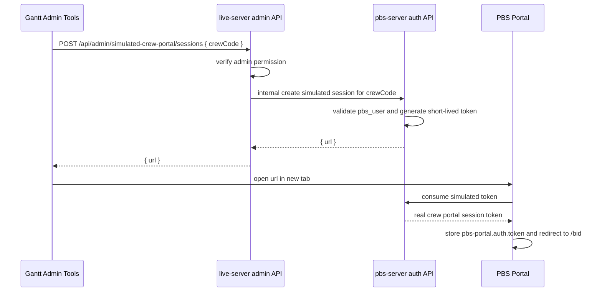

# Gantt PBS Admin Tools 模拟 Crew Portal 登录设计

## 背景

参考项目 `/Users/lei/Codehub/crew-web-vue-3.0` 里的 `Simulated Crew Portal` 页面只有前端代码。现有行为可以推断为：

- 管理员输入 `crewCode`。
- 点击 `Simulate` 后调用 `GET /api/simulate/generateSecret?crewCode=...`。
- 后端返回一个可打开的 Portal 登录 URL，前端追加 `crew=<crewCode>` 后用新 tab 打开。
- `Log` 按钮调用 `GET /api/simulate/logList`，展示 admin user、crew code、crew name、login time。

旧实现里跳转域名可能是 `https://roster.evaair.com/login`，而不是固定的测试域名。这说明目标 Portal URL 必须按环境配置，不能在前端或后端代码里写死。

## 目标

在当前 ROIS Gantt 的 `PBS > PBS Admin > Admin Tools` 菜单下面增加一个独立的 `Simulated Crew Portal` 子页面，让管理员可以输入 crew code，并以该 crew 身份打开 PBS Crew Portal。

## 范围

本轮做简单可用版本：

1. 在 Gantt `PBS Admin > Admin Tools` 菜单下面新增 `Simulated Crew Portal` 子菜单 / 子页面。
2. `Simulated Crew Portal` 页面包含：
   - `Crew` 输入框。
   - `Simulate` 按钮。
   - 简单的错误提示和 loading 状态。
3. 点击 `Simulate`：
   - 前端调用 `live-server` 的 admin API。
   - 后端校验当前 Gantt 用户必须是管理员。
   - 后端校验目标 crew portal 用户存在且可登录。
   - 后端生成短期模拟登录凭证或一次性登录链接。
   - 前端用新 tab 打开后端返回的 URL。
4. 目标 Portal URL 必须从环境配置读取，不允许硬编码 `roster.evaair.com`、`crew-test.pier.com` 或本地地址。
5. 记录一次模拟登录操作日志，至少包含：
   - admin user code / name
   - target crew code / name
   - time
   - result

本轮暂不做复杂后台管理：

- 不把功能塞进现有 `Admin Tools` 内容页。
- 不新增 PBS 一级菜单，只在 `Admin Tools` 菜单下面增加二级入口。
- 不做复杂 log 查询页面，除非实现成本很低且不影响主线。
- 不改变 Gantt Live / Scenario 页面。
- 不改变普通 crew 的正常登录流程。

## 推荐交互

位置：

```text
Gantt
└── PBS
    └── PBS Admin
        └── Admin Tools
            ├── Admin Tools
            └── Simulated Crew Portal
```

UI：

- 使用现有 PBS admin 页面样式。
- `Simulated Crew Portal` 是独立页面，不和 Algorithm Export / Crew Bid Import 混在同一个页面里。
- 输入框 label 为 `Crew`，placeholder 为 `Crew code`。
- 主按钮文案为 `Simulate`。
- 成功后不在当前页面跳转，而是 `window.open(url, '_blank', 'noopener,noreferrer')`。
- 失败使用现有全局 toast/message，不把原始异常对象展示给用户。

## 后端逻辑推断与当前项目落地

当前项目有两套认证：

- Gantt 管理端使用 `live-server` JWT，存在 `sessionStorage.rois-auth`。
- PBS Crew Portal 使用 `pbs-server` JWT，存在 `sessionStorage.pbs-portal.auth.token`。

因此模拟登录不能直接复用 Gantt 管理员 token，也不能覆盖管理员自己的 Gantt session。

推荐链路：



关键点：

- `pbs-server` 应该是生成 PBS Portal session 的唯一权威，因为它拥有 `pbs_user`、portal 登录规则和 PBS JWT。
- `live-server` 只负责 Gantt admin 权限入口，不直接伪造 PBS Portal token。
- 模拟登录 token 必须短期有效，建议 1 到 5 分钟。
- token 最好一次性消费，避免 URL 泄漏后重复使用。
- Portal 消费 token 后应清理 URL query，避免 token 留在地址栏。

## 配置来源

配置分两类：

- 服务间鉴权 secret 继续走 env / secret manager。
- 业务可调整参数走 live schema 的 `dictionary`，`parent_code = 'SYS_PARAM'`。

env 只保留：

```text
PBS_INTERNAL_API_SECRET=...
```

`dictionary` 配置项：

| parent_code | code | code_value | 说明 |
|---|---|---|---|
| `SYS_PARAM` | `PBS_PORTAL_PUBLIC_URL` | `https://.../pbs` | 当前环境的 Crew Portal 公开访问地址 |
| `SYS_PARAM` | `PBS_SIMULATED_LOGIN_TTL_SECONDS` | `300` | 模拟登录 token TTL，缺省 300 秒，最大 3600 秒 |

说明：

- `PBS_PORTAL_PUBLIC_URL` 通过现有配置字典能力维护，不在代码或 env 文件中写死。
- `PBS_PORTAL_PUBLIC_URL` 缺失时，模拟登录接口返回明确配置错误，不默认 fallback 到 localhost。
- `PBS_INTERNAL_API_SECRET` 是 `live-server` 调 `pbs-server` 内部模拟登录接口时使用的鉴权密钥，不能放到可通过业务接口读取/修改的配置里。
- 代码中不写死 `https://roster.evaair.com/login`、`crew-test.pier.com` 或其他环境域名。

## API 设计

### Gantt 调用 live-server

```http
POST /api/admin/simulated-crew-portal/sessions
Authorization: Bearer <gantt-admin-token>
Content-Type: application/json

{
  "crewCode": "B79185"
}
```

返回：

```json
{
  "url": "https://current-env-portal/login?simulateToken=..."
}
```

错误：

- crew code 为空：前端本地校验。
- 非管理员：`403`。
- crew 不存在或不可登录：`404` 或业务错误。
- Portal URL 未配置：`500`，用户文案只提示配置缺失，不展示内部变量名或 stack。

### live-server 调用 pbs-server

```http
POST /api/internal/simulated-crew-portal/sessions
X-Internal-Secret: <secret>
Content-Type: application/json

{
  "crewCode": "B79185",
  "adminUserCode": "admin",
  "adminUserName": "Admin User"
}
```

返回：

```json
{
  "url": "https://current-env-portal/login?simulateToken=..."
}
```

### PBS Portal 消费 token

简单版可以复用登录页：

```text
/login?simulateToken=...
```

登录页检测到 `simulateToken` 后：

1. 调 `POST /api/auth/simulated-session`。
2. 拿到 PBS Portal session token。
3. 写入 `pbs-portal.auth.token`。
4. 清理 URL。
5. 跳转到 `/bid`。

## 数据与日志

本轮优先复用现有 PBS schema 中的日志表：

- 如果 `pbs_login_log` 足够表达模拟登录，增加 `authMode = simulated` 或 equivalent metadata。
- 如果现有表无法表达 admin actor 与 target crew 的关系，再新增专门日志表。

日志至少需要区分：

- 正常 crew 自己登录。
- SSO 登录。
- 管理员模拟登录。

如果新增字段或表，需要单独确认数据库 migration。

## 安全约束

1. 只有 Gantt admin 能发起模拟登录。
2. 浏览器不能直接调用 pbs-server 内部模拟创建接口。
3. 不能只靠 `crewCode` 登录。
4. 模拟 token 必须短期有效。
5. 推荐一次性消费。
6. Token 不能写入日志。
7. 用户可见错误不能暴露 stack、SQL、内部 host、secret、原始异常。
8. 模拟登录后 PBS Portal 内显示的是目标 crew 信息，不显示管理员身份为当前 crew。

## 验收标准

1. Gantt `PBS > Admin Tools` 菜单下面出现 `Simulated Crew Portal` 子入口。
2. 输入合法 crew code 后点击 `Simulate`，新 tab 打开当前环境配置的 PBS Portal 地址。
3. 新 tab 内建立目标 crew 的 PBS Portal session。
4. 当前 Gantt 管理员 session 不被覆盖。
5. 空 crew code 不能提交，并显示清晰错误。
6. 非管理员不能调用后端接口。
7. 目标 crew 不存在或不可登录时，前端显示业务错误，不打开空页面。
8. SIT / UAT / Production 通过环境变量切换 Portal URL，不改代码。
9. 操作日志能查到 admin 模拟了哪个 crew 以及时间。
10. 不影响现有 `Admin Tools` 页面里的 Algorithm Export、Crew Bid Import。

## 验证计划

自动化：

- Gantt unit / component 级测试覆盖：
  - 空 crew code 禁止提交。
  - 成功返回 URL 时调用 `window.open`。
  - API 失败时展示现有全局错误入口。
- live-server 后端测试覆盖：
  - 非 admin 403。
  - crew code 校验。
  - pbs-server proxy 返回 URL。
  - pbs-server 错误映射。
- pbs-server 后端测试覆盖：
  - internal secret 校验。
  - crew 不存在。
  - token 过期。
  - token 一次性消费。
  - 成功生成 crew session。
- pbs-portal 测试覆盖：
  - `/login?simulateToken=...` 能完成 session bootstrap。
  - 成功后清理 URL。

手工 / Playwright：

- 在真实 Gantt UI 打开 `PBS > Admin Tools > Simulated Crew Portal`。
- 输入测试 crew code。
- 点击 `Simulate`。
- 验证新 tab 打开的是环境配置域名。
- 验证 Portal 显示目标 crew 信息。
- 验证 Gantt 原 tab 仍是管理员。

## Multi-Agent Parallelism Assessment

- Recommendation: Yes
- Rationale: 该功能跨 Gantt、live-server、pbs-server、pbs-portal、E2E，但写入边界可以拆开。
- Suggested split: 一个 agent 做 Gantt UI，一个 agent 做 live-server/pbs-server auth API，一个 agent 做 pbs-portal token 消费和 Playwright。
- Write boundaries: Gantt 只改 `gantt/src/components/pbs/**` 和相关测试；后端只改各自 `routes/services/config/tests`；portal 只改 auth/login 相关文件。
- Conflict risk: Medium，主要风险在 auth contract 和环境配置命名，需要主 agent 统一接口。
- Execution gate: spec 经用户确认后再开始实现。

## 待确认

1. 模拟成功后默认落点：本设计建议进入 `/pbs/bid`。
2. 本轮是否必须做 `Log` 弹窗：建议简单版先写日志，UI 查询可以后置。
3. 是否允许新增 pbs-server internal API 与模拟 token 消费 API：推荐允许，否则实现会耦合 live-server 和 pbs-server JWT。
