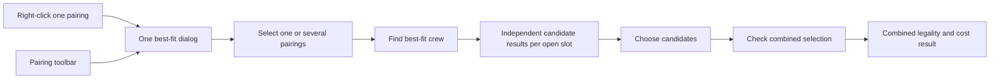

# Best-fit crew — batch review, Ver2

Status: design and interactive HTML prototype only. Supersedes Ver1's single-pairing restriction, four-step wizard, and blanket claim that alternatives can share one engine evaluation. No production API, Rust integration or roster write is delivered by this revision.

> **Update 2026-09-11 (implementation):** the Live slice is now built and verified — see
> §Implemented. Read §Implemented together with the rest: three deliberate deviations
> (Live-only v1, per-pairing endpoints instead of a job queue, and cost limited to the
> guarantee member) are recorded there with their reasons.

## Product flow

Both entry points open the same shared `AppDialog` in Live and Scenario:

1. Right-click one open/partial pairing → **Find best-fit crew**: that pairing is preselected.
2. Pairing pane toolbar → **Best-fit crew**: the dialog lists open/partial pairings within the pane's base, fleet, division and date scope. Select several, or select all in scope, then click **Find best-fit crew (N)** once.

One screen contains selection and results. No separate Pairing → Filter → Legality → Rank wizard. Base/fleet/division are inherited and shown in the pairing summary; basic eligibility is automatic. The only routine choices are the pairings, **Fairness / Cost**, and a cost set. Details expand when needed.

The left worklist remains visible while the batch runs. Each pairing shows its open rank slots, progress, best candidate per slot, eligible count, warning count, and any failure. Clicking a pairing shows its candidate table on the right. Rank-slot selection divides CA/FO (or other configured ranks); these are separate staffing decisions, not one undifferentiated crew ranking. If a slot needs two crew, track two distinct choices and prevent duplicate crew within the same pairing.

The detail table shows crew, base/fleet/rank match, MBH, incremental cost with currency/completeness, and **No new violations / New soft warnings / New hard violations / Not checked**. Hard and unknown results cannot be shortlisted. Existing unchanged violations remain visible in details and do not become new failures merely because they exist.

Soft-warning candidates may be shortlisted for review. Shortlisting neither accepts the warning nor creates a draft. Acceptance and any required reason belong to a future explicit assignment action under existing policy.



## What “at the same time” means

The planner launches all selected pairing searches in one action. Each candidate result answers: “Would assigning this pairing to this crew, relative to the current roster, introduce a hard violation?” Other alternative assignments are absent from that hypothetical roster.

The same crew may be recommended for multiple pairings. Display **Shared recommendation — validate together**; do not quietly reserve that crew or silently change the second ranking. Reuse can be valid when pairings are separated in time. Overlap is one conflict; cumulative duty/rest/credit and team rules also require validation.

**Check combined selection** evaluates only the chosen pairing-slot-crew combinations together. It catches shared-crew overlaps, cumulative limits and co-crew conditions. Changing any choice invalidates the combined result. Success reads **No new hard violations in this selection**, with soft warnings still visible. Incomplete slot coverage is stated separately; a successful subset check must not imply all open slots are covered.

This is batch decision support. It does not claim an optimal solution for all pairings and does not invoke the PBS optimizer. Automatic conflict resolution or assignment is outside this design; multi-pairing search and combined preview are now explicitly in scope.

## Rust simulation: verified existing building blocks

Read against current source:

- `live-server/src/services/rule/legality-preview.ts`, `previewDraftLegality`: starts a transaction, builds temporary roster data, resolves Live/Scenario source and ruleset, calls `computeViolations`, maps configured rule severity, rolls back and releases the connection. It returns the resulting violations and `allowed`, not a before/after delta.
- `createLiveTempRoster`: copies affected crews' roster rows, applies an overlay, and seeds pairing/flight complement rows. This complement matters: candidate checks can depend on other crew already on the same flight.
- `resolvePreviewRosterOverlay`: when focus pairing IDs are present, only those pairing rows are replaced. Without them, a date-window replacement is used. A partial roster payload can therefore erase relevant hypothetical history if the wrong overlay mode is used.
- `resolveWindow`: currently derives an engine window from item times with 365 days of history and 31 days of look-ahead. This is not the same as the visible Gantt viewport; preserve rule-required history and explicit RP bounds.
- `normalizePreviewViolations`: severity is resolved from ruleset configuration, and `allowed` means every returned finding has severity below 3. This boolean cannot implement “no NEW hard violation” on its own.
- `live-server/scripts/legality-recheck-core.mjs`: memoizes source reads, loads rule instances and invokes the `rule-engine-rs/target/release` check binaries. Rule tasks already run concurrently and binary spawning is capped. One preview call may run several Rust binaries; it is not one in-process Rust call.

### The required isolated evaluation

For each `(context, pairing source/id/version, rank slot, crew)`:

1. Resolve effective-dated base, fleet and rank across the assignment dates; reuse `validateAssignment`/the rank-acting configuration. Do not hardcode “CA may always act as FO.” Exclude inactive crew and scope to the selected division/context. Fetch complete pairing segments and necessary roster history server-side.
2. Capture a consistent source snapshot including the user's current draft, ruleset parameters, roster dependencies, flight complement and relevant credit data. Record a snapshot token. Do not call `assignPairingDraft()` to simulate: that helper adds draft operations, updates coverage and acquires locks. Extract/reuse only pure item-construction logic.
3. Evaluate **before** against the captured roster with no candidate added. Evaluate **after** against the same roster plus this candidate's segment-level rows with the resolved acting rank, flight IDs, duty/segment order, times, rest and credit. Preserve ground duties and every unrelated pairing. Both evaluations use identical rule instances, focus intervals and RP bounds.
4. Compare findings using crew, rule code/instance, scope, physical duty/flight or pairing identity and rule window. Normalize synthetic IDs to stable identities. Return `existingUnchanged`, `new`, `worsened`, `resolved` and an explicit comparison status.
5. Any new or worsened severity ≥3 blocks that candidate. New soft findings remain reviewable. Missing binaries, timeouts, invalid material, unsupported checks or an incomplete comparison mean **Not checked / Needs review**, never a pass.
6. Roll back temporary state on success, failure and cancellation. No live roster, coverage, lock, notification, persisted violation or manday state is changed by a preview.

Existing `previewDraftLegality` needs an internal evaluation-context seam for this: it opens its own transaction and derives focus/window from `afterItems`. Calling it twice does not guarantee a common snapshot or identical scope. An empty `afterItems` currently returns success without evaluating anything, so it is not a valid way to obtain a clean baseline for an empty crew roster.

Recommended implementation: factor the current transaction/source setup into an internal preview evaluator, pin a read snapshot per job or invalidate on dependency-version change, and use isolated temporary tables per candidate. Preserve the current single-preview API contract with focused regression tests. Do not claim snapshot correctness until ruleset/source reads and all dependent tables use that snapshot. Share cached baselines only when crew, rule/focus window, context and all dependency versions match.

### Why alternatives cannot simply be merged

Putting P1 and P2 onto crew C in one `afterItems` union asks whether C can do both. It does not answer whether C could take either independently. Similarly, adding candidate C1 and C2 to the same vacant pairing changes the hypothetical co-crew complement, which can change rules such as 8030 and avoid-co-pairing.

Use one batch UI job with a bounded worker pool of isolated candidate evaluations. Parallelism is an implementation detail and must respect the DB pool and existing Rust process cap. The safe initial approach is candidate isolation; combining evaluations is allowed only after proving independence for all applicable rules. The combined-selection check intentionally builds one joint hypothetical roster and rechecks affected existing co-crew as well as selected crew.

### Detecting a worsened existing violation

Set subtraction by rule code alone is insufficient. An already excessive cumulative total can increase without producing a new code/window. The current public violation DTO contains message and scope fields but no general normalized actual/limit payload. The implementation must retain structured rule evidence or add a rule-aware comparison adapter; it must not parse arbitrary message text as the general solution. If worsening cannot be established reliably, return an incomplete comparison requiring review instead of marking the candidate legal.

The prototype illustrates this contract with explicit fixture evidence. It does not validate Rust rule semantics.

## Cost library, including combined cost

Reuse `CostLibraryService` and `calculateCost` from `live-server/src/services/cost/`. Pin the selected set's version and member revision IDs; do not replace members with each instance's latest revision. Resolve applicability, effective dates, enabled state and currencies before pricing. The default is an applicable enabled default set if available; otherwise request a set in the same toolbar.

The guarantee calculator already returns **Pay(after credit) − Pay(before credit)** and takes `beforeCredit`, `addedCredit`, optional `removedCredit` and `hourlyRate`. These inputs are hours of payable credit. MBH is for fairness and must not be substituted for credit. Use authoritative pre-guarantee credit appropriate to that payroll policy; if the available MCred aggregate has already applied a floor or incompatible policy, it needs an explicit adapter and cannot be treated as raw payable credit. Split cross-month assignments by the relevant payroll period with correct local dates.

The standby calculator already replaces baseline standby credit, adds pairing credit and values the result through its linked guarantee revision. Reuse that calculation when applicable; do not also charge the guarantee pay delta a second time for the same activation.

Other cost members use the library's quantity/fixed/minimum/bands/booking inputs only when that event is caused by this assignment. Same-base eligibility does not imply positioning or booking charges. Record non-applicable members separately from missing prices. Disabled items are intentionally excluded; applicable unpriced items make the estimate incomplete. Cash and operational penalties should remain distinguishable; a monetary total requires comparable units and one currency or an explicit conversion policy.

Ranking: ascending MBH for fairness, stable crew-ID tie-break until a seniority policy is confirmed. Cost: complete comparable incremental totals first, ascending value; incomplete costs appear separately, not as zero. Within equal costs use MBH then crew ID. Ranking changes reuse completed legality results; cost-set changes recalculate cost and invalidate combined cost.

For combined selections, recompute each crew's payroll delta using all selected duties together, then add other applicable costs with their own deduplication keys. Do not sum independent candidate prices. Example using a demonstration 85-hour guarantee, 1.2× from 85–90 and rate 100/hour: crew at 84 hours plus either of two 1-hour pairings costs 0 independently, but both together reach 86 and cost 120. These are example inputs, not fixed product tariffs.

## Proposed job contract (not implemented)

`POST /api/best-fit/jobs` accepts context/scenario, source-qualified pairing IDs and versions, open slots, draft token, ranking basis and cost-set ID. Server resolves permitted scope and authoritative date/RP boundaries. Return job ID, snapshot token and candidate-check totals. Existing authentication and schema isolation apply; a job must not bypass cost-library read permissions.

Progress polling (or an existing event mechanism if reused) returns results keyed by pairing-source + pairing ID + rank slot + crew ID. States: queued, checking, complete, failed, cancelled, stale. Each result includes before/after comparison, rule evidence, effective ruleset and cost revision references. Pairing summaries distinguish total basic candidates, completed checks and remaining checks; a partial ranking says **Best among N checked**, never implies a global winner.

`POST /api/best-fit/jobs/:id/combined-preview` accepts the snapshot token and explicit slot/crew choices. Reject stale dependencies and invalid/duplicate selections, then build and evaluate the combined hypothetical roster and costs. Return coverage completeness separately from legality. No commit occurs.

Configure batch size, worker concurrency and timeouts; expose **Continue remaining** if a limit is reached. “Max results shown” must not silently become “only these crew evaluated.” Retry failed evaluations without discarding successful ones. Cancel stops unscheduled work and ignores late responses; each open dialog uses a job-generation token.

## UI states and acceptance

- Both entry paths lead to the same screen. Several selected pairings produce their own results with one click.
- Left worklist counts mean open pairings in scope, not only those loaded into a viewport. If partial loading is unavoidable, state it and fetch remaining pages.
- Different bases/fleets/rank slots produce different basic candidate pools. A no-match result differs from a failed legality check.
- Existing unchanged hard findings do not block; a newly hard or worsened hard result does. Error/pending results cannot be selected.
- Fairness and cost can pick different winners. Unpriced never displays as zero. Details show the selected cost revisions and calculation inputs.
- Recommending the same crew for two pairings raises a shared recommendation notice. Combined preview detects overlap and cumulative-rule failures, and succeeds for a valid alternate selection. Changing a choice makes that verdict stale immediately.
- All prototype controls must work or be visibly disabled. HTML fixtures and verification are local design evidence, not a real Rust run or public UI acceptance.

Implementation acceptance must run through Ryan's configured public Gantt target, with versioned screenshots, real Rust execution evidence, before/after persisted-state comparisons and rollback/error tests. In this design-only task the public product is unchanged; no production acceptance is claimed.

## Deliverables

- `2026-09-11-best-fit-crew-mockups/batch-Ver2.html`: one-screen batch prototype.
- Existing Option A/B are retained as historical Ver1 alternatives.
- Frontend implementation should share one dialog/source contract across Live and Scenario, mounting at the shared shell and reusing `AppDialog`. No new independent legality formulas or cost engine belong in the frontend.

---

## Implemented (2026-09-11, Live slice)

Shipped end to end and verified against the running Live Gantt, the demo database and
the real `rule-engine-rs` check binaries.

| Layer | File |
|---|---|
| Shared preview-item builder (one definition of "crew C takes pairing P") | `live-server/src/services/assignment/preview-roster-items.ts` |
| Planner service: candidate pipeline, legality delta, cost, combined preview | `live-server/src/services/best-fit/best-fit-service.ts` |
| Routes (`POST /api/best-fit/pairing`, `POST /api/best-fit/combined-preview`) | `live-server/src/routes/best-fit/best-fit.ts`, registered in `live-server/src/index.ts` |
| API client / state | `gantt/src/services/best-fit-api.ts`, `gantt/src/stores/best-fit-store.ts` |
| Dialog (one screen: worklist + per-slot ranking + detail + combined bar) | `gantt/src/components/best-fit/best-fit-dialog.tsx` |
| Hand-off to the assign draft ("hands") | `gantt/src/utils/best-fit-apply.ts` → `assignPairingDraft` |
| Entry points | `pane-condition-strip.tsx` (`best-fit-button`, Live pairing pane icon cluster = Entry 2) and `components/roster/context-menu.tsx` ("Find best-fit crew…" on a pairing row = Entry 1) |
| Shell mount | `gantt/src/components/shell/app-shell.tsx` (one instance, same hoist as Auto-assign) |
| Evidence | `live-server/tests/unit/best-fit-service.test.ts` (19), `gantt/src/utils/__tests__/best-fit-candidates.test.ts` (7), `e2e/tests/gantt/best-fit-crew-open-pairings.spec.ts` |

### How the Rust simulation was implemented

Per selected pairing, per open composition slot, for each eligible crew:

1. **Stage 1** resolves the slot with the SHARED `validateAssignment` (`@rois/shared-rules`)
   — the same function `precheckAssignment` uses, so Best-fit and the assign path cannot
   disagree about eligibility or about a rank-acting downgrade. Base/fleet/division come
   from one bulk current-effective query.
2. **Baseline and after run in the same request** for the same crew:
   - baseline = the crew's roster with the shortlisted pairings removed (pairing-scoped overlay, no placeholders);
   - after = the same roster plus this crew's hypothetical segment rows.
   A window overlay was tried first and produced false "new" findings because it replaces a
   date slice and can drop duties at the slice edges — the pairing-scoped overlay is the
   correct primitive here.
3. **Delta** by identity `(rule, instance, scope, pairing, duty, flight, window)`: identical
   → `existingViolations` (shown, never blocking); otherwise new or changed. Any new/changed
   finding with severity ≥ 3 blocks the candidate; severity < 3 stays selectable.
4. **Engine failure = `unknown`**, never `pass`, and unknown candidates are not shortlistable.
5. **Combined preview** places the chosen slot/crew combinations on one hypothetical roster
   per crew and re-runs the same engine, with the same baseline/after diff, so pre-existing
   crew findings do not block a shortlist.

### Three deliberate deviations from the text above

1. **Live-only in v1.** Scenario needs scenario-context preview plus the scenario
   display-id ↔ `sourcePairingId` mapping; shipping it blind would risk previewing the wrong
   pairing. The button is live-gated in the pane condition strip, so Scenario shows nothing
   rather than a broken entry. Scenario support is the next increment.
2. **Per-pairing endpoints instead of a job queue.** The frontend fires one bounded request
   per selected pairing (max 5 per run, max 6 candidates per slot) and shows real per-pairing
   progress; cancelling is aborting a request. This mirrors the existing read-only planner
   precedent (`/api/roster/auto-assign/plan`) without building a job registry. A job/polling
   contract is still the right answer if the batch limit needs to grow past a single screen.
3. **Cost is the guarantee member only.** The first cut fed credit hours into every cost
   member and billed the whole catalogue for one pairing (USD 57,645 on the demo set). Only
   the guarantee calculator's inputs (baseline payable credit, pairing payable credit) are
   determined by "this pairing lands on this crew". Hotel, per-diem, deadhead, callout,
   booking, delay and standby members are reported as **not-applicable with a reason**
   instead of invented; each needs its own event adapter before it can be priced.

### Data findings from the live run (not code defects)

- **Manday coverage is sparse in the demo DB.** Only 343 crew have any `crew_manday_*` row for
  2026 periods out of ~9,178 loaded, and the rows that exist often carry 0 block hours. With
  MBH 0 and month credit far below the 85 h guarantee floor, both ranking bases degenerate
  (fairness falls back to crew-id order, cost is 0 for everyone). The feature is correct; the
  ranking is only as good as the manday data.
- **Missing stats are now treated as unknown, not zero.** A crew with no manday row used to
  look like the free-est crew on both bases. Candidates without stats now rank below known
  crew and the UI shows `no data`, with the reason spelled out.
- Pre-existing roster noise is common in the demo data (e.g. overlapping FLY/DO rows for a
  crew). These are visible as `existingViolations` in the detail panel and do not block.

### Verification

```sh
cd live-server && npx vitest run tests/unit/best-fit-service.test.ts tests/unit/auto-assign-service.test.ts   # 25 passed
cd gantt && npx vitest run src/utils/__tests__/best-fit-candidates.test.ts                                    # 7 passed
cd e2e && GANTT_BASE_URL=http://127.0.0.1:5273 npx playwright test --config=config/playwright.config.ts \
  --project=gantt --no-deps tests/gantt/best-fit-crew-open-pairings.spec.ts --reporter=list                   # 1 passed (23.8s)
npm run check:ui                                                                                              # PASS, 0 hard violations
```

Screenshot from the Playwright run: `docs/assets/screenshots/gantt/best-fit-crew-live-Ver2.png`
(real Live Gantt, real pairing V4152, real rule codes in the legality column).

### Assigning after the combined check

`Assign N to draft` (enabled only while a completed combined check is still fresh) does two
things, in this order:

1. **Re-runs the combined preview.** The decision the planner approved must still hold at the
   moment of writing; another planner may have moved crew or the roster may have changed since
   the button lit up. If the fresh check fails or cannot complete, nothing is assigned.
2. **Replays each shortlisted seat through `assignPairingDraft`** — the same function a
   cross-pane drag-drop uses: optimistic draft op, precheck, live legality check, rollback on
   refusal, crew lock, and the pairing scrolled into view first. Best-fit adds no second write
   path, and every step is gated by the engine a second time.

Nothing is published by this action: the assignments accumulate in the normal draft and the
planner presses **Save** in the toolbar, exactly like a manual batch of assigns or
Auto-assign open pairings. The result line reports queued vs refused (a refused step is rolled
back by the assign path, never silently completed). Soft warnings still surface through the
existing rule-confirm dialog per assignment.

There is deliberately **no auto-save** and no background/automatic assignment: Best-fit is
decision support, and publishing stays a planner action.

Not yet verified: public-environment (`cr.rois.one`) acceptance and Scenario context.
