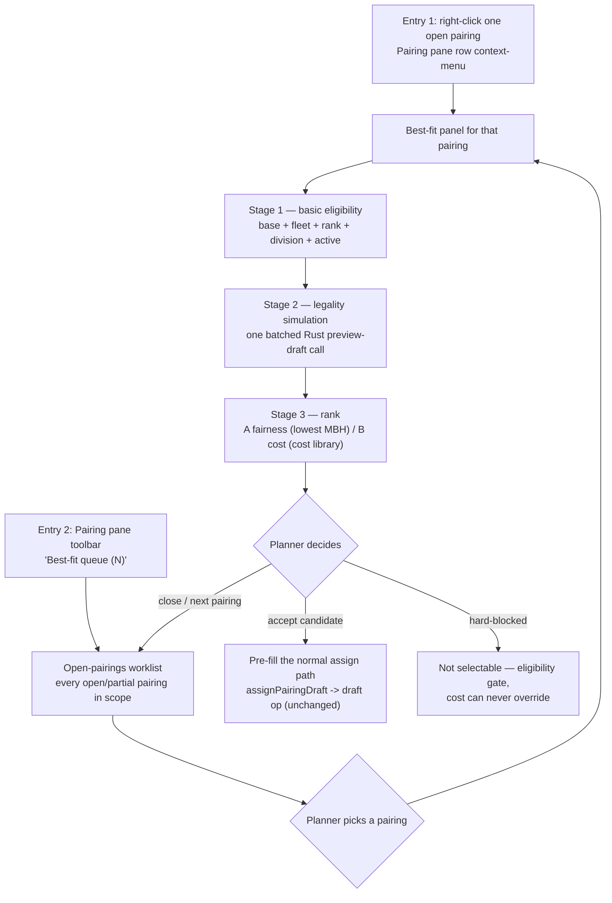

# Best-Fit Crew for an Open Pairing — Design & Prep

> Historical Ver1. Superseded by [batch design Ver2](2026-09-11-best-fit-crew-batch-design-Ver2.md).
> Multi-pairing search is now in scope. The all-candidates-in-one-preview approach below is withdrawn:
> alternatives need isolated evaluations, followed by a separate combined-selection preview.
> Ver2 also corrects credit-based cost inputs, snapshot/delta handling and the simplified UI flow.

Date: 2026-09-11 America/Vancouver
Status: Design + UI mockups (Option A / Option B). No production code changed.
Scope: Live + Scenario Gantt — staff an **open / partially open pairing** by ranking crew candidates.

Related: `docs/superpowers/specs/2026-09-10-0917-crew-recovery-cost-library-design-Ver1.md`,
`docs/superpowers/specs/2026-09-10-crew-cost-standby-tiers-Ver2.md`,
`docs/superpowers/specs/2026-09-10-cost-library-pg-design.md`,
`docs/modules/gantt/live-scenario-gantt-playbook.md`,
`docs/superpowers/specs/2026-09-11-best-fit-crew-mockups/` (mockups).

---

## 1. User story

A planner sees a pairing with unmet crewing coverage (`open` or `partial`). Instead of guessing
which crew to drag onto it, the planner asks for **best-fit crew**: the product returns the crew who
can legally take this pairing, ordered by a stated, explainable ranking rule.

Two ranking bases are in scope, both requested by Ryan:

- **A — Fairness**: lowest monthly block hours (MBH) first.
- **B — Cost**: lowest incremental crew cost first, computed with the new cost library.

The output is a **decision aid**. It does not assign anything. Hard legality failures are
eligibility gates and are never waived by a cheap cost. Soft warnings stay selectable, with the
planner owning the override.

## 2. Scope and non-goals

In scope

- One entry point per context (Live / Scenario) that opens a best-fit panel for a chosen open pairing.
- Three-stage candidate pipeline: basic eligibility → legality simulation → rank.
- Per-candidate legality **delta** from the Rust rule engine (new violations only).
- Per-candidate incremental cost from the cost library, with explicit priced/unpriced handling.
- Per-row explanations ("why this rank", "why blocked").
- Optional, explicitly-confirmed hand-off into the existing assign path.

Out of scope (v1)

- Multi-pairing / whole-roster optimization (that is the PBS solver's job).
- Automatic assignment. Assignment stays a separate, planner-confirmed action.
- Changing the cost library schema or the Rust rule engine.
- Reserve/standby generation (that lives in the Recovery / RES Pairing flows).

## 3. Where it lives

### 3.1 Entry points (two, per Ryan)

**Entry 1 — single pairing, from the row context menu.**
Right-click one pairing row in the Pairing pane → **"Find best-fit crew…"**. Enabled only when that
pairing is short staffed, i.e. `classifyCoverage(pairing.composition, selectedRanks)` is `open` or
`partial`. This is the deep entry: the planner already knows which pairing needs help.

**Entry 2 — all open pairings, from the Pairing pane toolbar.**
A toolbar button in the Pairing pane → **"Best-fit queue (N)"**, where `N` is the number of
`open` / `partial` pairings inside the current filter scope. It opens a **worklist** of every open
pairing; the planner picks one and runs Best-Fit on it. This is the work-queue entry: the planner
knows they must clear today's gaps but not which pairing to start with.

| Context | Entry | Notes |
|---|---|---|
| Live | Pairing pane row context-menu → "Find best-fit crew…" | Deep entry for one pairing. |
| Live | Pairing pane toolbar → "Best-fit queue (N)" | Queue entry listing all open pairings in scope. |
| Scenario | Both of the above, through the scenario source adapter | §Gantt-Unify: one shared queue + one shared panel, two thin data adapters. |
| Both | Pairing Info dialog → "Find best-fit crew" secondary action | Convenience entry once a pairing is already open. |

Where the toolbar button goes: `gantt/src/components/panes/shared/pairing-pane.tsx` already takes a
`toolbar?: (rowCount, openCredit?) => React.ReactNode` render-prop, and already computes
`openCreditText` from `sumCoverageCredit(...)` gated by `isOpenPartialCoverage(...)`. The queue
button belongs in that same toolbar cluster, next to the existing open/partial credit badge — the
count and the credit come from the exact same rows, so no new query is needed for the badge.

The pairing row's own coverage state is authoritative. The canonical classifier already exists and
must be reused, not re-derived:

- `gantt/src/utils/pairing-coverage.ts` → `classifyCoverage()` returns `open` / `partial` / `full` / `over`
  (shortage-wins precedence; mirrored in `live-server/src/services/pairing/coverage.ts`).

### 3.2 Component shape (proposed)

```
gantt/src/components/best-fit/
  best-fit-queue-dialog.tsx       # Entry 2: the worklist of every open/partial pairing
  best-fit-crew-dialog.tsx        # shared shell: context header + funnel + list + detail
  best-fit-candidate-list.tsx     # virtualized ranked list + per-row states
  best-fit-candidate-detail.tsx   # legality delta + cost breakdown + sim gantt strip
  best-fit-funnel.tsx             # stage counts
gantt/src/services/best-fit-api.ts        # thin client over the live-server endpoints
gantt/src/stores/best-fit-store.ts        # per-context (live | scenarioId) request state
gantt/src/utils/best-fit-source.ts        # open pairings + crew universe per context
```

The dialog is mounted once inside the shared shell (`gantt/src/components/shell/app-shell.tsx`),
driven by `ui-store`, exactly like the existing `nInfo` / flight-detail / recovery dialogs — not
forked per context.

The existing `gantt/src/components/recovery/` module already solves the hard parts of "build a
simulated assignment for a crew and ask the engine" (`gantt/src/utils/assign-pairing-op.ts`,
`gantt/src/components/recovery/recovery-violation-dialog.tsx`). Best-fit should borrow those
placeholders and the preview call, not re-implement them.

### 3.3 Flow



### 3.4 The open-pairings worklist (Entry 2)

The queue is a **read-only list**, not a second optimizer. Each row is one open/partial pairing and
the row itself is the invitation to run Best-Fit on it.

Row content: pairing label + id · departure date/time (base-local) · base · fleet · division ·
assignment group/assignment · coverage state · **open slots by rank** (e.g. `CA ×1, FO ×1`) ·
uncovered credit (HH:MM) · days-to-departure urgency.

Default sort: **earliest departure first** (most urgent), then largest uncovered credit. Alternates:
largest open-slot count, base → fleet grouping, pairing id.

Default filters: the pairing pane's current filter scope (base / fleet / division / ranks / date
range), coverage narrowed to `open` + `partial`. An explicit date window (default the viewport
roster period) keeps the list bounded; the toolbar badge `N` must be "open pairings inside this
same scope", never a global count.

Actions: open Best-Fit for one row; locate the row in the pairing pane; copy the pairing id.
**Multi-select is deliberately out of v1** — selecting several open pairings and solving them
together is a mini-optimizer, which belongs to the PBS solver, not this panel (noted as future work
in §12).

## 4. Data contracts (verified in code)

### 4.1 The open pairing

`gantt/src/types/pairing.ts` — `Pairing` carries `base`, `fleet`, `division`, `assignmentGroup`,
`assignment`, `blockMinutes`, `tafb`, `dutyCount`, `segCount`, `schStrDtUtc` / `schEndDtUtc`,
`composition: CompositionSlot[]` (`rank`, `plan`, `fill`), and `isFull`.

Detail/roster payloads add the per-crew facts used by the pairing info popup
(`gantt/src/services/pairing-api.ts`): `PairingCompositionRow { actingRank, plan, fill, open }`
and `PairingCrewDetail { crewId, base, actingRank, mbhMin, creditMin, ... }`.

Source endpoints:

- `GET /api/pairing` — list, with `sortBy`/`coverage`/`assignments`/`base`/`fleet`/`division`/`page`
  (`live-server/src/routes/pairing/pairing.ts:31-62`, Redis-cached).
- `GET /api/pairing/:id` detail → composition rows with open counts.
- `GET /api/pairing/:id/crew-detail` — already rostered crew, with `mbhMin` / `creditMin`.

### 4.2 The candidate crew universe

`gantt/src/types/crew.ts` — `Crew` carries `crewId`, `division`, `filiale`, `seniorityNum`,
current-effective `panelRank`, `panelBase`, `panelFleets`, and `quals: CrewQualSummary`
`{ rank, fleetQuals, airportQuals }`.

The recovery module already does the same eligibility read
(`gantt/src/services/recovery-candidates.ts` → `currentFleetQuals()`), including the deliberate rule
that **historical fleet rows must not** be used where an expired qualification would wrongly surface
a candidate. Reuse that stance: eligibility uses current-effective values only.

### 4.3 Manday / fairness inputs

`GET /api/crew/stats?crewIds=…&rosterPeriod=YYYYRPMM` → `Record<crewId, CrewStats>` with
`mbh` (month block hours, **minutes**), `mcred`, `mdo`, `ybh`, `ydo`
(`live-server/src/routes/crew/crew-stats.ts`, `services/crew/crew-stats-service.ts`).

The `rosterPeriod` must be resolved from the pairing's roster period / the current viewport — not
defaulted. Calling the endpoint without it silently falls back to a heuristic current RP and would
rank crew against the wrong month.

### 4.3b The direct architectural precedent: Auto-assign open pairings

`POST /api/roster/auto-assign/plan` (`live-server/src/routes/roster/roster.ts:432`) →
`planAutoAssign()` (`live-server/src/services/roster/auto-assign-service.ts:729`) is the same
brain applied in the opposite direction: given **crew**, rank **pairings**. It already establishes
the pattern Best-Fit must follow:

- **Read-only decision trace, persists nothing.** The response is a per-crew trace + plan that the
  frontend replays through the normal draft/assign path. Best-Fit must keep this contract.
- **Dependency-injected IO** (`AutoAssignDeps`: `resolveCrewContext`, `fetchCandidates`, `precheck`,
  `fetchExistingRoster`, `fetchSegments`, `fetchCandidateBlockMinutes`, `fetchRuleNames`, `runLegality`)
  so the whole brain is unit-testable with fakes, no DB and no Rust.
- **Cheap eligibility first, engine last.** `deps.precheck(fastify, crewId, candId)` emits
  `no-slot` skips (division / open slot / rank) before any rule-engine work.
- **One batched engine call per roster state**, `affectedCrewIds: [crewId]`, and a documented
  severity rule: *"severity 3 = hard (always remove); skipOnSoft also removes severity 1-2"*.

Best-Fit is the same brain with the roles swapped, so it should reuse
`precheckAssignment` (`live-server/src/services/assignment/precheck-service.ts:24`, which wraps
`validateAssignment` from `@rois/shared-rules` and resolves the exact slot acting rank after the
rank-acting downgrade) and `runLegality: typeof previewDraftLegality`.

One deviation is required: `precheckAssignment` takes one `(crewId, pairingId)` pair and performs
its own DB reads per call, which is fine for one crew × many pairings but wasteful for
many crew × one pairing. Best-Fit needs a **bulk variant** that loads the pairing composition and
the candidate crew ranks/bases/fleets once, then calls the same `validateAssignment` per candidate.
The rule semantics must stay in `@rois/shared-rules` — do not fork them.

### 4.4 Legality simulation (the Rust rule engine)

`POST /api/legality/preview-draft`
(`live-server/src/routes/rule/legality.ts:78`, service `live-server/src/services/rule/legality-preview.ts:740`)

Request: `{ contextType: 'live'|'scenario', scenarioId?, rulesetId?, affectedCrewIds: string[],
afterItems: RosterItem[], focusPairingIds?: number[], rpFrom?, rpTo? }`

Response: `{ allowed: boolean, violations: [{ crewId, pairingId, dutySeq, ruleCode, ruleInstance,
scopeKey, severity, startDt, endDt, message, flightId }] }`

Client wrapper already exists: `gantt/src/services/legality-preview-api.ts` (`legalityPreviewApi.checkDraft`,
`toRuleViolations`). Severity convention in the UI layer: `canOverride = severity < 3`, i.e.
**severity ≥ 3 is a hard violation**.

The placeholder roster items for "crew C takes pairing P" are built exactly as
`assignPairingDraft()` does it (`gantt/src/utils/assign-pairing-op.ts:34-163`) — same fields, same
synthetic task ids, same `rosterActingRank` resolution via `validateAssignment`
(`@rois/shared-rules`). Do not invent a second placeholder builder.

### 4.5 Cost (the new cost library)

- `GET /api/cost-library/catalog` → `{ types, instances, sets }`; each instance carries
  `latestRevision`; each set carries ordered `members { costInstanceId, costRevisionId, enabled, sortOrder }`.
- `POST /api/cost-library/calculate` `{ revisionId, inputs }` → `{ amount, currencyCode,
  status: 'priced'|'unpriced'|'disabled', breakdown: [{label, value}], formula }`
  (`live-server/src/services/cost/cost-calculator.ts`).
- Calculator codes: `quantity | fixed | minimum | guarantee | standby | bands | booking`
  (`live-server/src/services/cost/cost-validation.ts`). Standby requires a matching-currency GH
  guarantee revision.
- UI precedent: `gantt/src/components/cost/cost-library-view.tsx`.

## 5. The candidate pipeline

Stages are applied in order; every stage reports a count so the UI can show a funnel and so the
planner can see *where* crew were removed.

### Stage 0 — universe

Active crew in the pairing's scope (division/filiale), respecting the existing pane filters where the
planner has narrowed them.

### Stage 1 — basic eligibility (hard, non-waivable)

For each open composition slot of the pairing:

1. **Base**: crew current-effective base == pairing base.
2. **Fleet**: pairing fleet ∈ crew current-effective fleet quals.
3. **Rank**: crew rank can fill the vacant slot's acting rank (includes the rank-acting downgrade
   path already used by `validateAssignment` / `precheckAssignment`).
4. **Division / filiale**: crew division == pairing division (with the known division-scoping
   caveat for Scenario, `playbook §8.3`).
5. **Active status**: crew is not inactive/soft-deleted, and any qualification the rule engine
   requires is not expired on the pairing's working date.

Stage 1 is a *necessary* filter, not a sufficient one — it cannot know about rest, days off, or
monthly limits. Only the rule engine can answer those.

Implementation: one bulk query resolving current-effective base / fleets / rank / division / status
for the candidate set + one pairing composition read, then the shared `validateAssignment` per
candidate. This replaces N × `precheckAssignment` round trips without changing a single rule.

### Stage 2 — legality simulation (hard block vs soft warning)

For each Stage-1 survivor, simulate "assign P to C" and collect the **new** violations:

- **Baseline** = the violations of C's roster *today* (before the assignment).
- **After** = the violations of C's roster *plus the placeholder pairing*.
- **Delta** = After − Baseline, keyed by (ruleCode, ruleInstance, dutySeq/pairing, window).

rules

- any delta violation with `severity >= 3` → **hard block** (candidate excluded, with the blocking
  rule codes surfaced verbatim);
- any delta violation with `severity < 3` → **soft warning** (candidate stays, flagged);
- no delta → **pass**.

**Batching.** `previewDraftLegality` opens a DB transaction and runs the engine for the affected
crew set. It is therefore called **once** with `affectedCrewIds = [all Stage-1 survivors]` and a
single `afterItems` union, not once per crew. Violations carry `crewId`, so they attribute back to
the candidate. This is the difference between a usable panel and an N-transaction stall.

The auto-assign service already calls the engine exactly this way (`auto-assign-service.ts:624`),
including the documented severity convention — follow that precedent rather than inventing a new one.

**Baseline.** Prefer computing the baseline server-side in the same request (same ruleset, same RP
bounds, roster unchanged). Reusing the client's currently displayed violation set is cheaper but
goes stale the moment a planner edits the draft in another pane; if it is used, it must be labelled
as such and re-validated before an assignment is executed.

**RP bounds.** `rpFrom`/`rpTo` must be passed explicitly from the pairing's roster period. Rules
7505/7507 are RP-window-dependent and the client helper's default (current filter bounds) is not
always the pairing's RP.

### Stage 3 — rank

Only `pass` and `soft-warning` candidates are ranked. Hard-blocked candidates are shown in a
collapsed "Excluded" section with reasons, sorted last.

**A — Fairness**

1. ascending `mbh` (month block hours),
2. ascending `mcred` (month credit),
3. descending `seniorityNum`,
4. ascending `crewId` (stable).

**B — Cost**

1. ascending incremental cost (see §6),
2. unpriced candidates last within the same completeness class,
3. ascending `mbh` (fairness as tie-break),
4. ascending `crewId`.

Every row must render the reason for its position ("lowest MBH 42:15", "lowest cost CNY 3,240 ·
Daily Recovery rev 3"). A rank without an explanation is not acceptable for a planner decision.

## 6. Cost of one assignment (the part that needs a product decision)

The cost library prices **cost instances** (pay, layover, DHD, booking …), not "the cost of this
assignment". Best-fit therefore needs a small, explicit evaluation layer:

```
incrementalCost(pairing, crew, costSet) =
    Σ over enabled members m in costSet:
        calculate(m.revision, inputsFor(m, pairing, crew))
```

with:

- `inputsFor` mapping pairing/crew facts to each calculator's inputs (quantity / credit hours /
  standby times / bands …), reusing `pairing.blockMinutes`, pairing credit, `tafb`, `workday` and
  the crew's current `mbh`;
- an explicit **completeness** result: `priced` (all enabled members priced), `partial` (≥1 unpriced
  member), `disabled` (member disabled) — never silently sum a partial set as if it were a total;
- the currency taken from the revisions; mixed currencies must be refused, not added.

Open decisions for Ryan (recommended option first):

1. **Which cost set is the default baseline** — recommended: the cost set marked `is_default`
   (`cost_set.is_default` already exists), with a per-request override.
2. **Which costs are marginal for a single pairing assignment** — recommended: crew pay premium
   (GH/marginal), positioning/DHD, layover/hotel, and booking change; exclude standing fixed costs
   that do not change because one pairing moved.
3. **Unpriced members** — recommended: keep the candidate ranked but show "partial cost" and never
   let a partial cost outrank a fully-priced candidate in the same view.

Until (1)-(3) are answered, the mockups show the cost column with a visible cost-set label and
explicit priced / unpriced / disabled states.

## 7. Performance and scale

The crew universe is thousands; a naive per-crew simulation is not viable.

| Stage | Implementation | Cost |
|---|---|---|
| 0-1 basic eligibility | server-side SQL over current-effective crew base/fleet/rank + crew stats | one query, indexed |
| 2 legality | **one** `preview-draft` call for the whole survivor set | one DB transaction + one engine run |
| 3 rank + cost | client-side sort + one `calculate` batch per cost set | one request per cost set, cached per pairing |

Guards:

- Cap the simulated set (default 40, "max candidates" in the mockups) after Stage 1, ordered by the
  active ranking basis so the cap never hides the likely winner. Report the cap in the UI.
- Cache the Stage-2 result per (pairing, ruleset, RP, roster revision). Any draft edit invalidates it.
- Show stage progress: the panel must be usable while Stage 2 runs, with per-row `Queued →
  Simulating → verdict` states.

## 8. Proposed API (live-server)

### 8.1 The queue (Entry 2)

Prefer **reusing the existing list**: `GET /api/pairing?coverage=open,partial&base=…&fleet=…&division=…&pageSize=…`
already returns `Pairing.composition` (`rank`/`plan`/`fill`) and `blockMinutes`, and the client
already has the canonical `classifyCoverage` / `sumCoverageCredit` helpers. The toolbar badge and the
queue rows should be computed from that same payload.

Add a server-side aggregate **only if** the paginated list makes the badge unreliable (e.g. more open
pairings than the page size):

```
GET /api/pairing/open-summary?base=…&fleet=…&division=…&from=…&to=…
→ { total, byBase: [...], byRank: [...], uncoveredCreditMinutes, truncated: boolean }
```

Do not build a second pairing query path; extend the existing pairing route if this is needed.

### 8.2 Best-Fit for one pairing

One endpoint keeps eligibility, legality and cost consistent and avoids N round trips:

```
POST /api/best-fit/crew
{
  contextType: 'live' | 'scenario',
  scenarioId?: number,
  rulesetId?: number,
  pairingId: number,
  rosterPeriod: string,        // YYYYRPMM — explicit, never defaulted
  rpFrom: string, rpTo: string,
  rankSlots?: string[],        // default: all vacant slots
  maxCandidates?: number,      // default 40
  basis?: 'fairness' | 'cost', // affects cap ordering only
  costSetId?: number
}
→ {
  pairing: { …basic info…, composition: [...], coverage: 'open'|'partial' },
  funnel: { universe, basic, simulated, pass, soft, hard, capped },
  candidates: [{
    crewId, name, seniority, base, fleets, rankUsed,
    stats: { mbh, mcred, mdo }, fairnessRank, costRank,
    cost: { amount, currency, status, breakdown, formula, costSetLabel },
    legality: { verdict: 'pass'|'soft'|'hard', violations: [...], baselineCount },
    reasons: string[]
  }],
  excluded: [{ crewId, ruleCodes, message }],
  generatedAt: string,
  engine: { rulesetId, rpFrom, rpTo }
}
```

Assignment stays on the existing path (`gantt/src/utils/assign-pairing-op.ts` →
`checkLiveDraftLegality` → draft op), so best-fit never becomes a second write path.

This endpoint is the mirror of `POST /api/roster/auto-assign/plan` and should share its conventions
(read-only plan, DI'd IO, `precheck` then one batched `runLegality`, explicit `rpFrom`/`rpTo`).

## 9. Risks

| Risk | Impact | Mitigation |
|---|---|---|
| Legality delta mis-attributed (baseline drift) | crew wrongly blocked or wrongly allowed | compute baseline in the same request; key the delta by crewId + rule + window; regression tests with a crew that already has violations |
| N× engine calls | panel unusable at scale | single batched call; cap candidates; cache by roster revision |
| Cost sum treated as a real total while unpriced members exist | wrong ranking the planner trusts | explicit completeness state; partial cost never outranks fully priced |
| Wrong roster period for MBH / RP-bounded rules | wrong "fairness" winner; 7505/7507 misfire | require explicit `rosterPeriod` + `rpFrom/rpTo`; reject the request if absent |
| Historical (expired) fleet quals used | candidates surfaced that the engine will reject | current-effective quals only, mirroring `recovery-candidates.currentFleetQuals` |
| Scenario pairing set is not division-scoped | wrong candidates in Scenario | apply the division narrowing explicitly (playbook §8.3) |
| Live/Scenario fork | product inconsistency (§Gantt-Unify violation) | one shared dialog + source adapter; per-context store registry |

## 10. Verification plan (implementation phase)

- Unit: pipeline stage counts; fairness/cost ordering; hard/soft classification from a fixture
  violation set; cost completeness; hh:mm formatting.
- Backend: `node:test` on the new route — one batched engine call, correct funnel, explicit
  `rosterPeriod` required, unpriced handling.
- Legal regression: a crew with a pre-existing violation must not be hard-blocked for that same
  violation (delta correctness).
- E2E (Playwright, real UI from `https://cr.rois.one/altair/live` per Ryan's target): open an
  open pairing → best-fit → assert the funnel, a ranked winner under each basis, a soft-warning
  candidate, and that a hard-blocked crew is excluded; screenshot under
  `docs/assets/screenshots/gantt/` and inspect it.
- `npm run check:ui` for frontend style.

## 11. UI mockups

Two standalone, interactive HTML options are delivered under
`docs/superpowers/specs/2026-09-11-best-fit-crew-mockups/`:

- `option-a.html` — centered modal: pairing header, filter/funnel strip, ranked table + detail panel.
- `option-b.html` — right-docked, step-driven workspace (Pairing → Filter → Legality → Rank) with
  cards and in-place expansion.

Both must demonstrate **both entry points**:

- a pairing-pane toolbar button **"Best-fit queue (N)"** that opens the open-pairings worklist, and
- a pairing-row right-click menu item **"Find best-fit crew…"** on an open/partial row,

with the worklist row action opening the per-pairing Best-Fit panel. Both use synthetic fixtures
only and state on screen that nothing is assigned.

## 12. Follow-ups

- Record the Recovery + cost-library structures in the Gantt playbook (§17), which currently has no
  Recovery section.
- Decide §6 items 1-3 before implementation.
- Converge the three candidate builders rather than growing a fourth: Best-Fit, the Recovery dialog
  (`gantt/src/services/recovery-candidates.ts`) and auto-assign (`live-server/src/services/roster/auto-assign-service.ts`)
  all answer "who can legally take this work"; at minimum they must share `validateAssignment`,
  the placeholder roster-item builder and the batched legality caller.
- Future work (explicitly out of v1): multi-select several open pairings in the queue and solve them
  together. That is an assignment optimizer and overlaps the PBS solver's scope; do not grow it here
  without a product decision.
