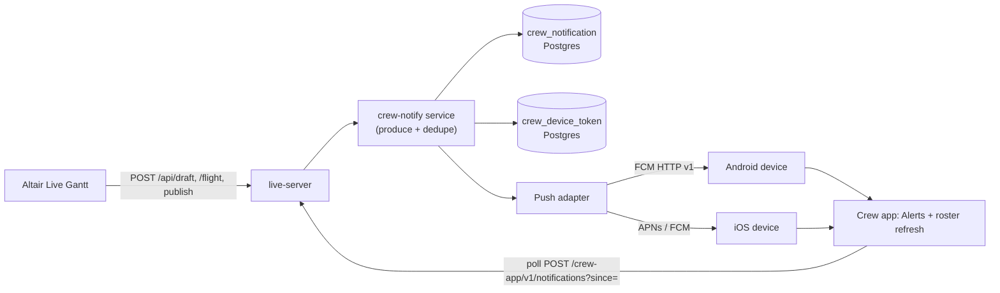

# Crew App Live Notification + Push Framework Design

Date: 2026-09-11
Status: Design / pre-implementation (dev-readiness review)

## Question

How does our main Altair **Live** path (`/altair/live` → `live-server`) send a
notification to the crew app — including when the crew app is **not open** — and
what must be built before development starts?

## Short Answer

It does not, today. There are two independent halves and only one of them exists:

| Half | Owner today | State |
|---|---|---|
| Produce + store a crew notification | EVACC `backend/crew_notify` (EK only) | Built, gated behind `ENABLE_EK_CREW_APP_TEST_GATEWAY=1` |
| Deliver it to the device when the app is closed | nobody | **Not built — no APNs, no FCM, no device-token registry** |

Altair Live (`live-server`) has **no crew-app notification path at all**. Its
"notify" service broadcasts to operator gantt clients over WebSocket, not to
crew. So the Live → crew-app flow, and every closed-app scenario, is greenfield.

---

## Current-State Findings

### 1. The crew app's notification transport is pull-only

- `crew-app/src/features/notifications/notificationsApi.ts:150` — the only client.
  Plain `fetch` POSTs to `${apiBaseUrl}/crew-app/v1/notifications`; there is no
  WebSocket, SSE, or background listener anywhere in `crew-app/src`.
- `crew-app/src/features/notifications/notificationsSlice.ts:130` —
  `loadNotifications` is the single load path.
- `crew-app/src/features/notifications/NotificationsScreen.tsx:92` — refreshed
  only by `useFocusEffect` when the **Alerts** tab gains focus, plus pull-to-refresh
  and after a discretion decision (`notificationsSlice.ts:188`).
- `crew-app/src/navigation/RootNavigator.tsx:359` — Alerts tab is always present.

Consequence: a crew member learns about a roster change only by opening the app
and then opening the Alerts tab. There is no wake-up path.

### 2. No device push plumbing exists

Verified on the current app (v98, `crew-app/src/version.ts`):

- `crew-app/package.json` — no `notifee`, no `@react-native-firebase/messaging`,
  no APNs/FCM library of any kind.
- `crew-app/ios/RoyceTravelTemplate/` — no `*.entitlements` file at all, so no
  `aps-environment`; `AppDelegate.mm` registers no remote-notification handling.
- `crew-app/android/app/src/main/AndroidManifest.xml` — only `INTERNET`; no
  `POST_NOTIFICATIONS` (required on Android 13+), no Firebase messaging service,
  no `google-services.json`.
- The only background/native scheduling that exists is unrelated: the iOS
  Live Activity module (`MeetingLiveActivityModule.swift`, `pushType: nil`) and
  the calendar sync config (`CalendarModule.swift:40`).

### 3. Notifications are produced by EVACC, not by Altair Live

- Package: `ROIs-Suit-aiGen-EVACC/backend/crew_notify/` (`models.py`, `store.py`,
  `service.py`, `router.py`).
- Store: **Redis, no TTL** — `crewnotify:log:{crewId}` (append-only list),
  `crewnotify:seq:{crewId}` (per-crew cursor), `crewnotify:discretion:{id}`.
- Producer: `CrewNotifyService.on_flight_committed`
  (`crew_notify/service.py:80`), called from EVACC's own flight-detail edit
  commit path (`EVACC backend/main.py:8344`). It emits a `flight_change`
  notification and, when the recomputed FDP exceeds the limit, opens an
  `fdp_discretion` request.
- Router registered at `EVACC backend/main.py:8816`, gated by
  `ENABLE_EK_CREW_APP_TEST_GATEWAY=1`.
- Auth: `backend/crew_app.py:authenticate_crew` — a fixed test crew
  (`C900001` / `Pier2026`), explicitly marked as needing per-crew tokens before
  production write-back.
- The originating plan (`EVACC docs/superpowers/plans/2026-08-19-crew-app-notifications.md`)
  states: *"Real APNs/FCM push is explicitly out of scope for stage 1 — the
  durable store + poll is the backbone; push is a later latency optimization."*

### 4. Altair Live notifies only operator gantt clients

`live-server/src/services/roster/roster-change-notifier.ts:16` does exactly two
things: invalidate the roster chunk caches, then
`fastify.wsBroadcastAll(schema, { type: 'roster-updated' })`. The WS message union
(`live-server/src/plugins/websocket.ts:23`) is entirely gantt-facing
(`roster-updated`, `manday-updated`, `lock-*`, `violations.updated`, …). `/ws/locks`
requires a JWT and carries no crew identity.

Live mutation points that already funnel through that notifier — these are the
natural producer hooks for crew notifications:

| Live event | Call site |
|---|---|
| Draft save / assignment change | `live-server/src/routes/draft/draft.ts:300` |
| Flight edit / delay cascade | `live-server/src/routes/flight/flight.ts:245` |
| Scenario publish to live | `live-server/src/routes/scenario/scenario.ts:1510` |
| Manday recompute (single crew) | `live-server/src/routes/roster/roster.ts:64` |
| Recovery recompute | `live-server/src/routes/recovery/recovery.ts:120` |
| Bulk de-assign worker | `live-server/src/workers/roster-bulk-delete-worker.ts:260,281` |
| Shared manday mutation | `live-server/src/services/manday/manday-operation-service.ts:68` |

### 5. The F8/ET Alerts tab is already broken

For F8 and ET the app routes to `live-server`
(`crew-app/src/features/auth/airlines.ts:131,141`; `airlines.ts:14` →
`https://cr.rois.one/api`). `live-server/src/routes/` has `mobile-roster` for
login + roster but **no `crew-app` route**, so
`POST https://cr.rois.one/api/crew-app/v1/notifications` returns 404 and the Alerts
tab surfaces `Request not found`. This is a live defect independent of push.

Note a contract difference the new routes must handle: `live-server` returns
`{ code, data, message }` (`live-server/CLAUDE.md`, and
`routes/mobile-roster/mobile-roster.ts:29`), whereas EVACC's `crew_notify`
returns the notification object raw. The app already unwraps the envelope for
F8 roster (`ekRosterApi.ts:222 parseF8RosterEnvelope`) but not for notifications,
so the notification client needs per-airline envelope handling.

---

## Gap Summary

| Capability | Today | Needed for "app not open" |
|---|---|---|
| Live produces a crew notification | No | Producer hook at the Live mutation points (§4) |
| Durable per-crew notification store for F8/ET | No | Store on `live-server` |
| Crew can read history for F8/ET | No (404) | `POST /api/crew-app/v1/notifications` on `live-server` |
| Device token registry | No | New table + register/revoke endpoints |
| Push send (APNs/FCM) | No | Provider adapter + credentials |
| App receives push closed/backgrounded | No | Native entitlements + RN push library + handlers |
| Tap-through into the right screen | No | Deep link → Alerts / pairing |
| Per-crew auth for push registration | Fixed test crew (EK only) | Per-crew token or PBS-credential session |

---

## Target Architecture



Design rules:

1. **The durable feed is the source of truth; push is only a wake-up hint.**
   A missed or dropped push must never lose the notification. Every push tap
   resolves to a feed fetch.
2. **Reuse the EVACC v1 contract shape** so the app keeps one client. Same
   `Notification` fields, same cursor semantics (`since` → records after cursor),
   same three endpoints.
3. **One provider for both platforms** (FCM) to avoid carrying two server-side
   credential systems and two client libraries.
4. **Emit after commit**, never from a preview/dry-run — same rule EVACC already
   enforces.
5. **Never notify a crew who is not on the pairing**, and never notify on a
   no-op edit.

### Data model (live-server, Drizzle → existing `public`/airline schema)

```
crew_notification
  seq            bigserial primary key     -- global monotonic cursor
  airline        text                      -- 'F8' | 'ET'
  crew_id        text
  notif_id       text unique               -- stable idempotency key
  type           text                      -- roster_change | flight_change | fdp_discretion | info
  created_utc    timestamptz
  title          text
  body           text
  status         text                      -- unread | read
  read_utc       timestamptz null
  related_pairing_id text null
  related_flight_id  text null
  related_duty_id    text null
  payload        jsonb                     -- app-renderable detail (sch/act times, reason)
  index (airline, crew_id, seq)

crew_device_token
  token_id       bigserial primary key
  airline        text
  crew_id        text
  platform       text                      -- ios | android
  device_token   text                      -- unique per (platform, token)
  app_version    int
  created_utc    timestamptz
  last_seen_utc  timestamptz
  revoked_utc    timestamptz null
```

Postgres (not Redis) because notification history is business history that
planners and auditors may need to query next to roster rows, and `live-server`
already owns the drizzle schema. A `bigserial seq` gives the app one cursor
across all its notifications without the per-crew counters EVACC needed.

### HTTP contract (live-server, mirrors EVACC v1)

All POST + JSON body carrying `{ airline, crewId, password }`, matching the
existing mobile-roster auth style, and wrapped in the live-server envelope
`{ code, data, message }`.

- `POST /api/crew-app/v1/notifications` — body `{ airline, crewId, password, since? }`
  → `{ cursor, notifications: [...], openDiscretions: [] }`
- `POST /api/crew-app/v1/notifications/{notifId}/read` → `{ ok: true }`, idempotent
- `POST /api/crew-app/v1/devices` — body `{ airline, crewId, password, platform, deviceToken, appVersion }`
  → registers/refreshes a token (upsert by token, un-revoke on re-register)
- `POST /api/crew-app/v1/devices/revoke` — body adds `deviceToken`; called on logout
- Add every one of these to the `PUBLIC_EXACT_ROUTES` list in
  `live-server/src/plugins/auth.ts:37`, exactly like `/api/mobile-roster/session`.

### Push adapter

One module with an injectable sender so tests never hit the network:

```
PushSender.send({ platform, token, title, body, data }) -> { ok, status, shouldRevoke }
```

- Android: FCM HTTP v1 (`https://fcm.googleapis.com/v1/projects/<id>/messages:send`),
  service-account JWT.
- iOS: FCM HTTP v1 with the APNs key uploaded to the Firebase project — keeps one
  credential path and one client SDK.
- `UNREGISTERED` / `BadDeviceToken` → soft-revoke the row (this is why the token
  table needs `revoked_utc`).
- Dispatch is fire-and-forget off the commit path: it must never block or fail a
  roster mutation.

#### Cost and reliability of the provider options

The wake-up channel is owned by the OS vendors. There is no free-but-different
alternative, because a self-hosted service (ntfy / Gotify / UnifiedPush /
WebSocket) cannot wake a closed iOS app at all, and on Android it still travels
through FCM underneath.

| Option | Messaging cost | Reliability | Notes |
|---|---|---|---|
| FCM for both platforms | $0 | OS-level channel | One server credential, one RN library. iOS needs the APNs `.p8` key uploaded to the Firebase project. Verified no-cost on Firebase's pricing page (`Cloud Messaging (FCM)` → "No-cost") |
| FCM Android + direct APNs HTTP/2 iOS | $0 | OS-level channel | Two server integrations instead of one; avoids Firebase on the iOS side. Token-based `.p8` JWT signing |
| Third-party (OneSignal et al.) | free tier, capped | OS-level channel under the hood | Adds a vendor that would hold crew PII; adds data-residency questions |
| ntfy / Gotify / UnifiedPush self-hosted | $0 | **Cannot deliver to a closed iOS app** | Android still uses FCM; not a viable answer for this requirement |
| WebSocket / SSE only | $0 | requires the app to be open | Fails "even app is not open" |

Non-messaging costs: the Apple Developer Program membership fee (needed anyway
for iOS signing and the push entitlement; confirm the current amount on
developer.apple.com), Google Play Console if distributing through Play, and zero
marginal cost for the Postgres tables. Since we already ship the iOS app, push
adds no new recurring licence.

Honest reliability limits to design around: push delivery is best-effort by
design. iOS may hold a notification (Focus, Low Power Mode, throttling) and
Android Doze can delay it; silent/data-only pushes are heavily throttled on iOS
and must not be the mechanism anything depends on. This is exactly why the
durable feed stays the source of truth and the focus-time poll stays as the
safety net.

### App-side changes (`crew-app`)

1. Add `@react-native-firebase/app` + `@react-native-firebase/messaging`;
   `AndroidManifest.xml` gains `POST_NOTIFICATIONS` + the messaging service;
   iOS gains a `*.entitlements` with `aps-environment` (dev/prod), the Push
   Notifications capability, background mode `remote-notification`, and an
   `AppDelegate` APNs token bridge.
2. Register the token after a successful login and on every app start while
   signed in; revoke on logout. Send it to the **same `apiBaseUrl`** the airline
   already uses, so EK keeps going to EVACC and F8/ET go to `live-server`.
3. Background/foreground handlers: show a heads-up notification, and on tap
   deep-link to Alerts or straight to the affected pairing/duty.
4. Keep the existing focus-triggered poll and add an app-foreground refresh;
   push is an accelerator, not a replacement.
5. Add per-airline envelope unwrapping to `notificationsApi.ts` (live-server
   wraps in `{code,data,message}`; EVACC does not).
6. Bump `crew-app/src/version.ts` (currently 98) per the module rule.

### Auth hardening

`authenticate_crew` today accepts one fixed test credential; the mobile-roster
path re-verifies the PBS password hash on every call
(`live-server/src/services/mobile-roster/mobile-roster-service.ts`). Push
registration and read receipts should move to a short-lived per-crew session
token issued at login, so the device stops shipping the portal password on every
request and the server can revoke a device. Treat this as part of the phase that
adds device tokens, not as a later cleanup — a push endpoint is a new externally
reachable surface.

---

## Phasing

| Phase | Content | Outcome |
|---|---|---|
| 0 | This decision doc + producer scope decision | Agreed contract |
| 1 | live-server `crew_notify` store + v1 poll endpoint + app envelope handling | F8/ET Alerts tab works (app open) |
| 2 | Producer hooks at the §4 Live mutation points, with coalescing/dedupe | Live roster changes appear in the feed |
| 3 | `crew_device_token`, session token, FCM adapter, native app push setup | **Closed-app delivery** |
| 4 | Hardening: quiet hours, per-event rate limits, metrics, read receipts, tap-through analytics | Production-grade |

Phase 1 alone fixes a shipped defect; Phase 3 is the part that satisfies "even
app is not open".

## Verification Plan

- Phase 1: `live-server` vitest for the service + route (auth reject, cursor
  delta, read idempotency, envelope shape); app Jest for envelope parsing.
- Phase 2: unit tests per producer hook asserting notification content and
  suppressing no-ops; a regression test that a replayed commit does not
  duplicate.
- Phase 3: real-device test on Android 13+ and iOS — force-stop the app, trigger
  a Live change, assert the push arrives and tapping it opens the right screen.
  Use FCM's test-send for the transport check and a real Live mutation for the
  end-to-end check.
- Real-UI gate per repo rules: drive `https://cr.rois.one/altair/live` with
  Playwright, make a roster change, then assert the crew-side notification
  exists and capture a versioned screenshot under
  `docs/assets/screenshots/crew-app/`. Playwright cannot assert an OS-level push,
  so the closed-app assertion must come from the paired device run and be
  reported explicitly.

## Risks

1. **External credentials.** FCM service account + APNs key + Apple/Google
   project access do not exist yet. This is the critical-path external
   dependency; without it Phase 3 cannot be tested on device.
2. **Notification fatigue.** Live edits are frequent (delay cascades, bulk
   de-assign). Without coalescing rules and quiet hours, crew will mute the app.
   The producer scope decision (below) is a product decision, not a technical one.
3. **Two producers, one contract.** EK stays on EVACC, F8/ET on live-server. Any
   contract change must land in both or the app forks.
4. **Auth.** Password-per-request plus a new push surface is a real exposure;
   the session-token work is in scope for Phase 3.
5. **Roster staleness.** A "your roster changed" alert is only useful if the
   roster fetch that follows returns the new assignment — the Phase 2 hooks must
   fire after cache invalidation (`notifyRosterTasksChanged` already bumps
   `roster:v2:chunkver`, so the hook belongs after that call, not before).

## Open Decisions For Ryan

1. **Producer scope for stage 1** — (a) only assignments the crew personally
   received/removed, (b) also flight-time changes on their pairings,
   (c) everything touching their roster including manday/legality flags.
   *Recommended: (a)+(b) — it is what a crew member acts on, and it avoids the
   fatigue risk in §Risks-2.*
2. **Push provider** — (a) FCM for both platforms, (b) FCM Android + direct APNs
   HTTP/2 iOS, (c) no push in stage 1, WS/foreground only.
   *Recommended: (a) — one credential path, one RN library, one server adapter.*
3. **Store owner** — (a) new `live-server` Postgres store (recommended: single
   owner for Live data, queryable, no cross-service hop), (b) extend EVACC
   `crew_notify` to multi-airline and have `live-server` call it (reuses working
   code but couples CMS to EVACC and inherits its fixed-test-crew auth).

## Out Of Scope Here

No code was changed by this review. Nothing in this document authorizes EK/EVACC
changes, Firebase project creation, or credential handling — those need the
decisions above and explicit instruction.
